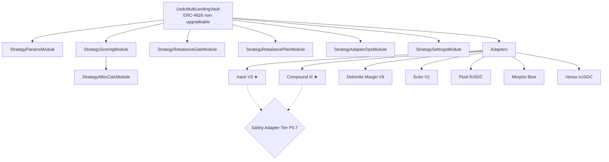

# multyr-strategies

> Production strategies for Multyr Protocol — USDC Lending V10
> (V9.2 + P0.7 + Wave 1+2 hardening), with formal verification evidence,
> 1M Echidna campaign, and deterministic multichain build. Audit engagement pending.

[](LICENSE)
[](https://getfoundry.sh)
[](https://github.com/Multyr/multyr-strategies/actions)

---

## Overview

`multyr-strategies` contains the production lending strategies that plug into the Multyr
core vault (`multyr-core/CoreVault`). The sole published strategy is **USDC Lending V10**
(V9.2 + P0.7 Safety Adapter Cap Tier + Wave 1+2 hardening) — a multi-adapter yield
aggregator deployed on **Arbitrum One** (initial), with V10 enabling identical bytecode
deployment on Optimism / Base / Polygon / Ethereum L1 / zkSync.

The strategy accepts USDC from a `CoreAggregatorVault` and autonomously distributes capital
across up to seven lending protocol adapters (Aave V3, Compound III, Dolomite, Euler V2,
Fluid, Morpho Blue, Venus) through a keeper-driven scoring, capping, and multi-step
rebalancing system.

Each strategy published in this repository has completed internal pre-audit hardening before
promotion. Strategies in development (Multiply, PT-Multiply) are kept in
private development repositories until they reach the same standard (ADR-003). Publishing
a strategy here is the promotion event; the public git history starts at the first clean
commit.

Version 9.2 introduces **P0.7 Safety Adapter Cap Tier**, a dual-anchor
safety architecture where designated safety adapters (Aave V3 +
Compound V3) receive idle-cash overflow that cannot fit in opportunistic
venues. The mechanism is gated by per-adapter cap-drift mandates,
per-adapter cooldown, and a four-layer cap engine that preserves the
V9.1 invariants while extending the safety surface. Full V9.1 invariants
remain in force; P0.7 adds eight new safety claims documented in
docs/invariants.md.

---

## Architecture



★ = safety adapter (P0.7). Safety adapters receive idle-cash overflow
via the dual-anchor architecture when opportunistic adapters are at cap
or in cooldown. Priority order: Aave V3 (5000/5000 bps) → Compound III
(4000/4000 bps).

The main controller (`UsdcMultiLendingVault`) is a stateless dispatcher. Functions not
defined directly on the controller are routed to one of six delegatecall modules via the
`fallback()` dispatcher. All modules inherit `StrategyStorageLayout` to guarantee storage
slot alignment in the delegatecall context. There is no proxy pattern — the contract
stack is non-upgradeable.

See [`docs/overview.md`](docs/overview.md) for the full contract stack and module dispatch
semantics.

See [`docs/adapters.md`](docs/adapters.md) for per-adapter deposit modes, APY computation
methods, and security properties.

---

## Key Concepts & Invariants

- **USDC conservation**: total USDC tracked by the strategy (idle + deployed across all
  adapters) must equal `totalAssets()` at every state boundary. No rounding loss exceeding
  1 wei per operation is permitted. Verified by 14 Halmos symbolic proofs.
- **Adapter cap enforcement**: per-adapter absolute exposure cannot exceed
  `STRUCTURAL_BASE × RISK_OVERLAY × FAILURE_OVERLAY × LIQUIDITY_OVERLAY`. No allocation
  step bypasses the four-layer cap engine regardless of scoring output.
- **Non-upgradeable strategy**: `UsdcMultiLendingVault` uses no proxy pattern.
  The delegatecall module set is fixed at construction; no `setModule()` function exists.
- **Role finality after bootstrap**: `BOOTSTRAP_ROLE` is renounced after adapter
  registration. `DEFAULT_ADMIN_ROLE` is transferred to Timelock. No role can be re-granted
  to the deployer EOA post-deploy.
- **Stale APY fallback defined**: the Aave V3 adapter uses a three-source priority chain
  (admin override then keeper-pushed rate then on-chain `getReserveData()` fallback).
  APY never silently degrades to zero on keeper delay.
- **Rebalance plan expiry**: any outstanding rebalance plan expires after two hours.
  Stale plans are invalidated before the next `prepareRebalance()` call. No plan persists
  indefinitely.
- **DegradedMode circuit breaker**: `degradedModeActive` halts rebalancing and harvest
  when triggered. Three objective on-chain conditions can trigger it; clearance requires
  explicit governance action via `clearDegradedMode()`. No automatic re-entry after clear.
- **Rebalance gate P0–P3**: any rebalance is blocked unless all four gates pass
  (execution cost, hysteresis, coordination, regime). No keeper can bypass gates.
- **TVL zero-allocation guard**: a zero-valued TVL cache timestamp (never poked) results
  in ZERO allocation band — the adapter receives no capital until the first keeper poke.
  Stale TVL is treated as MICRO (30%) not zero, preventing blackout on keeper delay.
- **Euler PUSH mode one-time approval**: the Euler adapter sets a one-time unlimited
  Permit2 approval at construction. `initializeMarkets()` must run before admin role
  transfer; the bootstrap sequence enforces this invariant.

---

### P0.7 Safety Adapter Cap Tier invariants

- **Safety hard ceiling discipline**: for every safety adapter `i`,
  `positionAssets[i] <= hardCeiling_i` where
  `hardCeiling_i = fbCeiling_i x (BPS + capDriftToleranceBps) / BPS`,
  within +/-2 wei rounding tolerance.
  Verified by Halmos P1+P3 (symbolic) and Echidna I03b (1M sequences).
- **Mandate completeness**: if `positionAssets[i] > hardCeiling_i` for
  any safety adapter, the cap-drift mandate is detectable on the next
  rebalance check. Verified by Halmos P2 + Echidna I03c.
- **Safety tranche preservation**: if a safety adapter has
  `normalTarget_i < currentPosition_i <= fallbackCeiling_i`, the next
  rebalance does NOT reduce `currentPosition_i` to `normalTarget_i`.
  Verified by Halmos P4 (most critical preserve-tranche property).
- **Non-safety adapter uses normal caps**: for any non-safety adapter,
  the cap drift gate uses only the normal abs/rel cap path; safety
  fallback caps never apply. Verified by Halmos P2.
- **Cooldown semantic (re-deploy only)**: after a cap-drift mandate
  fires on adapter `i`, `deployIdle` skips `i` until
  `lastRelCapMandateTs[i] + mandateRedeployCooldownSeconds` has elapsed.
  The cooldown does NOT prevent future mandates from firing on `i`.
  Verified by Echidna I04+I05.
- **Promotion clears cooldown (H-03)**: promoting a non-safety adapter
  to safety (`addSafetyFallbackAdapter`) clears any prior
  `lastRelCapMandateTs[i]` cooldown stamp. Verified by Halmos P6 +
  Echidna I10.
- **Quarantine blocks safety promotion (L-01)**: `addSafetyFallbackAdapter`
  reverts if the adapter is currently quarantined. Verified by unit test
  `test_D1f_09_quarantined_adapter_promotion_reverts`.
- **Legacy non-regression**: when no safety adapters are configured,
  the system behaves identically to pre-P0.7 baseline. Verified by
  Echidna I12.

See [`docs/invariants.md`](docs/invariants.md) for the full formal invariant set and
[`docs/threat-model.md`](docs/threat-model.md) for the attack surface analysis.

---

## Adapter Registry

| Adapter | Protocol | Deposit mode | APY source |
|---|---|---|---|
| `AaveV3USDCAdapter` | Aave V3 (Arbitrum One) | PULL | 3-source hybrid (admin override, keeper, on-chain fallback) |
| `CometUsdcMultiMarketAdapter` | Compound III / Comet | PULL | Keeper-pushed utilization rate |
| `DolomiteUsdcMultiMarketAdapter` | Dolomite Margin V9 | PULL | Keeper-pushed WAD rate via `DolomiteSupplyRateProvider` |
| `EulerUsdcMultiMarketAdapter` | Euler V2 (EVault) | PUSH | `interestRate()` in ray (EVault native) |
| `FluidUsdcMultiMarketAdapter` | Fluid fUSDC | PULL | PPS snapshot delta (keeper-poked) |
| `MorphoUsdcMultiMarketAdapter` | Morpho Blue vaults | PULL | PPS snapshot with staleness cache |
| `VenusUsdcMultiMarketAdapter` | Venus vUSDC_Core | PULL | `supplyRatePerBlock × blocksPerYear` (per-chain configurable; default 126,144,000 Arbitrum; C-04 fix) |

See [`docs/adapters.md`](docs/adapters.md) for full per-adapter security properties,
role tables, and APY computation details.

---

## Modules

| Contract | File | Priority | Purpose |
|---|---|---|---|
| `UsdcMultiLendingVault` | `controller/UsdcLendingStrategy.sol` | CRITICAL | Main controller, fallback dispatcher, deposit/withdraw lifecycle |
| `StrategyStorageLayout` | `controller/StrategyStorageLayout.sol` | CRITICAL | Single source of truth for storage layout, constants, custom errors |
| `StrategyScoringModule` | `controller/StrategyScoringModule.sol` | CRITICAL | Scoring pipeline entry, DegradedMode checks, delegatecall to AllocCalc |
| `StrategyAllocCalcModule` | `controller/StrategyAllocCalcModule.sol` | CRITICAL | Pure allocation pipeline: compute, normalize, sort, cap |
| `StrategyRebalancePlanModule` | `controller/StrategyRebalancePlanModule.sol` | HIGH | Phase 1+2 of 3-phase rebalance state machine |
| `StrategyRebalanceGateModule` | `controller/StrategyRebalanceGateModule.sol` | HIGH | P0-P3 gate check before any rebalance is prepared |
| `StrategySettingsModule` | `controller/StrategySettingsModule.sol` | HIGH | 45+ governance admin setters |
| `StrategyAdapterOpsModule` | `controller/StrategyAdapterOpsModule.sol` | HIGH | Safe adapter deposit with failure tracking |
| `StrategyParamsModule` | `controller/StrategyParamsModule.sol` | MEDIUM | TVL poke, parameter setters for keeper writes |
| `LendingStrategyUpkeep` | `automation/LendingStrategyUpkeep.sol` | HIGH | Chainlink Automation keeper (harvest, poke-APY, rebalance, deploy-idle) |
| `RewardSwapHelper` | `swap/RewardSwapHelper.sol` | HIGH | Chainlink-anchored reward swap with Uniswap V3 to Camelot V3 fallback |
| `StrategyBootstrapper` | `StrategyBootstrapper.sol` | MEDIUM | One-shot adapter registration; BOOTSTRAP_ROLE renounced post-deploy |
| `StrategySafetyOverflowModule` | `controller/StrategySafetyOverflowModule.sol` | HIGH | Safety overflow execution + degraded mode checks (extracted F-SIZE-01) |
| `StrategyExplainabilityLens` | `lens/StrategyExplainabilityLens.sol` | LOW | Read-only scoring explainability (best-effort, not authoritative) |
| `StrategyRouter` | (from multyr-core) | HIGH | Routes vault calls to correct strategy module |
| `StrategyHealthRegistry` | `StrategyHealthRegistry.sol` | MEDIUM | Per-adapter health scores, failure tracking |
| `StrategyConfigLib` | `lib/StrategyConfigLib.sol` | LOW | Pure library — single source of truth for parameter reads (Lens x3) |

> **P0.7 + V10 changes**: `StrategySettingsModule`, `StrategyRebalancePlanModule`,
> `StrategyRebalanceGateModule`, `StrategyAllocCalcModule`, and
> `StrategyStorageLayout` are extended with safety-adapter-tier semantics
> (slots 78-81 packed: capDriftToleranceBps, maxIdleBps,
> targetSafetyMarginBps, mandateRedeployCooldownSeconds +
> safetyFallbackAdapters[] + safetyFallback mapping + lastRelCapMandateTs
> mapping). `StrategyExplainabilityLens` refactored in S2.4-bis to enable
> coverage instrumentation. See docs/audit-scope.md for line-count
> breakdown.

Total audit scope: 25 Solidity files (23 original + StrategySafetyOverflowModule + StrategyConfigLib added in V10). See [`docs/audit-scope.md`](docs/audit-scope.md) for in-scope file list and line count breakdown.

---

## Repo Layout

```
multyr-strategies/
|- src/
|   \- strategies/
|       \- usdc-lending/
|           |- UsdcLendingStrategy.sol     Main controller (UsdcMultiLendingVault)
|           |- StrategyBootstrapper.sol    One-shot deploy helper
|           |- controller/                 StrategyStorageLayout + 6 delegatecall modules
|           |- adapters/
|           |   |- lending/                Seven lending adapter contracts
|           |   \- rates/                  AaveLiquidityRateProvider, DolomiteSupplyRateProvider
|           |- automation/                 LendingStrategyUpkeep
|           |- interfaces/                 ILendingAdapter, IAdapterEmergency
|           |- lens/                       StrategyExplainabilityLens
|           \- swap/                       RewardSwapHelper
|- lib/
|   |- multyr-core/                        GitHub submodule
|   \- multyr-periphery/                   GitHub submodule
|- docs/                                   Overview, adapters, audit-scope, invariants, threat-model
|- audits/                                 Signed external audit PDFs (empty until first published audit)
|- SECURITY.md
|- CONTRIBUTING.md
\- LICENSE
```

---

## Cross-Repo Dependencies

`multyr-strategies` depends on two upstream repositories for shared interfaces.

| Dependency | Type | Import alias | Purpose |
|---|---|---|---|
| `multyr-core` | GitHub submodule | `@multyr-core/` | `IStrategy`, `ICoreVault`, `IStrategyRouter`, shared role constants |
| `multyr-periphery` | GitHub submodule | `@multyr-periphery/` | `IRewardsDistributor` (LendingStrategyUpkeep harvest routing) |

Remappings in `foundry.toml`:
```
@multyr-core/=lib/multyr-core/src/
@multyr-periphery/=lib/multyr-periphery/src/
```

The strategy itself (`UsdcMultiLendingVault`) has no direct dependency on periphery
contracts at execution time. The periphery submodule dependency is limited to the keeper
contract (`LendingStrategyUpkeep`) for post-harvest fee routing.

---

## Documentation

| Document | Location | Content |
|---|---|---|
| Architecture overview | `docs/overview.md` | Contract stack, module dispatch, storage layout, rebalance lifecycle |
| Adapter reference | `docs/adapters.md` | Per-adapter deposit modes, APY methods, security properties, role tables |
| Audit scope | `docs/audit-scope.md` | In-scope files, line counts, critical architecture notes, known waivers |
| Formal invariants | `docs/invariants.md` | Halmos (23 proofs) + Echidna (15 invariants) formal claims |
| Threat model | `docs/threat-model.md` | Attack surface analysis, trust assumptions, out-of-scope risks |
| V10 design rationale | `docs/v10/DESIGN_RATIONALE.md` | EIP-170 extractions, multichain portability, deterministic build |
| Multichain playbook | `docs/v10/MULTICHAIN_PLAYBOOK.md` | Per-chain deploy guide and blocksPerYear table |
| Audit evidence index | `docs/audit/README.md` | Halmos, Echidna 1M, sizes, Wave 1+2 fix logs |
| Wave 1+2 summary | `docs/audit/WAVE1_2_SUMMARY.md` | Executive summary for auditor onboarding |
| Contract sizes | `docs/audit/sizes/CONTRACT_SIZES.md` | Post-Wave 2 bytecode size table (all 25 contracts) |

---

## Audits

No external audits have been completed yet. USDC Lending **V10** has
completed Wave 1+2 internal hardening: 15 code fixes (4 CRITICAL, 11 HIGH),
23 Halmos symbolic proofs, 1,000,860-sequence Echidna campaign (15 invariants,
0 counterexamples), 2,354 Foundry tests (0 failures), and deterministic bytecode
build. The first external audit engagement is in progress (2026-Q3 target,
Spearbit / Sherlock). When the signed audit report is published, the PDF will
appear in `audits/`. See [`docs/audit/WAVE1_2_SUMMARY.md`](docs/audit/WAVE1_2_SUMMARY.md)
for the complete pre-submission evidence package.

For pre-engagement evidence (formal verification proofs, fuzz campaign
results, fork test logs, backtest production validation), qualified
reviewers can request the pre-submission package via
security@multyr.fi.

| Date | Auditor | Scope | Findings | Report |
| --------------- | ------- | ------------------------------------------------ | -------- | ------ |
| 2026-Q3 in progress | TBD | `multyr-strategies` v1.0 (USDC Lending V10) | — | — |

Bug bounty program: forthcoming (Immunefi — link to be published after first signed
audit report).

---

## Security

To report a vulnerability, email **security@multyr.fi** or see [`SECURITY.md`](SECURITY.md)
for the full responsible disclosure process, severity classification (CVSS v3.1), and
response timeline.

Acknowledged within 48 hours. Critical findings triaged within 72 hours.
Do not open public GitHub issues for security vulnerabilities.

---

## Build and Test

### Prerequisites

- [Foundry](https://book.getfoundry.sh/) `forge` >= 0.2.0
- Git with submodule support
- For fork tests: Arbitrum One archive RPC endpoint (`ARBITRUM_RPC_URL`)

### Setup

```bash
git clone --recurse-submodules https://github.com/Multyr/multyr-strategies
cd multyr-strategies
forge install
```

### Build

```bash
forge build
```

Build configuration: `via_ir = true`, `optimizer_runs = 200`, Solidity `0.8.28` pinned
(uniform across all production files — rate providers and interfaces included).
Deterministic build: `evm_version = "cancun"`, `bytecode_hash = "none"`, `cbor_metadata = false`.
Byte-identical artifacts across machines and Foundry versions (given same solc 0.8.28).

### Test

```bash
# Unit and integration tests (no RPC required)
forge test

# Fork tests against live Arbitrum state (requires RPC)
ARBITRUM_RPC_URL=<rpc> forge test --match-path "test/fork/**"

# Halmos formal verification (symbolic execution)
FOUNDRY_PROFILE=lending halmos
```

Test suite baseline (branch `feature/v10.0-storage-initialize`, current
HEAD): **2,354 tests passing**, 0 failures, 1 skipped. Breakdown: 1,555 V9.1
baseline + 447 P0.7 additions + 352 Wave 1+2 hardening tests (245 added
across Wave 1+2). Formal verification: **23 Halmos symbolic proofs** with
0 counterexamples. Stateful fuzz: **1,000,860 sequences** over **15 Echidna
invariants** (I01–I12), 0 counterexamples in baseline 1M run. Diff coverage
on P0.7 surface: 97.3% lines / 84% branches.

---

## V10.0 Storage + Initialize Refactor

V10 introduces three categories of change beyond V9.2+P0.7:

**1. EIP-170 safety** (Wave 2 F-SIZE-01 / F-SIZE-02)
- `StrategyScoringModule`: 24,426 B → 21,528 B (extracted safety overflow logic)
- `UsdcMultiLendingVault`: 24,048 B → 21,299 B (extracted realizeLiquidity + degraded checks)
- `StrategySafetyOverflowModule` (new): 13,424 B
- All 25 production contracts now within 23,552 B project safety rule (0 violations)

**2. Multichain portability**
- `VenusUsdcMultiMarketAdapter.blocksPerYear` per-chain configurable (C-04, was Arbitrum-hardcoded)
- Compound III confirmed chain-agnostic (per-second rates throughout)
- Deterministic build: `evm_version=cancun`, `bytecode_hash=none`, `cbor_metadata=false`
- Single audit covers all chains (byte-identical bytecode via CREATE2)

**3. Wave 1+2 hardening highlights**
- H-03 + F-SCORING-01: `positionAssets` uses actual deposited (not planned) amount — 3 sites fixed
- F-SCORING-INV2: governance `adapterMaxExposureBps` cap enforced at ALL TVL tiers (was ignored at T1)
- HIGH-V1: Venus NAV reads preceded by `accrueVenusInterest` keeper helper
- Lens × 3: `StrategyConfigLib` single source of truth eliminates duplicated storage reads
- See [`docs/audit/WAVE1_2_SUMMARY.md`](docs/audit/WAVE1_2_SUMMARY.md) for full fix log

---

## Deployment

Deployment is managed in `multyr-deployment` (private). No deployment artifacts are
committed to this repository.

Three invariants govern the deploy sequence: (1) `EulerUsdcMultiMarketAdapter.initializeMarkets()`
must run before `DEFAULT_ADMIN_ROLE` is transferred to Timelock; (2) the deployer receives
no roles; (3) `BOOTSTRAP_ROLE` is renounced after bootstrap completes.

| Network | Status |
|---|---|
| Arbitrum One | Pending first external audit (scheduled 2026-Q3) |

---

## Governance

The strategy is governed by the Multyr Foundation timelocked multisig via
`DEFAULT_ADMIN_ROLE`. Governance actions — adding or toggling adapters, updating scoring
weights and exposure caps, clearing `degradedModeActive`, configuring reward pipelines —
all flow through the Timelock. Minimum delay is enforced at the Timelock level. The
strategy has no self-updating or oracle-driven parameter modification.

| Role | Capabilities |
|---|---|
| `DEFAULT_ADMIN_ROLE` (Timelock multisig) | Adapter management, scoring weights, exposure caps, DegradedMode clearance |
| `KEEPER_ROLE` | `prepareRebalance`, `executeRebalanceStep`, APY poke, harvest |
| `BOOTSTRAP_ROLE` | Adapter registration only; renounced after bootstrap |

---

## License

The strategy contracts and adapters are licensed under the **Business Source License 1.1**
with an automatic conversion to GPL-2.0-or-later four years after the protocol's mainnet
launch date. See [`LICENSE`](LICENSE) for full terms.

The Solidity interfaces in `src/strategies/usdc-lending/interfaces/` are additionally
available under the **MIT License** — see
[`src/strategies/usdc-lending/interfaces/LICENSE-INTERFACES`](src/strategies/usdc-lending/interfaces/LICENSE-INTERFACES).

---

## Contributing

See [`CONTRIBUTING.md`](CONTRIBUTING.md). This repository contains only strategies that
have completed internal pre-audit hardening. Development work on new or in-progress
strategies belongs in private development repositories.

---

## Links

- Protocol: [multyr.fi](https://multyr.fi)
- Core protocol: [Multyr/multyr-core](https://github.com/Multyr/multyr-core)
- Periphery: [Multyr/multyr-periphery](https://github.com/Multyr/multyr-periphery)
- Subgraphs: [Multyr/subgraphs](https://github.com/Multyr/subgraphs)
- Security contact: security@multyr.fi
