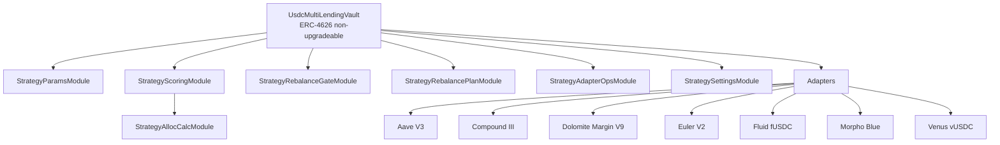

# multyr-strategies

> Production strategies for Multyr Protocol — USDC Lending V9.1.
> Audit package v4 assembled and verified; Spearbit/Sherlock engagement scheduled Q3 2026.
> Branch: `feature/p0.7-safety-adapter-tier` — see [`audit_p07_v4/`](audit_p07_v4/) for the submission package.

[](LICENSE)
[](https://getfoundry.sh)
[](https://github.com/Multyr/multyr-strategies/actions)

---

## Overview

`multyr-strategies` contains the production lending strategies that plug into the Multyr
core vault (`multyr-core/CoreVault`). The sole published strategy is **USDC Lending V9.1**
— a multi-adapter yield aggregator deployed on Arbitrum One.

The strategy accepts USDC from a `CoreAggregatorVault` and autonomously distributes capital
across up to seven lending protocol adapters (Aave V3, Compound III, Dolomite, Euler V2,
Fluid, Morpho Blue, Venus) through a keeper-driven scoring, capping, and multi-step
rebalancing system.

Each strategy published in this repository has completed internal pre-audit hardening before
promotion. Strategies in development (Multiply, PT-Multiply) are kept in
`multyr-strategies-dev` (private) until they reach the same standard (ADR-003). Publishing
a strategy here is the promotion event; the public git history starts at the first clean
commit.

---

## Architecture



The main controller (`UsdcMultiLendingVault`) is a stateless dispatcher. Functions not
defined directly on the controller are routed to one of six delegatecall modules via the
`fallback()` dispatcher. All modules inherit `StrategyStorageLayout` to guarantee storage
slot alignment in the delegatecall context. There is no proxy pattern — the contract
stack is non-upgradeable.

See [`docs/overview.md`](docs/overview.md) for the full contract stack and module dispatch
semantics.

See [`docs/adapters.md`](docs/adapters.md) for per-adapter deposit modes, APY computation
methods, and security properties.

---

## Key Concepts & Invariants

- **USDC conservation**: total USDC tracked by the strategy (idle + deployed across all
  adapters) must equal `totalAssets()` at every state boundary. No rounding loss exceeding
  1 wei per operation is permitted. Verified by 14 Halmos symbolic proofs.
- **Adapter cap enforcement**: per-adapter absolute exposure cannot exceed
  `STRUCTURAL_BASE × RISK_OVERLAY × FAILURE_OVERLAY × LIQUIDITY_OVERLAY`. No allocation
  step bypasses the four-layer cap engine regardless of scoring output.
- **Non-upgradeable strategy**: `UsdcMultiLendingVault` uses no proxy pattern.
  The delegatecall module set is fixed at construction; no `setModule()` function exists.
- **Role finality after bootstrap**: `BOOTSTRAP_ROLE` is renounced after adapter
  registration. `DEFAULT_ADMIN_ROLE` is transferred to Timelock. No role can be re-granted
  to the deployer EOA post-deploy.
- **Stale APY fallback defined**: the Aave V3 adapter uses a three-source priority chain
  (admin override then keeper-pushed rate then on-chain `getReserveData()` fallback).
  APY never silently degrades to zero on keeper delay.
- **Rebalance plan expiry**: any outstanding rebalance plan expires after two hours.
  Stale plans are invalidated before the next `prepareRebalance()` call. No plan persists
  indefinitely.
- **DegradedMode circuit breaker**: `degradedModeActive` halts rebalancing and harvest
  when triggered. Three objective on-chain conditions can trigger it; clearance requires
  explicit governance action via `clearDegradedMode()`. No automatic re-entry after clear.
- **Rebalance gate P0–P3**: any rebalance is blocked unless all four gates pass
  (execution cost, hysteresis, coordination, regime). No keeper can bypass gates.
- **TVL zero-allocation guard**: a zero-valued TVL cache timestamp (never poked) results
  in ZERO allocation band — the adapter receives no capital until the first keeper poke.
  Stale TVL is treated as MICRO (30%) not zero, preventing blackout on keeper delay.
- **Euler PUSH mode one-time approval**: the Euler adapter sets a one-time unlimited
  Permit2 approval at construction. `initializeMarkets()` must run before admin role
  transfer; the bootstrap sequence enforces this invariant.

See [`docs/invariants.md`](docs/invariants.md) for the full formal invariant set and
[`docs/threat-model.md`](docs/threat-model.md) for the attack surface analysis.

---

## Adapter Registry

| Adapter | Protocol | Deposit mode | APY source |
|---|---|---|---|
| `AaveV3USDCAdapter` | Aave V3 (Arbitrum One) | PULL | 3-source hybrid (admin override, keeper, on-chain fallback) |
| `CometUsdcMultiMarketAdapter` | Compound III / Comet | PULL | Keeper-pushed utilization rate |
| `DolomiteUsdcMultiMarketAdapter` | Dolomite Margin V9 | PULL | Keeper-pushed WAD rate via `DolomiteSupplyRateProvider` |
| `EulerUsdcMultiMarketAdapter` | Euler V2 (EVault) | PUSH | `interestRate()` in ray (EVault native) |
| `FluidUsdcMultiMarketAdapter` | Fluid fUSDC | PULL | PPS snapshot delta (keeper-poked) |
| `MorphoUsdcMultiMarketAdapter` | Morpho Blue vaults | PULL | PPS snapshot with staleness cache |
| `VenusUsdcMultiMarketAdapter` | Venus vUSDC_Core | PULL | `supplyRatePerBlock × BLOCKS_PER_YEAR` (Arbitrum-only guard) |

See [`docs/adapters.md`](docs/adapters.md) for full per-adapter security properties,
role tables, and APY computation details.

---

## Modules

| Contract | File | Priority | Purpose |
|---|---|---|---|
| `UsdcMultiLendingVault` | `controller/UsdcLendingStrategy.sol` | CRITICAL | Main controller, fallback dispatcher, deposit/withdraw lifecycle |
| `StrategyStorageLayout` | `controller/StrategyStorageLayout.sol` | CRITICAL | Single source of truth for storage layout, constants, custom errors |
| `StrategyScoringModule` | `controller/StrategyScoringModule.sol` | CRITICAL | Scoring pipeline entry, DegradedMode checks, delegatecall to AllocCalc |
| `StrategyAllocCalcModule` | `controller/StrategyAllocCalcModule.sol` | CRITICAL | Pure allocation pipeline: compute, normalize, sort, cap |
| `StrategyRebalancePlanModule` | `controller/StrategyRebalancePlanModule.sol` | HIGH | Phase 1+2 of 3-phase rebalance state machine |
| `StrategyRebalanceGateModule` | `controller/StrategyRebalanceGateModule.sol` | HIGH | P0-P3 gate check before any rebalance is prepared |
| `StrategySettingsModule` | `controller/StrategySettingsModule.sol` | HIGH | 45+ governance admin setters |
| `StrategyAdapterOpsModule` | `controller/StrategyAdapterOpsModule.sol` | HIGH | Safe adapter deposit with failure tracking |
| `StrategyParamsModule` | `controller/StrategyParamsModule.sol` | MEDIUM | TVL poke, parameter setters for keeper writes |
| `LendingStrategyUpkeep` | `automation/LendingStrategyUpkeep.sol` | HIGH | Chainlink Automation keeper (harvest, poke-APY, rebalance, deploy-idle) |
| `RewardSwapHelper` | `swap/RewardSwapHelper.sol` | HIGH | Chainlink-anchored reward swap with Uniswap V3 to Camelot V3 fallback |
| `StrategyBootstrapper` | `StrategyBootstrapper.sol` | MEDIUM | One-shot adapter registration; BOOTSTRAP_ROLE renounced post-deploy |
| `StrategyExplainabilityLens` | `lens/StrategyExplainabilityLens.sol` | LOW | Read-only scoring explainability (best-effort, not authoritative) |

Total audit scope: 23 Solidity files, 11,974 lines. See [`docs/audit-scope.md`](docs/audit-scope.md)
for in-scope file list and line count breakdown.

---

## Repo Layout

```
multyr-strategies/
|- src/
|   \- strategies/
|       \- usdc-lending/
|           |- UsdcLendingStrategy.sol     Main controller (UsdcMultiLendingVault)
|           |- StrategyBootstrapper.sol    One-shot deploy helper
|           |- controller/                 StrategyStorageLayout + 6 delegatecall modules
|           |- adapters/
|           |   |- lending/                Seven lending adapter contracts
|           |   \- rates/                  AaveLiquidityRateProvider, DolomiteSupplyRateProvider
|           |- automation/                 LendingStrategyUpkeep
|           |- interfaces/                 ILendingAdapter, IAdapterEmergency
|           |- lens/                       StrategyExplainabilityLens
|           \- swap/                       RewardSwapHelper
|- lib/
|   |- multyr-core/                        GitHub submodule
|   \- multyr-periphery/                   GitHub submodule
|- docs/                                   Overview, adapters, audit-scope, invariants, threat-model
|- audits/                                 Signed external audit PDFs (empty until first published audit)
|- audit_p07_v4/                           Audit submission package v4 (SHA256: 028e6223...)
|   |- REPRODUCTION.md                     Deterministic reproduction steps (pinned block 472761449)
|   |- THREAT_MODEL.md                     Attack surface, trust assumptions, out-of-scope risks
|   |- EVIDENCE/                           Test output captures (Halmos, Echidna, fork, coverage)
|   |- BACKTEST/                           Scoring simulation validation data
|   |- SIGNOFF/                            Cowork sign-off documents (R12_AUDIT, GAS_NOTES, etc.)
|   \- SRC_SNAPSHOT/                       Frozen source snapshots of 8 critical modules
|- SECURITY.md
|- CONTRIBUTING.md
\- LICENSE
```

---

## Cross-Repo Dependencies

`multyr-strategies` depends on two upstream repositories for shared interfaces.

| Dependency | Type | Import alias | Purpose |
|---|---|---|---|
| `multyr-core` | GitHub submodule | `@multyr-core/` | `IStrategy`, `ICoreVault`, `IStrategyRouter`, shared role constants |
| `multyr-periphery` | GitHub submodule | `@multyr-periphery/` | `IRewardsDistributor` (LendingStrategyUpkeep harvest routing) |

Remappings in `foundry.toml`:
```
@multyr-core/=lib/multyr-core/src/
@multyr-periphery/=lib/multyr-periphery/src/
```

The strategy itself (`UsdcMultiLendingVault`) has no direct dependency on periphery
contracts at execution time. The periphery submodule dependency is limited to the keeper
contract (`LendingStrategyUpkeep`) for post-harvest fee routing.

---

## Documentation

| Document | Location | Content |
|---|---|---|
| Architecture overview | `docs/overview.md` | Contract stack, module dispatch, storage layout, rebalance lifecycle |
| Adapter reference | `docs/adapters.md` | Per-adapter deposit modes, APY methods, security properties, role tables |
| Audit scope | `docs/audit-scope.md` | In-scope files, line counts, critical architecture notes, known waivers |
| Formal invariants | `docs/invariants.md` | USDC conservation, RBAC, queue semantics |
| Threat model | `docs/threat-model.md` | Attack surface analysis, trust assumptions, out-of-scope risks |

---

## Audits

No external audits have been completed yet. USDC Lending V9.1 has completed internal
pre-audit hardening (P0.7 Safety Adapter Cap Tier sprint). The first engagement is scheduled
for Spearbit/Sherlock in 2026-Q3.

**Audit submission package v4** is committed at [`audit_p07_v4/`](audit_p07_v4/).
Entry point: [`audit_p07_v4/README.md`](audit_p07_v4/README.md).
Reproduction: [`audit_p07_v4/REPRODUCTION.md`](audit_p07_v4/REPRODUCTION.md) (deterministic,
pinned block 472761449).

When third-party security audit reports are published, the signed PDF files will appear
in [`audits/`](audits/).

For internal security work — hardening reports, automated tool outputs (Slither, Halmos,
Echidna, Aderyn), and self-reviews — see `audit_p07_v4/EVIDENCE/` and the `multyr-research`
repository (private, available to qualified reviewers on request).

| Date | Auditor | Scope | Findings | Report |
|---|---|---|---|---|
| Planned 2026-Q3 | TBD (Spearbit/Sherlock) | `multyr-strategies` v1.0 — USDC Lending V9.1 P0.7 | — | — |

Bug bounty program: forthcoming (Immunefi — link to be published after first signed
audit report).

---

## Security

To report a vulnerability, email **security@multyr.fi** or see [`SECURITY.md`](SECURITY.md)
for the full responsible disclosure process, severity classification (CVSS v3.1), and
response timeline.

Acknowledged within 48 hours. Critical findings triaged within 72 hours.
Do not open public GitHub issues for security vulnerabilities.

---

## Build and Test

### Prerequisites

- [Foundry](https://book.getfoundry.sh/) `forge` >= 0.2.0
- Git with submodule support
- For fork tests: Arbitrum One archive RPC endpoint (`ARBITRUM_RPC_URL`)

### Setup

```bash
git clone --recurse-submodules https://github.com/Multyr/multyr-strategies
cd multyr-strategies
forge install
```

### Build

```bash
forge build
```

Build configuration: `via_ir = true`, `optimizer_runs = 200`, Solidity `0.8.28`
(controller and adapters); `0.8.24` (rate providers, interfaces).

### Test

```bash
# Unit and integration tests (no RPC required)
forge test

# Fork tests against live Arbitrum state (requires RPC)
ARBITRUM_RPC_URL=<rpc> forge test --match-path "test/fork/**"

# Halmos formal verification (symbolic execution)
FOUNDRY_PROFILE=lending halmos
```

Test suite baseline (branch `feature/p0.7-safety-adapter-tier`): **2004 tests, 0 fail**.
Includes unit/fuzz/integration tests (controller + adapters), 4 adversarial fork E2E tests
pinned at Arbitrum One block 472761449, 14 Halmos symbolic proofs of USDC conservation /
RBAC / queue FIFO (0 counterexamples), Echidna fuzzing campaign (corpus in
`test/strategies/usdc-lending/echidna/corpus/`), and 26 safety-tier P0.7 negative-path
tests. Coverage report: [`coverage/COVERAGE_BREAKDOWN_PER_FILE.md`](coverage/COVERAGE_BREAKDOWN_PER_FILE.md).

---

## Deployment

Deployment is managed in `multyr-deployment` (private). No deployment artifacts are
committed to this repository.

Three invariants govern the deploy sequence: (1) `EulerUsdcMultiMarketAdapter.initializeMarkets()`
must run before `DEFAULT_ADMIN_ROLE` is transferred to Timelock; (2) the deployer receives
no roles; (3) `BOOTSTRAP_ROLE` is renounced after bootstrap completes.

| Network | Status |
|---|---|
| Arbitrum One | Pending first external audit (scheduled 2026-Q3) |

---

## Governance

The strategy is governed by the Multyr Foundation timelocked multisig via
`DEFAULT_ADMIN_ROLE`. Governance actions — adding or toggling adapters, updating scoring
weights and exposure caps, clearing `degradedModeActive`, configuring reward pipelines —
all flow through the Timelock. Minimum delay is enforced at the Timelock level. The
strategy has no self-updating or oracle-driven parameter modification.

| Role | Capabilities |
|---|---|
| `DEFAULT_ADMIN_ROLE` (Timelock multisig) | Adapter management, scoring weights, exposure caps, DegradedMode clearance |
| `KEEPER_ROLE` | `prepareRebalance`, `executeRebalanceStep`, APY poke, harvest |
| `BOOTSTRAP_ROLE` | Adapter registration only; renounced after bootstrap |

---

## License

The strategy contracts and adapters are licensed under the **Business Source License 1.1**
with an automatic conversion to GPL-2.0-or-later four years after the protocol's mainnet
launch date. See [`LICENSE`](LICENSE) for full terms.

The Solidity interfaces in `src/strategies/usdc-lending/interfaces/` are additionally
available under the **MIT License** — see
[`src/strategies/usdc-lending/interfaces/LICENSE-INTERFACES`](src/strategies/usdc-lending/interfaces/LICENSE-INTERFACES).

---

## Contributing

See [`CONTRIBUTING.md`](CONTRIBUTING.md). This repository contains only strategies that
have completed internal pre-audit hardening. Development work on new or in-progress
strategies belongs in `multyr-strategies-dev` (private).

---

## Links

- Protocol: [multyr.fi](https://multyr.fi)
- Core protocol: [Multyr/multyr-core](https://github.com/Multyr/multyr-core)
- Periphery: [Multyr/multyr-periphery](https://github.com/Multyr/multyr-periphery)
- Subgraphs: [Multyr/subgraphs](https://github.com/Multyr/subgraphs)
- Security contact: security@multyr.fi
