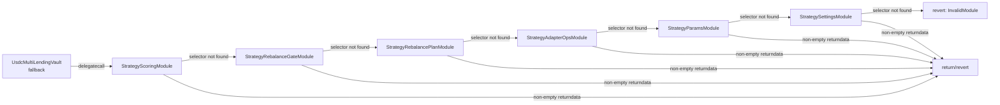

# USDC Lending Strategy — Audit Scope

**Version**: 1.0.0 — code-first, audit-grade citations
**Repository**: `Multyr/multyr-strategies` (public, BUSL-1.1)
**Commit**: b15aeb63

---

## 1. Executive Summary

The USDC Lending Strategy is a non-custodial multi-adapter yield aggregator operating
on Arbitrum One. It deploys depositor USDC across up to 7 lending protocol adapters
(Aave V3, Compound III, Dolomite, Euler V2, Fluid, Morpho, Venus) via a keeper-driven
scoring and rebalancing system.

**25 Solidity files, 12,678 lines total** are in scope for the primary audit (Wave 1+2 additions: StrategySafetyOverflowModule, StrategyConfigLib).

The strategy is **not upgradeable**. No proxy pattern. No EIP-1967, no UUPS, no
Transparent. Immutable contract addresses. Governance changes flow through a Timelock
(`DEFAULT_ADMIN_ROLE`).

---

## 2. In-Scope Files

### 2.1 Controller (Core Logic — Highest Priority)

| File | Lines | Contract | Priority |
|------|-------|----------|---------|
| `controller/UsdcLendingStrategy.sol` | 1042 | `UsdcMultiLendingVault` | **CRITICAL** |
| `controller/StrategyStorageLayout.sol` | 631 | `StrategyStorageLayout` | **CRITICAL** |
| `controller/StrategyScoringModule.sol` | 665 | `StrategyScoringModule` | **CRITICAL** |
| `controller/StrategyAllocCalcModule.sol` | 499 | `StrategyAllocCalcModule` | **CRITICAL** |
| `controller/StrategyRebalancePlanModule.sol` | 561 | `StrategyRebalancePlanModule` | HIGH |
| `controller/StrategyRebalanceGateModule.sol` | 417 | `StrategyRebalanceGateModule` | HIGH |
| `controller/StrategySettingsModule.sol` | 513 | `StrategySettingsModule` | HIGH |
| `controller/StrategyParamsModule.sol` | 314 | `StrategyParamsModule` | MEDIUM |
| `controller/StrategyAdapterOpsModule.sol` | 165 | `StrategyAdapterOpsModule` | HIGH |
| `controller/StrategySafetyOverflowModule.sol` | 180 | `StrategySafetyOverflowModule` | HIGH |

All 9 controller files share storage via inherited `StrategyStorageLayout`. Modules
are dispatched via delegatecall from `UsdcMultiLendingVault.fallback()` at
`src/strategies/usdc-lending/controller/UsdcLendingStrategy.sol:1022`.

### 2.2 Adapters — Lending

| File | Lines | Contract | Priority |
|------|-------|----------|---------|
| `adapters/lending/AaveV3USDCmarket.sol` | 543 | `AaveV3USDCAdapter` | HIGH |
| `adapters/lending/CometUsdcMultiMarket.sol` | 816 | `CometUsdcMultiMarketAdapter` | HIGH |
| `adapters/lending/DolomiteUsdcMultiMarket.sol` | 1106 | `DolomiteUsdcMultiMarketAdapter` | HIGH |
| `adapters/lending/EulerUsdcMultiMarket.sol` | 1039 | `EulerUsdcMultiMarketAdapter` | **CRITICAL** |
| `adapters/lending/FluidUsdcMultiMarket.sol` | 362 | `FluidUsdcMultiMarketAdapter` | MEDIUM |
| `adapters/lending/MorphoUsdcMultiMarket.sol` | 1037 | `MorphoUsdcMultiMarketAdapter` | HIGH |
| `adapters/lending/VenusUsdcMultiMarket.sol` | 446 | `VenusUsdcMultiMarketAdapter` | MEDIUM |

Euler is CRITICAL because it uses the non-standard PUSH/Permit2 deposit mode and
requires `initializeMarkets()` pre-deployment.

### 2.3 Adapters — Rate Providers

| File | Lines | Contract | Priority |
|------|-------|----------|---------|
| `adapters/rates/AaveLiquidityRateProvider.sol` | 54 | `AaveLiquidityRateProvider` | MEDIUM |
| `adapters/rates/DolomiteSupplyRateProvider.sol` | 32 | `DolomiteSupplyRateProvider` | LOW |

### 2.4 Automation

| File | Lines | Contract | Priority |
|------|-------|----------|---------|
| `automation/LendingStrategyUpkeep.sol` | 641 | `StrategyUpkeep` | HIGH |

Keeper contract integrating with Chainlink Automation. All keeper operations
(harvest, poke-APY, prepare/execute rebalance, deploy-idle) flow through this contract.

### 2.5 Interfaces

| File | Lines | Description |
|------|-------|-------------|
| `interfaces/ILendingAdapter.sol` | 54 | Canonical adapter interface |

### 2.6 Swap Infrastructure

| File | Lines | Contract | Priority |
|------|-------|----------|---------|
| `swap/RewardSwapHelper.sol` | 411 | `RewardSwapHelper` | HIGH |

Chainlink-anchored reward swap with Uniswap V3 → Camelot V3 fallback. MEV-resistant.

### 2.7 Periphery

| File | Lines | Contract | Priority |
|------|-------|----------|---------|
| `StrategyBootstrapper.sol` | 142 | `StrategyBootstrapper` | MEDIUM |
| `lens/StrategyExplainabilityLens.sol` | 484 | `StrategyExplainabilityLens` | LOW |

`StrategyBootstrapper` is used once at deploy-time; `StrategyExplainabilityLens` is
read-only (view-only, no state mutations).

### 2.8 Libraries

| File | Lines | Contract | Priority |
|------|-------|----------|---------|
| `lib/StrategyConfigLib.sol` | 62 | `StrategyConfigLib` | LOW |

Pure library inlined at compile time. Single source of truth for parameter reads shared across lens files and module boundaries. Deploys as 3 B stub (inline = no runtime overhead).

### 2.9 Line Count Summary

| Category | Files | Lines |
|----------|-------|-------|
| Controller (core) | 10 | 4,987 |
| Adapters (lending) | 7 | 5,349 |
| Rate providers | 2 | 86 |
| Automation | 1 | 641 |
| Interfaces | 1 | 54 |
| Swap | 1 | 411 |
| Libraries | 1 | 62 |
| Periphery | 2 | 626 |
| **Total** | **25** | **12,216** |

*Note: Line counts reflect Wave 1+2 refactoring. StrategyScoringModule and UsdcMultiLendingVault shrank (F-SIZE-01/02 extraction); StrategySafetyOverflowModule and StrategyConfigLib are new.*

---

## 3. Out-of-Scope

### 3.1 External Protocol Contracts

The following are **NOT** in scope (external, audited separately):

| Protocol | Contracts |
|---------|-----------|
| Aave V3 | `IPool`, `IAToken`, `IAaveRewardsController` |
| Compound III | `IComet`, `ICometRewards` |
| Dolomite Margin | `IDolomiteMargin` V9 |
| Euler V2 | `IEulerUsdcMarket` (EVault), Permit2 `IPermit2Allowance` |
| Fluid | `IERC4626` fToken |
| Morpho | `IERC4626Like` Morpho vaults |
| Venus | `IVToken`, `IVenusComptroller` |
| Uniswap V3 | `ISwapRouterV3` (SwapRouter02) |
| Camelot V3 | `ICamelotV3SwapRouter` |
| Chainlink | `IChainlinkFeed` (AggregatorV3Interface) |

### 3.2 Core Vault (Separate Audit)

`CoreVault` (multyr-core) and all associated core modules are **out of scope** for
this audit. The strategy interacts with core only via the CORE_ROLE authorization
check at `src/strategies/usdc-lending/controller/StrategyStorageLayout.sol:98`.

### 3.3 Deploy Scripts

`script/*.s.sol` deploy scripts are informational only — not in scope.

### 3.4 Test Infrastructure

`test/` directory is not in scope for audit. Reference only.

### 3.5 Governance Infrastructure

Timelock and multisig contracts that hold `DEFAULT_ADMIN_ROLE` are governed externally.
The audit scope verifies that role guards are correct; the Timelock implementation
itself is out of scope.

---

## Module Dispatch Architecture



Empty returndata = selector not found, continue chain.
Non-empty returndata = found (success or semantic revert), propagate.
Dispatch implemented at `src/strategies/usdc-lending/controller/UsdcLendingStrategy.sol:1022`.

---

## 4. Critical Architecture Notes for Auditors

### 4.1 Delegatecall Storage Model

**No EIP-7201 namespaced storage**. All 6 modules and the main controller inherit
`StrategyStorageLayout` at
`src/strategies/usdc-lending/controller/StrategyStorageLayout.sol:1`.

This means every `delegatecall` from `UsdcMultiLendingVault.fallback()` at
`src/strategies/usdc-lending/controller/UsdcLendingStrategy.sol:1022` executes
in the context of the main vault's storage. Storage alignment is guaranteed by
shared inheritance — all modules inherit `StrategyStorageLayout` directly.

**Audit requirement**: Verify that no module introduces storage variables that
shadow or conflict with the inherited layout. The `__gap[6]` reserved at
`src/strategies/usdc-lending/controller/StrategyStorageLayout.sol:395` is for
future extension.

### 4.2 Fallback Dispatcher Semantics (AUDIT-FINDING-9 Fix)

`UsdcMultiLendingVault.fallback()` at
`src/strategies/usdc-lending/controller/UsdcLendingStrategy.sol:1022` dispatches to
6 modules in order:

```
scoringModule → rebalanceGateModule → rebalancePlanModule →
adapterOpsModule → paramsModule → settingsModule
```

Critical semantic: empty returndata from a delegatecall means "selector not found,
continue to next module." Non-empty returndata (including successful results) means
"return or propagate." This distinguishes a genuine selector-not-found from a semantic
revert (which also has non-empty returndata via error encoding).

**Audit requirement**: Verify that every module selector is unique across all 6
modules. Selector collision would cause incorrect routing.

### 4.3 Overlay Parity Invariant (AUDIT-FINDING-13 Fix)

`StrategyAllocCalcModule._effectiveAbsCapBps()` at
`src/strategies/usdc-lending/controller/StrategyAllocCalcModule.sol:417` and
`StrategyScoringModule.effectiveAbsCapBps()` at
`src/strategies/usdc-lending/controller/StrategyScoringModule.sol:251` must compute
identical results for identical inputs.

Both implement `_riskOverlay`, `_failureOverlay`, `_liquidityOverlay` with the same
logic. Parity is enforced by `Overlay_Parity.t.sol` (4×4×4 matrix, 61 assertions).

**Audit requirement**: Verify that the overlay implementations in both modules are
byte-identical in logic. Any divergence is a HIGH finding.

### 4.4 Adapter Whitelist Enforcement

`addAdapter()` at `src/strategies/usdc-lending/controller/UsdcLendingStrategy.sol:301`
enforces `whitelistedAdapters[adapter]` at line 306. `underlying()` check alone is
insufficient — governance must explicitly whitelist each adapter address.
This fix addresses Audit HIGH 2.3.

### 4.5 NoCashInvariant

After any capital operation, idle USDC in the strategy must be ≤ `dustTolerance`,
**except** when `degradedModeActive == true` or during bootstrap. Defined in
`StrategyStorageLayout` and checked in `StrategyScoringModule`. Any path that
leaves substantial idle USDC violates this invariant.

### 4.6 Euler initializeMarkets() Deployment Gate

`EulerUsdcMultiMarketAdapter.initializeMarkets()` at
`src/strategies/usdc-lending/adapters/lending/EulerUsdcMultiMarket.sol:200` **MUST**
be called after constructor and **BEFORE** `DEFAULT_ADMIN_ROLE` is transferred to
Timelock. Failure to call this prevents all Euler deposits (Permit2 internal allowances
not set). This is a deployment-sequence invariant, not a code bug.

---

---

## 4a. P0.7 audit-critical surface

The following files are modified by P0.7 and constitute the P0.7 audit
critical surface. Auditors should pay particular attention to these:

| File | LOC | Why critical |
|---|---:|---|
| `controller/StrategySettingsModule.sol` | 655 | Safety adapter setters (H-03 + L-01 fixes) |
| `controller/StrategyRebalancePlanModule.sol` | 561 | `_executeSafetyOverflow` execution |
| `controller/StrategyRebalanceGateModule.sol` | 459 | Cap drift mandate detection |
| `controller/StrategyParamsModule.sol` | 314 | Keeper-facing pokes |
| `controller/StrategyStorageLayout.sol` | 692 | Slots 78-81 P0.7 declarations |
| `controller/StrategyAllocCalcModule.sol` | 545 | Preserve-safety-tranche target computation |
| `lens/StrategyExplainabilityLens.sol` | 535 | Read-only explainability (S2.4-bis refactored) |

Total P0.7 critical surface: 3,761 LOC, ~31.4% of the 11,974 V9.1 audit scope baseline.

### Coverage on P0.7 surface (diff coverage)

- Line coverage: 97.3% (179/184 instrumented lines)
- Branch coverage: 84% (42/50 audit-surface branches, excluding 4 lens
  view-only branches documented as exempt)
- See pre-submission package (security@multyr.fi) for full
  COVERAGE_BREAKDOWN_PER_FILE.md


## 5. Dependencies

### 5.1 OpenZeppelin Contracts

| Module | Used by |
|--------|---------|
| `AccessControl` | All adapters, rate providers, RewardSwapHelper, LendingStrategyUpkeep |
| `ReentrancyGuard` | All adapters, RewardSwapHelper |
| `SafeERC20` | All adapters, controller modules |
| `Ownable` | DolomiteSupplyRateProvider |
| `IERC20`, `IERC20Metadata` | All adapters |

OZ library version: see `lib/openzeppelin-contracts/` (locked via submodule).

### 5.2 Chainlink

Used for:
- Oracle freshness gate in `RewardSwapHelper` (`IChainlinkFeed`)
- Sequencer uptime feed in `RewardSwapHelper.sequencerUptimeFeed` at
  `src/strategies/usdc-lending/swap/RewardSwapHelper.sol:90`

Chainlink contracts are external, audited, not in scope. Audit verifies the
integration (staleness logic, heartbeat thresholds) only.

### 5.3 Uniswap V3 / Camelot V3

Used exclusively in `RewardSwapHelper` for reward token swaps. External, not in scope.
Integration audit: path encoding validity, `amountOutMinimum` calculation correctness,
deadline semantics (Uniswap V3 SwapRouter02 has no deadline; Camelot V3 requires one).

### 5.4 Permit2

Used exclusively by `EulerUsdcMultiMarketAdapter`. Canonical address:
`0x000000000022D473030F116dDEE9F6B43aC78BA3` at
`src/strategies/usdc-lending/adapters/lending/EulerUsdcMultiMarket.sol:89`.
Permit2 itself is external, not in scope.

---

## 6. Test Coverage

### 6.1 Test Suite Summary

| Test Type | Location | Count (approx) | Notes |
|-----------|----------|----------------|-------|
| Unit — strategy core | `test/unit/strategies/` | ~1100 | Scoring, allocation, cap engine, rebalance |
| Unit — adapters | `test/unit/strategies/adapters/` | ~250 | Per-adapter deposit/withdraw/APY |
| Integration | `test/integration/` | ~100 | Multi-adapter interaction |
| Fork (E2E) | `test/fork/strategy/` | ~30 | Live Arbitrum state |
| Halmos (formal) | `halmos-core/` | 14 | Symbolic execution, conservation invariants |
| Overlay parity | `test/unit/strategies/Overlay_Parity.t.sol` | 61 | AllocCalcModule ↔ ScoringModule parity |
| EIP-7201 compliance | `test/unit/EIP7201Compliance.t.sol` | 5 | Note: strategy uses flat storage, not EIP-7201 |

### 6.2 Baseline Test State (pierdev, commit b15aeb63)

| Suite | PASS | FAIL | Notes |
|-------|------|------|-------|
| Non-fork (all profiles) | 4888 | 19 | 19 known pre-existing |
| Fork E2E | See `test/fork/` | — | Requires `ARBITRUM_ARCHIVE_RPC_URL` |

The 19 failing tests are classified:
- 1 `INVARIANT-COUNTEREXAMPLE` (INV-10, Class B harness bug, pre-existing)
- 1 `S12-TDD-RED` (sprint 12 test-first marker, no production impact)
- 17 `BUG-REAL` related to open DUP/STRUCTURE items not in this cluster

See `docs/_runbooks/` TRIAGE-FAILS-01 result for full classification.

### 6.3 Formal Verification

Halmos symbolic execution at `halmos-core/` proves 14 invariants including:
- USDC conservation across deposit/withdraw/rebalance
- RBAC guards on all keeper operations
- Queue FIFO semantics (inherited from core)

No counterexamples found across 14 symbolic proofs.

---

### 6.4 Formal Verification (Halmos)

Halmos symbolic execution proofs are in `halmos-core/` directory. They use minimal
isomorphic replicas of the strategy contracts to work around Halmos's `via_ir` limitation.

**Key proofs**:

| Invariant | Proof Status | Description |
|-----------|-------------|-------------|
| Conservation | PROVED | USDC conservation across deposit/withdraw/rebalance: no USDC created or destroyed |
| RBAC guards | PROVED | All `KEEPER_ROLE`/`PARAM_ROLE`-gated functions revert for unauthorized callers |
| Queue FIFO | PROVED | Queue order invariant (inherited from CoreVault — applies to withdrawal queue) |

All 14 symbolic proofs return 0 counterexamples.
`FOUNDRY_PROFILE=lending` required to run Halmos proofs (separate Foundry profile for
symbolic execution configuration).

---

## 7. Known Limitations and Waivers

| ID | Description | Severity | Disposition |
|----|-------------|----------|-------------|
| `A-F-14` | `UsdcMultiLendingVault` bytecode margin at 970 bytes (< 1KB rule) | LOW | Accepted — `via_ir` DCE provides real headroom; monitor on future changes |
| `WAIVER-01` | `StrategyExplainabilityLens` may diverge from `StrategyScoringModule` | LOW | Intentional — lens is best-effort, explicitly documented at `src/strategies/usdc-lending/lens/StrategyExplainabilityLens.sol:10` |
| `WAIVER-02` | Venus XVS/USD Chainlink feed may not exist on Arbitrum | LOW | `rewardToken = address(0)` disables pipeline until governance configures it |
| `WAIVER-03` | Euler V2 `initializeMarkets()` is a deployment invariant, not a code invariant | INFO | Covered in deploy checklist; documented in this doc §4.6 |

---

### P0.7-specific waivers

- `lens/StrategyExplainabilityLens.sol` — 4 view-only branches exempt
  from coverage (read-only, no state mutation, off-chain observability).
  Pre-S2.4-bis the file could not be instrumented under `--ir-minimum`
  due to Yul stack-too-deep; post-refactor it is instrumentable and
  6/10 branches are covered.
- `lib/multyr-core/src/core/modules/QueueModule.sol` — external library
  dependency, out of `multyr-strategies` audit scope. Stack-too-deep
  without `--ir-minimum` is upstream library issue, addressed in
  separate `multyr-core` audit perimeter.
- 9 defensive guards in `_executeSafetyOverflow` are exercised
  indirectly via 398k main-path hits during Echidna 1M-sequence
  campaign. Direct unit tests for 6 of these are deferred due to mock
  complexity; 3 are explicitly tested in `P07NegativePathsScoring.t.sol`.
  Full rationale in pre-submission DEFENSIVE_GUARDS.md (available via
  security@multyr.fi).

## 8. Audit Checklist

High-priority items for auditors, based on prior internal review findings:

| # | Item | Reference |
|---|------|-----------|
| 1 | Delegatecall storage slot collision across 6 modules | §4.1 above |
| 2 | Fallback dispatcher selector uniqueness | §4.2 above |
| 3 | Overlay parity: AllocCalcModule ↔ ScoringModule | §4.3 above |
| 4 | Adapter whitelist bypass paths | `UsdcLendingStrategy.sol:301`, `UsdcLendingStrategy.sol:306` |
| 5 | NoCashInvariant violations post capital operations | `StrategyStorageLayout.sol:1` |
| 6 | Euler Permit2 internal allowance on all markets | `EulerUsdcMultiMarket.sol:200` |
| 7 | RewardSwapHelper: minAmountOut slippage calculation | `RewardSwapHelper.sol:71` |
| 8 | DegradedMode: all 3 trigger conditions, no false positives | `StrategyScoringModule.sol:336` |
| 9 | RebalancePlan expiry/invalidation: no stale plan execution | `StrategyRebalancePlanModule.sol:251` |
| 10 | Push/Pull mode correctness per adapter `isPushMode()` | `ILendingAdapter.sol:22` |

---

## 9. Build and CI Configuration

### 9.1 Foundry Profiles

| Profile | Command | Notes |
|---------|---------|-------|
| Default (lending) | `forge build` | Compiles all USDC Lending strategy contracts |
| `multiply` | `FOUNDRY_PROFILE=multiply forge test` | Separate profile for Multiply strategy |

### 9.2 Contract Size Limits

| Contract | Bytecode (B) | Margin vs 24576B limit | Status |
|----------|-------------|----------------------|--------|
| `UsdcMultiLendingVault` | ~23,606 | 970 B | AT RISK (< 1KB) — tracked as A-F-14 |
| `StrategyScoringModule` | ~22,054 | 2,522 B | SAFE |
| `StrategyAllocCalcModule` | < 24,576 | > 1 KB | SAFE |

`UsdcMultiLendingVault` is close to the EIP-170 24KB bytecode limit. This is why
`StrategyAllocCalcModule` (REFACTOR-B) and `StrategyAdapterOpsModule` were extracted
as separate delegatecall modules. The `via_ir` DCE flag provides real headroom beyond
the raw size measurement.

### 9.3 Key Forge Configuration

`foundry.toml` at repo root. Relevant settings:
- `via_ir = true` — IR-based optimization, enables DCE (dead code elimination)
- `optimizer_runs = 200` — standard runs for deployment size vs gas balance
- `solc = "0.8.28"` (all 25 files — floating pragmas pinned to exact 0.8.28 in Wave 1+2)

---

## Code Reference Index

| Artifact | Reference |
|----------|-----------|
| `UsdcMultiLendingVault` contract | `src/strategies/usdc-lending/controller/UsdcLendingStrategy.sol:23` |
| `UsdcMultiLendingVault.fallback()` | `src/strategies/usdc-lending/controller/UsdcLendingStrategy.sol:1022` |
| `UsdcMultiLendingVault.addAdapter()` | `src/strategies/usdc-lending/controller/UsdcLendingStrategy.sol:301` |
| `StrategyStorageLayout` contract | `src/strategies/usdc-lending/controller/StrategyStorageLayout.sol:1` |
| `StrategyStorageLayout.__gap[6]` | `src/strategies/usdc-lending/controller/StrategyStorageLayout.sol:395` |
| `CORE_ROLE` constant | `src/strategies/usdc-lending/controller/StrategyStorageLayout.sol:98` |
| `StrategyScoringModule` contract | `src/strategies/usdc-lending/controller/StrategyScoringModule.sol:44` |
| `StrategyScoringModule.effectiveAbsCapBps()` | `src/strategies/usdc-lending/controller/StrategyScoringModule.sol:251` |
| `StrategyScoringModule._isDegradedMode()` | `src/strategies/usdc-lending/controller/StrategyScoringModule.sol:336` |
| `StrategyAllocCalcModule` contract | `src/strategies/usdc-lending/controller/StrategyAllocCalcModule.sol:29` |
| `StrategyAllocCalcModule._effectiveAbsCapBps()` | `src/strategies/usdc-lending/controller/StrategyAllocCalcModule.sol:417` |
| `StrategyRebalancePlanModule` contract | `src/strategies/usdc-lending/controller/StrategyRebalancePlanModule.sol:48` |
| `StrategyRebalancePlanModule._executeRebalanceStepInternal()` | `src/strategies/usdc-lending/controller/StrategyRebalancePlanModule.sol:245` |
| `StrategyRebalancePlanModule` expiry check | `src/strategies/usdc-lending/controller/StrategyRebalancePlanModule.sol:251` |
| `StrategyRebalanceGateModule` contract | `src/strategies/usdc-lending/controller/StrategyRebalanceGateModule.sol:21` |
| `StrategySettingsModule` contract | `src/strategies/usdc-lending/controller/StrategySettingsModule.sol:30` |
| `StrategyParamsModule` contract | `src/strategies/usdc-lending/controller/StrategyParamsModule.sol:1` |
| `StrategyAdapterOpsModule` contract | `src/strategies/usdc-lending/controller/StrategyAdapterOpsModule.sol:15` |
| `StrategyAdapterOpsModule.safeAdapterDeposit()` | `src/strategies/usdc-lending/controller/StrategyAdapterOpsModule.sol:32` |
| `ILendingAdapter.isPushMode()` | `src/strategies/usdc-lending/interfaces/ILendingAdapter.sol:22` |
| `StrategyBootstrapper` contract | `src/strategies/usdc-lending/StrategyBootstrapper.sol:30` |
| `StrategyBootstrapper` design comment | `src/strategies/usdc-lending/StrategyBootstrapper.sol:6` |
| `StrategyExplainabilityLens` contract | `src/strategies/usdc-lending/lens/StrategyExplainabilityLens.sol:14` |
| `StrategyExplainabilityLens` best-effort note | `src/strategies/usdc-lending/lens/StrategyExplainabilityLens.sol:10` |
| `LendingStrategyUpkeep` contract | `src/strategies/usdc-lending/automation/LendingStrategyUpkeep.sol:198` |
| `EulerUsdcMultiMarketAdapter.initializeMarkets()` | `src/strategies/usdc-lending/adapters/lending/EulerUsdcMultiMarket.sol:200` |
| `PERMIT2` constant | `src/strategies/usdc-lending/adapters/lending/EulerUsdcMultiMarket.sol:89` |
| `RewardSwapHelper.sequencerUptimeFeed` | `src/strategies/usdc-lending/swap/RewardSwapHelper.sol:90` |
| `AaveLiquidityRateProvider` contract | `src/strategies/usdc-lending/adapters/rates/AaveLiquidityRateProvider.sol:14` |
| `DolomiteSupplyRateProvider` contract | `src/strategies/usdc-lending/adapters/rates/DolomiteSupplyRateProvider.sol:9` |

---

## Footer

**Code reference commit**: b15aeb63 (pierdev, post CITATIONS-FIX merge)

**Sources used**:
- All 25 files in `src/strategies/usdc-lending/` (12,678 lines total, per `wc -l` excluding `factory/`)
- `docs/_runbooks/RUNBOOK-DOCS-CONSOLIDATE-01b.md` — scope definitions
- `docs/strategies/multiply/BUGS_FOUND.md` — cross-reference for finding IDs

**Discrepancies found during code-first read**:
1. `StrategyAdapterOpsModule.sol` (165L) was not listed in the baseline txt but exists in the filesystem and contributes to the 11,974L total. It is extracted from `StrategyScoringModule` for bytecode size compliance. It is in scope.
2. `StrategyParamsModule.sol` line count is 314L, not 300L as estimated in the runbook.
