# USDC Lending Strategy — Deployment Guide

> **Target chain**: Arbitrum One (`chainId = 42161`)
> **Prerequisite**: Core system deployed via `multyr-core/script/DeployCoreSystem.s.sol`
> **Deploy script**: `multyr-strategies/script/DeployUsdcLendingStrategy.s.sol:202`

---

## Architecture Overview

The USDC Lending Strategy uses a **V9.1 3-contract split** pattern where strategy logic is factored across
delegatecall modules. The main controller (`UsdcMultiLendingVault`) holds no logic bytecode of its own —
it delegates to four core modules and three optional modules.

```
UsdcMultiLendingVault (controller)
├── StrategyParamsModule        — stores all tunable parameters
├── StrategyScoringModule       — computes allocation scores + effectiveAbsCapBps
├── StrategyAdapterOpsModule    — executes adapter operations (deposit/withdraw/poke)
├── StrategyRebalanceGateModule — guards rebalance cadence + drift checks
├── StrategySettingsModule      (optional) — settings management
├── StrategyAllocCalcModule     (optional) — pure allocation computation
└── StrategyRebalancePlanModule (optional) — rebalance plan generation

StrategyBootstrapper (one-shot) — registers 7 adapters, then self-destructs BOOTSTRAP_ROLE
StrategyUpkeep                  — Chainlink-compatible automation keeper
```

The strategy interacts with **7 lending adapters** across 5 protocols:
- **Aave V3** — 1 market (USDC pool)
- **Morpho** — 5 markets (Gauntlet Core, Hyperithm Apex, Steakhouse HY, Gauntlet Prime, Yearn Degen)
- **Compound III (Comet)** — 1 market (USDC V3)
- **Euler V2** — 4 markets
- **Dolomite** — 1 market (dUSDC)
- **Fluid** — 1 market (fUSDC)
- **Venus** — 1 market (vUSDC)

---

## Prerequisites

| Requirement | Source | Notes |
|---|---|---|
| Core system deployed | `multyr-core/script/DeployCoreSystem.s.sol:202` | `VAULT_ADDRESS`, `STRATEGY_ROUTER_ADDRESS`, `BUFFER_MANAGER_ADDRESS`, `HEALTH_REGISTRY_ADDRESS` from its output |
| Timelock deployed | `multyr-deployment/script/DeployTimelock.s.sol:30` | `TIMELOCK_ADDRESS` — for `DO_SEAL=true` |
| Deployer has ≥0.001 USDC | Euler Permit2 dust | `multyr-strategies/script/DeployUsdcLendingStrategy.s.sol:393-400` — transfered to Euler adapter before `initializeMarkets()` |
| Deployer EOA | `DEPLOYER_PRIVATE_KEY` env var | Must own `DEFAULT_ADMIN_ROLE` on CoreVault and StrategyRouter |
| Arbitrum archive RPC | `RPC_URL` | Block confirmation times matter for broadcast |

---

## Environment Variables

### Required

```bash
DEPLOYER_PRIVATE_KEY      # deployer private key (hex, with 0x prefix)
VAULT_ADDRESS             # CoreVault address from DeployCoreSystem output
STRATEGY_ROUTER_ADDRESS   # StrategyRouter address
BUFFER_MANAGER_ADDRESS    # BufferManager address
HEALTH_REGISTRY_ADDRESS   # StrategyHealthRegistry address
GUARDIAN_ADDRESS          # guardian multisig
```

### Required when `DO_SEAL=true`

```bash
TIMELOCK_ADDRESS          # ROOT_TIMELOCK (TimelockController)
GLOBAL_CONFIG_ADDRESS     # GlobalConfig
PRICE_ORACLE_ADDRESS      # PriceOracleMiddleware
VAULT_FACTORY_ADDRESS     # VaultFactory
FEE_COLLECTOR_ADDRESS     # FeeCollector
SELECTOR_REGISTRY_ADDRESS # SelectorRegistry
SYSTEM_SEALER_ADDRESS     # SystemSealer
```

### Optional

```bash
INCENTIVES_ADDRESS        # default: address(0)
VETOER_ADDRESS            # default: address(0)
DO_SEAL                   # "true" → Phase 5 runs (seal + role transfer)
DEPLOY_UPKEEP             # default: true
DEPLOY_LENDING_ADAPTERS   # default: true
UNPAUSE_BUFFER            # default: true
ADAPTER_MAX_EXPOSURE_BPS  # uint16, default: 5000 (50%)
STRATEGY_OUTPUT_JSON      # output path; default: broadcast/strategy-addresses.json
```

Source: `multyr-strategies/script/DeployUsdcLendingStrategy.s.sol:742-768`

---

## Arbitrum One Constants

| Symbol | Address | Note |
|---|---|---|
| `USDC` | `0xaf88d065e77c8cC2239327C5EDb3A432268e5831` | Native bridged USDC |
| `AAVE_POOL` | `0x794a61358D6845594F94dc1DB02A252b5b4814aD` | Aave V3 Pool |
| `AAVE_AUSDC` | `0x724dc807b04555b71ed48a6896b6F41593b8C637` | aUSDC receipt token |
| `COMET_USDC_V3` | `0x9c4ec768c28520B50860ea7a15bd7213a9fF58bf` | Compound III USDC |
| `DOLOMITE_dUSDC` | `0x444868B6e8079ac2c55eea115250f92C2b2c4D14` | Dolomite dUSDC |
| `FLUID_FUSDC` | `0x1A996cb54bb95462040408C06122D45D6Cdb6096` | Fluid fUSDC |
| `VENUS_VTOKEN` | `0x7D8609f8da70fF9027E9bc5229Af4F6727662707` | Venus vUSDC |

Source: `multyr-strategies/script/DeployUsdcLendingStrategy.s.sol:115-135`

---

## Deploy Sequence

```mermaid
graph TD
    A[Phase 1: Deploy 4 core modules<br/>ParamsModule + ScoringModule + AdapterOpsModule + RebalanceGateModule] --> B
    B[Phase 1.1: Deploy UsdcMultiLendingVault<br/>assembly CREATE nonce control] --> C
    C[Phase 1.2: Deploy StrategyBootstrapper<br/>BOOTSTRAP_ROLE pre-granted in constructor] --> D
    D[Phase 1.5: Deploy 7 adapters<br/>Euler: USDC dust + initializeMarkets FIRST] --> E
    E[Phase 1.6: Deploy 2 rate providers<br/>AaveRP + DolomiteRP, wire to adapters] --> F
    F[Phase 1.7: Deploy optional modules<br/>Settings + AllocCalc + RebalancePlan] --> G
    G[Phase 2: Wire strategy<br/>register in router + setEcosystem] --> H
    H[Phase 2.5: Bootstrap ONE-SHOT<br/>register 7 adapters, BOOTSTRAP_ROLE renounced] --> I
    I[Phase 3: Deploy StrategyUpkeep<br/>grant KEEPER_ROLE] --> J
    J[Phase 3.4: Grant PARAM_ROLE<br/>Morpho + Dolomite + Fluid + AaveRP] --> K
    K[Phase 3.5: Transfer adapter admin roles<br/>to Timelock] --> L
    L[Phase 4: Unpause BufferManager] --> M
    M[Phase 5: Seal optional<br/>DO_SEAL=true] --> N
    N[Address book written<br/>broadcast/strategy-addresses.json]

    style D fill:#ffcccc
    style J fill:#ffcccc
    style H fill:#ffffcc
```



---

## Phase 1 — Deploy Core Modules + Strategy

Source: `multyr-strategies/script/DeployUsdcLendingStrategy.s.sol:244-324`

The deploy uses **nonce pre-computation** to wire cross-module addresses before deployment:

```
N+0 = StrategyParamsModule
N+1 = StrategyScoringModule
N+2 = StrategyAdapterOpsModule
N+3 = StrategyRebalanceGateModule
N+4 = UsdcMultiLendingVault     ← assembly CREATE
N+5 = StrategyBootstrapper
```

Source: `multyr-strategies/script/DeployUsdcLendingStrategy.s.sol:248-261`

### 1.0a — StrategyParamsModule

```solidity
StrategyParamsModule params = new StrategyParamsModule(USDC, cfg.vault);
```

Source: `multyr-strategies/script/DeployUsdcLendingStrategy.s.sol:264`
Contract: `multyr-strategies/src/strategies/usdc-lending/controller/StrategyParamsModule.sol:38`

Holds all 32 `StrategyInitParams` fields. Initialized with `_defaultParams()` values from
`multyr-strategies/script/DeployUsdcLendingStrategy.s.sol:701-739`.

### 1.0b — StrategyScoringModule

```solidity
StrategyScoringModule scoring = new StrategyScoringModule(
    USDC, cfg.vault, result.paramsModule, address(0), predictedOps
);
```

Source: `multyr-strategies/script/DeployUsdcLendingStrategy.s.sol:270-274`
Contract: `multyr-strategies/src/strategies/usdc-lending/controller/StrategyScoringModule.sol:44`

Note: `address(0)` placeholder for rebalancePlanModule — wired in Phase 1.7 after
`StrategyRebalancePlanModule` is deployed.

### 1.0c — StrategyAdapterOpsModule

Source: `multyr-strategies/script/DeployUsdcLendingStrategy.s.sol:277-283`
Contract: `multyr-strategies/src/strategies/usdc-lending/controller/StrategyAdapterOpsModule.sol:15`

### 1.0d — StrategyRebalanceGateModule

Source: `multyr-strategies/script/DeployUsdcLendingStrategy.s.sol:285-291`
Contract: `multyr-strategies/src/strategies/usdc-lending/controller/StrategyRebalanceGateModule.sol:21`

### 1.1 — UsdcMultiLendingVault (assembly CREATE)

```solidity
bytes memory code = abi.encodePacked(type(UsdcMultiLendingVault).creationCode, args);
assembly { deployed := create(0, add(code, 0x20), mload(code)) }
```

Source: `multyr-strategies/script/DeployUsdcLendingStrategy.s.sol:303`
Contract: `multyr-strategies/src/strategies/usdc-lending/controller/UsdcLendingStrategy.sol:23`

**Assembly CREATE is required** to maintain the exact nonce layout so StrategyBootstrapper
receives `BOOTSTRAP_ROLE` in the constructor before being deployed.

### 1.2 — StrategyBootstrapper

Source: `multyr-strategies/script/DeployUsdcLendingStrategy.s.sol:309-317`
Contract: `multyr-strategies/src/strategies/usdc-lending/StrategyBootstrapper.sol:30`

`BOOTSTRAP_ROLE` is granted automatically in `UsdcMultiLendingVault` constructor to the
predicted bootstrapper address (`predictedBootstrap = vm.computeCreateAddress(deployer, N+5)`).
The deploy asserts `hasRole(BOOTSTRAP_ROLE, bootstrapper)` immediately after deploy.

---

## Phase 1.5 — Deploy 7 Lending Adapters

Source: `multyr-strategies/script/DeployUsdcLendingStrategy.s.sol:328-428`

### SimpleProtocolRegistry

Before deployers the adapters, a `SimpleProtocolRegistry` is deployed and configured with all
market addresses:
- 5 Morpho vaults: Gauntlet USDC Core, Hyperithm USDC Apex, Steakhouse HY USDC, Gauntlet USDC Prime, Yearn Degen USDC
- 1 Comet (Compound III USDC V3)
- 4 Euler V2 vaults
- 1 Dolomite dUSDC

Source: `multyr-strategies/script/DeployUsdcLendingStrategy.s.sol:332-355`

### Adapter deploy order

| Step | Adapter | Constructor highlight |
|---|---|---|
| 1.5.3 | `AaveV3USDCAdapter` | `(USDC, AAVE_POOL, AAVE_AUSDC, deployer, strategy, capacity)` |
| 1.5.4 | `MorphoUsdcMultiMarketAdapter` | `(USDC, deployer, strategy, capacity, registry)` |
| 1.5.5 | `CometUsdcMultiMarketAdapter` | `(USDC, deployer, strategy, capacity, registry)` |
| 1.5.6 | `EulerUsdcMultiMarketAdapter` | **see critical note below** |
| 1.5.7 | `DolomiteUsdcMultiMarketAdapter` | `marketId=17, accountNumber=0` configured in Phase 1.6 |
| 1.5.8 | `FluidUsdcMultiMarketAdapter` | `(USDC, deployer, strategy, capacity, FLUID_FUSDC)` |
| 1.5.9 | `VenusUsdcMultiMarketAdapter` | `(USDC, deployer, strategy, capacity, VENUS_VTOKEN)` |

Source: `multyr-strategies/script/DeployUsdcLendingStrategy.s.sol:357-425`

### ⚠ CRITICAL — Euler `initializeMarkets()` BEFORE role transfer

```solidity
IERC20(USDC).transfer(address(euler), EULER_DUST);  // 0.001 USDC
euler.initializeMarkets();
```

Source: `multyr-strategies/script/DeployUsdcLendingStrategy.s.sol:398-399`

**v8-hotfix**: Euler uses Permit2 internal allowances. These must be initialized (via USDC dust transfer
+ `initializeMarkets()`) **before any role transfer**. Without this, the first strategy deposit to
Euler silently fails or quarantines the adapter. This happens in Phase 1.5.6, before Phase 3.5 role
transfers.

---

## Phase 1.6 — Rate Providers

Source: `multyr-strategies/script/DeployUsdcLendingStrategy.s.sol:433-459`

| Contract | Purpose |
|---|---|
| `AaveLiquidityRateProvider` | Supplies Aave liquidity rate for scoring |
| `DolomiteSupplyRateProvider` | Supplies Dolomite supply rate for scoring |

After deploy, rate providers are wired to their adapters:

```solidity
AaveV3USDCAdapter(payable(result.aaveAdapter)).setRateProvider(result.aaveRateProvider);
DolomiteUsdcMultiMarketAdapter(payable(result.dolomiteAdapter)).setRateProvider(result.dolomiteRateProvider);
```

Source: `multyr-strategies/script/DeployUsdcLendingStrategy.s.sol:446-448`

Dolomite also requires market configuration:
- `usdcMarketId = 17`
- `accountNumber = 0`

Source: `multyr-strategies/script/DeployUsdcLendingStrategy.s.sol:452-455`

---

## Phase 1.7 — Optional Modules (BEFORE Bootstrap)

Source: `multyr-strategies/script/DeployUsdcLendingStrategy.s.sol:464-492`

**⚠ MUST run before Phase 2.5 bootstrap.** Bootstrap calls `whitelistAdapter()` which reads module
addresses; if modules are wired after bootstrap, adapters will not see the updated configuration.

| Module | Wire method | Contract |
|---|---|---|
| `StrategySettingsModule` | `strategy.setSettingsModule()` | `multyr-strategies/src/strategies/usdc-lending/controller/StrategySettingsModule.sol:30` |
| `StrategyAllocCalcModule` | `strategy.setAllocCalcModule()` | `multyr-strategies/src/strategies/usdc-lending/controller/StrategyAllocCalcModule.sol:29` |
| `StrategyRebalancePlanModule` | `strategy.setRebalancePlanModule()` | `multyr-strategies/src/strategies/usdc-lending/controller/StrategyRebalancePlanModule.sol:48` |

Source: `multyr-strategies/script/DeployUsdcLendingStrategy.s.sol:487-489`

---

## Phase 2 — Wire Strategy

Source: `multyr-strategies/script/DeployUsdcLendingStrategy.s.sol:495-543`

### 2.1 — Register in StrategyRouter

```solidity
router.register(address(result.strategy), 100, 10000);
router.setMaxStrategyBps(address(result.strategy), 10000);
router.setLossCapPerStrategy(address(result.strategy), 50);
```

Source: `multyr-strategies/script/DeployUsdcLendingStrategy.s.sol:503-505`

- `maxBps = 10000` (100% allocation allowed)
- `lossCap = 50 bps` (0.5% loss cap per rebalance cycle)

Registration is **idempotent** — skipped if already registered. If `router.owner() != deployer`,
registration must be done via Timelock.

### 2.2 — Verify CORE_ROLE

```solidity
require(result.strategy.hasRole(CORE_ROLE, cfg.vault), "DEPLOY_BUG: CoreVault missing CORE_ROLE");
require(result.strategy.hasRole(CORE_ROLE, cfg.strategyRouter), "DEPLOY_BUG: StrategyRouter missing CORE_ROLE");
```

Source: `multyr-strategies/script/DeployUsdcLendingStrategy.s.sol:516-523`

`CORE_ROLE` is granted in the `UsdcMultiLendingVault` constructor. This assertion verifies no
constructor regression.

### 2.3 — `setEcosystem`

Source: `multyr-strategies/script/DeployUsdcLendingStrategy.s.sol:526-542`

Configures `bufferManager`, `strategyRouter`, `healthRegistry`, `incentives`, `guardian`, `vetoer`
on `CoreVault`. Idempotent — skipped if ecosystem already set.

---

## Phase 2.5 — Bootstrap (ONE-SHOT)

Source: `multyr-strategies/script/DeployUsdcLendingStrategy.s.sol:547-565`

```solidity
StrategyBootstrapper(payable(result.bootstrapper)).bootstrap(adapters);
require(!StrategyBootstrapper(payable(result.bootstrapper)).hasBootstrapRole(), "BOOTSTRAP_ROLE not renounced");
```

Source: `multyr-strategies/script/DeployUsdcLendingStrategy.s.sol:559-563`

**ONE-SHOT**: `StrategyBootstrapper.bootstrap()` registers all 7 adapters in order:
`[Aave, Morpho, Comet, Euler, Dolomite, Fluid, Venus]`

After `bootstrap()` completes, it **permanently renounces `BOOTSTRAP_ROLE`**. No re-bootstrap is
possible. If you need to add adapters post-deploy, use the timelock upgrade path.

Contract: `multyr-strategies/src/strategies/usdc-lending/StrategyBootstrapper.sol:30`

---

## Phase 3 — Automation

Source: `multyr-strategies/script/DeployUsdcLendingStrategy.s.sol:569-608`

### 3.1 — StrategyUpkeep

```solidity
StrategyUpkeep upkeep = new StrategyUpkeep(strategies);
```

Source: `multyr-strategies/script/DeployUsdcLendingStrategy.s.sol:575`
Contract: `multyr-strategies/src/strategies/usdc-lending/automation/LendingStrategyUpkeep.sol:198`

Takes `address[] strategies` in constructor — one upkeep can cover multiple strategies if needed.

### 3.2 — Grant KEEPER_ROLE

```solidity
result.strategy.grantRole(KEEPER_ROLE, result.strategyUpkeep);
```

Source: `multyr-strategies/script/DeployUsdcLendingStrategy.s.sol:582`

If deployer no longer has `DEFAULT_ADMIN_ROLE` at this point, grant via timelock:
`strategy.grantRole(keccak256("KEEPER_ROLE"), upkeepAddress)`

### 3.4 — Grant PARAM_ROLE (v8-hotfix CRITICAL)

Source: `multyr-strategies/script/DeployUsdcLendingStrategy.s.sol:594-608`

**⚠ MUST happen BEFORE Phase 3.5 adapter admin transfers.** After Phase 3.5, deployer has no
admin role on adapters, so PARAM_ROLE grants become impossible without timelock.

| Adapter / Contract | PARAM_ROLE grant to |
|---|---|
| `MorphoUsdcMultiMarketAdapter` | `StrategyUpkeep` |
| `DolomiteUsdcMultiMarketAdapter` | `StrategyUpkeep` |
| `FluidUsdcMultiMarketAdapter` | `StrategyUpkeep` |
| `AaveLiquidityRateProvider` | `StrategyUpkeep` |

Without `PARAM_ROLE`, `poke()` (APY refresh) silently does nothing on these adapters. Monitoring
will show stale APY data. Aave, Comet, Euler, Venus do not require PARAM_ROLE for their poke
implementations.

### 3.5 — Transfer Adapter Admin Roles to Timelock

Source: `multyr-strategies/script/DeployUsdcLendingStrategy.s.sol:612-656`

For each of the 7 adapters: `grantRole(DEFAULT_ADMIN_ROLE, timelock)` → `renounceRole(DEFAULT_ADMIN_ROLE, deployer)`.

**Euler special case**: PARAM_ROLE also transferred to timelock before deployer renounce, since
Euler PARAM_ROLE grants happen here (not in Phase 3.4).

Source: `multyr-strategies/script/DeployUsdcLendingStrategy.s.sol:628-633`

---

## Phase 4 — Unpause BufferManager

Source: `multyr-strategies/script/DeployUsdcLendingStrategy.s.sol:661-667`

```solidity
IBufferManager(cfg.bufferManager).setPaused(false);
```

Controlled by `UNPAUSE_BUFFER=true` env var (default: `true`). After unpause, the strategy can
receive allocation from CoreVault via the StrategyRouter.

---

## Phase 5 — Seal (optional, `DO_SEAL=true`)

Source: `multyr-strategies/script/DeployUsdcLendingStrategy.s.sol:672-688`

Transfers `DEFAULT_ADMIN_ROLE` + `PARAM_ROLE` on `UsdcMultiLendingVault` from deployer to timelock.
Verifies:
1. `CoreVault.isRoutingFrozen() == true`
2. `IAdminModule(vault).isComponentsTimelocked() == true`

Both conditions must be true before seal succeeds. These are set during the core deploy Phase 6
(`multyr-core/script/DeployCoreSystem.s.sol`).

---

## StrategyInitParams Defaults

Source: `multyr-strategies/script/DeployUsdcLendingStrategy.s.sol:701-739`

32-field struct initialized with production defaults:

| Parameter | Value | Note |
|---|---|---|
| `maxAdaptersPerAllocation` | 3 | Max adapters active in one rebalance |
| `minAdaptersActive` | 2 | Degraded mode trigger |
| `rebalanceMinMoveBps` | 50 | 0.5% minimum capital move |
| `minSecondsBetweenRebalances` | 86400 | 24h cooldown |
| `driftToleranceBps` | 80 | 0.8% before rebalance trigger |
| `wAPY` | 4000 | APY score weight (40%) |
| `wLiq` | 2000 | Liquidity score weight (20%) |
| `wRisk` | 2000 | Risk score weight (20%) |
| `wStability` | 1000 | Stability score weight (10%) |
| `wIncentive` | 1000 | Incentive score weight (10%) |
| `incentiveDecayHalfLife` | 604800 | 7-day incentive half-life |
| `adapterMaxExposureBps` | 5000 | 50% cap per adapter (overridable via env) |
| `newAdapterRampBps` | 500 | 5% ramp for new adapters |
| `gateHorizonDays` | 30 | Gate evaluation window |
| `gateMinNetBenefitBps` | 10 | 0.1% minimum net benefit |
| `slippageBpsEstimate` | 2 | 0.02% slippage estimate |
| `harvestThresholdBps` | 100 | 1% before harvest trigger |
| `minSecondsBetweenHarvests` | 86400 | 24h harvest cooldown |
| `stabilityEMAPeriod` | 7 | EMA lookback days |
| `minNewAdapterSeed` | 100,000 USDC | Minimum for new adapter |
| `newAdapterRampDuration` | 259200 | 3-day ramp duration |
| `maxIdleAfterDepositBps` | 500 | 5% max idle post-deposit |
| `maxIdleBootstrapBps` | 5000 | 50% max idle during bootstrap |
| `degradedViewThresholdBps` | 2500 | 25% trigger for DegradedMode |
| `failureDecaySeconds` | 3600 | Failure score decay rate |
| `bootstrapDuration` | 259200 | 3-day bootstrap window |
| `maxRelativeExposureBps` | 1000 | 10% max relative exposure |
| `externalTVLStalenessSeconds` | 100800 | 28h external TVL staleness |

---

## Standalone Upkeep Redeploy

If `StrategyUpkeep` needs redeployment without touching the strategy:

```bash
forge script multyr-strategies/script/DeployStrategyUpkeep.s.sol:DeployStrategyUpkeep \
  --rpc-url $RPC_URL --broadcast --verify
```

Script: `multyr-strategies/script/DeployStrategyUpkeep.s.sol:1`

Required env vars: `DEPLOYER_PRIVATE_KEY`, `STRATEGY_ADDRESS`.
After deploy: grant `KEEPER_ROLE` on the strategy to the new upkeep address.

---

## Post-Deploy State

After a successful deploy with `DO_SEAL=true`:

| Contract | Admin | Notes |
|---|---|---|
| `UsdcMultiLendingVault` | `ROOT_TIMELOCK` | Deployer renounced |
| `StrategyParamsModule` | — | No direct admin (owned by strategy) |
| `StrategyScoringModule` | — | No direct admin (owned by strategy) |
| `AaveV3USDCAdapter` | `ROOT_TIMELOCK` | Deployer renounced |
| `MorphoUsdcMultiMarketAdapter` | `ROOT_TIMELOCK` | Deployer renounced |
| `CometUsdcMultiMarketAdapter` | `ROOT_TIMELOCK` | Deployer renounced |
| `EulerUsdcMultiMarketAdapter` | `ROOT_TIMELOCK` | Deployer renounced (PARAM_ROLE also to TL) |
| `DolomiteUsdcMultiMarketAdapter` | `ROOT_TIMELOCK` | Deployer renounced |
| `FluidUsdcMultiMarketAdapter` | `ROOT_TIMELOCK` | Deployer renounced |
| `VenusUsdcMultiMarketAdapter` | `ROOT_TIMELOCK` | Deployer renounced |
| `AaveLiquidityRateProvider` | `ROOT_TIMELOCK` | Deployer renounced |
| `DolomiteSupplyRateProvider` | `ROOT_TIMELOCK` | via `transferOwnership()` |
| `StrategyUpkeep` | `ROOT_TIMELOCK` | KEEPER_ROLE on strategy |

Address book written to `broadcast/strategy-addresses.json` (or `STRATEGY_OUTPUT_JSON`).
Source: `multyr-strategies/script/DeployUsdcLendingStrategy.s.sol:796-798`

---

## Security Invariants

These invariants must hold after every deploy. Source:
`multyr-strategies/src/strategies/usdc-lending/controller/StrategyStorageLayout.sol:91`

1. **BOOTSTRAP_ROLE renounced**: `bootstrapper.hasBootstrapRole() == false` — verified at line
   `multyr-strategies/script/DeployUsdcLendingStrategy.s.sol:560-563`
2. **CORE_ROLE assigned**: Both `CoreVault` and `StrategyRouter` hold `CORE_ROLE` on the strategy —
   verified at `multyr-strategies/script/DeployUsdcLendingStrategy.s.sol:516-523`
3. **PARAM_ROLE on 4 adapters**: `StrategyUpkeep` has `PARAM_ROLE` on Morpho, Dolomite, Fluid,
   AaveRP — verified at `multyr-strategies/script/DeployUsdcLendingStrategy.s.sol:604-607`
4. **Euler markets initialized**: `euler.isInitialized() == true` for all 4 vaults —
   `multyr-strategies/script/DeployUsdcLendingStrategy.s.sol:399`
5. **Optional modules wired BEFORE bootstrap**: modules set before `bootstrap()` call —
   `multyr-strategies/script/DeployUsdcLendingStrategy.s.sol:487-489` (Phase 1.7 before Phase 2.5)
6. **Adapter count**: 7 adapters registered in `UsdcMultiLendingVault` — exactly
   `adapters.length == 7` passed to `StrategyBootstrapper.bootstrap()`
7. **7 adapter PARAM_ROLE / admin NEVER deployer** after seal: all roles transferred to timelock

---

## Troubleshooting

| Error | Cause | Fix |
|---|---|---|
| `WRONG_CHAIN: DeployUsdcLendingStrategy is Arbitrum-only` | Not on Arbitrum One | Set `--rpc-url` to Arbitrum |
| `ParamsModule address mismatch` | Nonce out of sync | Ensure no other txs between nonce computation and deploy |
| `insufficient USDC for Euler Permit2 dust` | Deployer has <0.001 USDC | Fund deployer with USDC before deploy |
| `BOOTSTRAP_ROLE not renounced` | `bootstrap()` did not complete | Check adapters array — all 7 must be non-zero |
| `DEPLOY_BUG: CoreVault missing CORE_ROLE` | Constructor regression | Rebuild strategy contracts, check `UsdcLendingStrategy.sol` constructor |
| `SEAL: routing not frozen` | Phase 5 (`DO_SEAL=true`) ran before core Phase 6 | Run core `_phase6_assertions()` first |
| Poke silently does nothing on Morpho/Dolomite/Fluid/AaveRP | PARAM_ROLE missing | Re-grant via timelock: `adapter.grantRole(PARAM_ROLE, upkeep)` |
| Euler deposits silently fail | `initializeMarkets()` not called | Cannot fix post-deploy without upgrade — Euler adapter restart required |

---

## Related Docs

- `multyr-core/docs/deployment.md` — core system prerequisite
- `multyr-strategies/docs/invariants.md` — invariant specification
- `multyr-strategies/docs/adapters.md` — adapter documentation
- `multyr-deployment/runbooks/full-system-deploy.md` — end-to-end multi-day deploy plan
