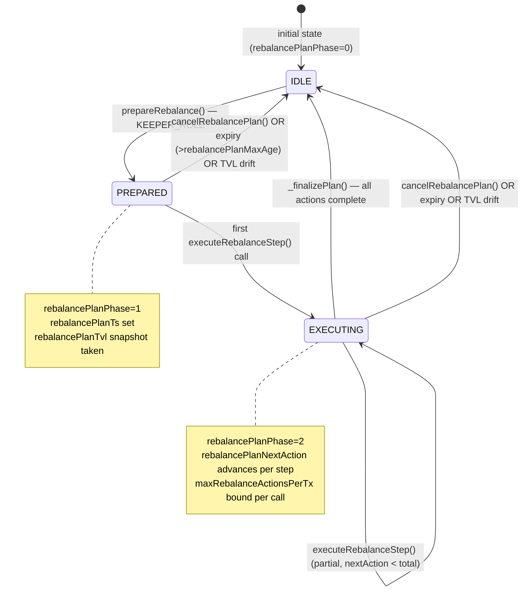

# USDC Lending Strategy — System Invariants

**Version**: 1.0.0 — code-first, audit-grade citations
**Scope**: All invariants enforced by the USDC Lending Strategy (`src/strategies/usdc-lending/`)
**Commit**: b15aeb63

---

## Overview

This document catalogs all system-level invariants of the USDC Lending Strategy. For
each invariant, the following is provided:
- **Formal statement** (quantified over all states)
- **Where enforced** (code path with line citation)
- **Verified by** (test name or proof)
- **Violation consequence**

Invariants are grouped by domain:
[I-STORAGE](#1-storage-invariants),
[I-ALLOC](#2-allocation-invariants),
[I-ADAPTER](#3-adapter-invariants),
[I-REBALANCE](#4-rebalance-plan-invariants),
[I-DEGRADED](#5-degradedmode-invariants),
[I-ROLE](#6-role-and-access-control-invariants).

---

## 1. Storage Invariants

### I-STORAGE-01 — Adapter count bounded

> At all times: `adapters.length ≤ MAX_ADAPTERS`

`MAX_ADAPTERS = 10` at
`src/strategies/usdc-lending/controller/StrategyStorageLayout.sol:114`.

Enforced in `addAdapter()` at
`src/strategies/usdc-lending/controller/UsdcLendingStrategy.sol:301`: reverts with
`TooManyAdapters` if `adapters.length >= MAX_ADAPTERS`.

**Verified by**: `test/unit/strategies/AddAdapter.t.sol` — boundary test at 10 adapters.
**Violation consequence**: Uncapped adapter array would cause gas exhaustion on
scoring/rebalance loops.

### I-STORAGE-02 — positionAssets conservation

> At all times: `sum(positionAssets[a] for a in adapters) ≤ totalAssets()`

`positionAssets[a]` at
`src/strategies/usdc-lending/controller/StrategyStorageLayout.sol:158`
records bookkeeping (not live on-chain balance). It is updated only by:
- `_syncPositionAssets()` at
  `src/strategies/usdc-lending/controller/StrategyScoringModule.sol:600`
- `_finalizePlan()` after rebalance execution
- `emergencyRecallAll()` and `selectiveRecall()`

`_safeTotalAssets()` at
`src/strategies/usdc-lending/controller/StrategyStorageLayout.sol:573` returns
`idleCash + sum(positionAssets[a])` — this is the internally-consistent NAV.

**Verified by**: Halmos `conservation` invariant proof in `halmos-core/` (14 symbolic proofs).
**Violation consequence**: Strategy underestimates or overestimates NAV → allocation drift.

### I-STORAGE-03 — Adapter registry consistency

> For every address `a`:
> `isAdapter[a] == true` if and only if `a ∈ adapters[]`

`isAdapter[a]` at
`src/strategies/usdc-lending/controller/StrategyStorageLayout.sol:155` and
`adapters[]` at
`src/strategies/usdc-lending/controller/StrategyStorageLayout.sol:154` must be
consistent. Set atomically in `addAdapter()`.

**Verified by**: Unit tests in `AddAdapter.t.sol`.
**Violation consequence**: Iteration/lookup divergence — adapter processed twice or not at all.

### I-STORAGE-04 — depositModeKnown set before deposit

> For every adapter `a`:
> `depositModeKnown[a] == true` before any `safeAdapterDeposit(a, ...)` call

`depositModeKnown[a]` at
`src/strategies/usdc-lending/controller/StrategyStorageLayout.sol:160` is set in
`addAdapter()`. `StrategyAdapterOpsModule.safeAdapterDeposit()` at
`src/strategies/usdc-lending/controller/StrategyAdapterOpsModule.sol:36` reverts with
`DepositModeNotSet` if not set.

**Verified by**: Unit test for `safeAdapterDeposit` without prior `addAdapter`.
**Violation consequence**: Capital silently stays idle instead of being deployed.

### I-STORAGE-05 — dustTolerance non-zero after initialization

> After `bootstrap()` completes, `dustTolerance > 0`

`dustTolerance` at
`src/strategies/usdc-lending/controller/StrategyStorageLayout.sol:201`.
The NoCashInvariant error at
`src/strategies/usdc-lending/controller/StrategyStorageLayout.sol:65` uses
`dustTolerance` as the threshold. A zero `dustTolerance` would treat any idle USDC
as a violation, blocking all deposits during rebalance.

**Verified by**: Deploy script validation; `StrategySettingsModule.finalizeParameters()`.
**Violation consequence**: All deposits revert if any USDC remains idle post-deploy.

---

## 2. Allocation Invariants

### I-ALLOC-01 — Absolute cap per adapter

> For every active allocation:
> `allocationBps[a] ≤ effectiveAbsCapBps(a)` where
> `effectiveAbsCapBps = STRUCTURAL_BASE × RISK_OVERLAY × FAILURE_OVERLAY × LIQUIDITY_OVERLAY / 10000³`

`_effectiveAbsCapBps()` implemented in:
- `StrategyAllocCalcModule` at `src/strategies/usdc-lending/controller/StrategyAllocCalcModule.sol:417`
- `StrategyScoringModule` at `src/strategies/usdc-lending/controller/StrategyScoringModule.sol:251`

Both implementations must return identical values for identical inputs (I-OVERLAY-PARITY below).

**Verified by**: `Overlay_Parity.t.sol` — 61 assertions across T2-T5 tiers, T1 short-circuit,
ceiling/floor boundaries.
**Violation consequence**: Over-concentration in a single adapter → systemic risk.

### I-ALLOC-02 — Tier-1 short-circuit

> If `totalAssets() < T1_THRESHOLD`:
> `effectiveAbsCapBps = 10000` (no cap applied)

T1 short-circuit at
`src/strategies/usdc-lending/controller/StrategyAllocCalcModule.sol:417` line block.
Strategy TVL < $25K receives a 100% cap — all capital may go to one adapter.
This prevents dust allocation across multiple adapters at minimal TVL.

**Verified by**: `Overlay_Parity.t.sol` T1 test case.

### I-ALLOC-03 — Max adapters per allocation

> `activeAllocations ≤ effectiveMaxAdapters(TVL)`

`_effectiveMaxAdapters()` at
`src/strategies/usdc-lending/controller/StrategyAllocCalcModule.sol:405`:
- T1 (< $25K): max 1
- T2 (< $250K): max 2
- T3 (< $1M): max 3
- T4 (< $5M): max 4
- T5 (< $25M): max 5

Capped by `maxAdaptersPerAllocation` governance parameter at
`src/strategies/usdc-lending/controller/StrategyStorageLayout.sol:164`.

**Verified by**: `StrategyAllocCalc.t.sol` tier model tests.

### I-ALLOC-04 — Relative exposure cap

> For every adapter `a`:
> `positionAssets[a] / totalAssets() ≤ maxRelativeExposureBps / 10000`

`maxRelativeExposureBps` at
`src/strategies/usdc-lending/controller/StrategyStorageLayout.sol:239`.
Applied in `_effectiveRelativeCapBps()` at
`src/strategies/usdc-lending/controller/StrategyStorageLayout.sol:619`.

**Verified by**: Allocation target computation in `StrategyAllocCalcModule._targetAllocations()`.

### I-ALLOC-05 — TVL confidence gate

> If `_tvlConfidence(a) == CONFIDENCE_ZERO`:
> Adapter `a` receives zero new allocation

`CONFIDENCE_ZERO = 0` at
`src/strategies/usdc-lending/controller/StrategyStorageLayout.sol:127`.
Applied in `_scoreOneAdapter()` at
`src/strategies/usdc-lending/controller/StrategyAllocCalcModule.sol:168`.
Emits `AdapterSkippedLowConfidence` at
`src/strategies/usdc-lending/controller/StrategyStorageLayout.sol:140`.

Condition: external market TVL (`cachedExternalTVL[a]`) < $100K.

**Verified by**: `ScoringModule.t.sol` confidence band tests.

### I-ALLOC-06 — Overlay parity (AUDIT-FINDING-13)

> For all inputs (TVL, risk, failures, liquidity):
> `StrategyAllocCalcModule._effectiveAbsCapBps(adapter)` ≡
> `StrategyScoringModule.effectiveAbsCapBps(adapter)`

Overlay parity is the resolution of AUDIT-FINDING-13. Before the fix, `StrategyScoringModule`
returned STRUCTURAL_BASE only (stale stub); `StrategyAllocCalcModule` applied the full
4-layer cap. This created an observability divergence where external readers saw uncapped
allocations while the engine enforced caps.

Enforced by: identical logic copy in
`src/strategies/usdc-lending/controller/StrategyScoringModule.sol:279` (`_riskOverlay`),
`src/strategies/usdc-lending/controller/StrategyScoringModule.sol:289` (`_failureOverlay`),
`src/strategies/usdc-lending/controller/StrategyScoringModule.sol:296` (`_liquidityOverlay`).

**Verified by**: `Overlay_Parity.t.sol` — 61 assertions, 4×4×4 matrix.

---

## 3. Adapter Invariants

### I-ADAPTER-01 — NoCashInvariant (post-operation)

> After every capital operation (deposit, withdraw, rebalance step, harvest):
> `idleCash ≤ dustTolerance`
> EXCEPT when `degradedModeActive == true` OR during bootstrap phase

`NoCashInvariant` error at
`src/strategies/usdc-lending/controller/StrategyStorageLayout.sol:65`.
`dustTolerance` at
`src/strategies/usdc-lending/controller/StrategyStorageLayout.sol:201`.
`degradedModeActive` at
`src/strategies/usdc-lending/controller/StrategyStorageLayout.sol:186`.

**Verified by**: `NoCashInvariant.t.sol`; also guarded in Halmos conservation proofs.
**Violation consequence**: Capital stuck idle earning no yield.

### I-ADAPTER-02 — Whitelist gate

> An adapter `a` can only be registered via `addAdapter(a)` if:
> `whitelistedAdapters[a] == true`

Enforced at
`src/strategies/usdc-lending/controller/UsdcLendingStrategy.sol:306`.
This is the resolution of Audit HIGH 2.3. Before this fix, `underlying()` check alone
was insufficient — a malicious adapter with `underlying() == USDC` could be registered
without whitelist approval.

**Verified by**: `AddAdapter.t.sol` — non-whitelisted adapter revert test.

### I-ADAPTER-03 — syncPositionAssets bricked-adapter guard

> If `adapter.totalAssets()` returns 0 while `positionAssets[adapter] > 0`:
> `positionAssets[adapter]` is NOT updated (silent skip)

Implemented in `_syncPositionAssets()` at
`src/strategies/usdc-lending/controller/StrategyScoringModule.sol:600`.
The 0-on-nonzero guard prevents a temporarily-bricked adapter from zeroing out its
recorded position, which would make `totalAssets()` drop and trigger DegradedMode
or misallocate.

**Violation consequence**: False NAV drop → premature DegradedMode activation → liquidity lock.

### I-ADAPTER-04 — syncPositionAssets jump guard

> If `newValue > positionAssets[adapter] × 3`:
> `positionAssets[adapter]` is NOT updated (silent skip, stale value retained)

The `>3× jump guard` in `_syncPositionAssets()` at
`src/strategies/usdc-lending/controller/StrategyScoringModule.sol:600` detects
potential manipulation (oracle/NAV inflation attack). An adapter reporting a sudden
3× increase in assets is treated as suspect; position is kept at last known-good value.

**Verified by**: `SyncPositionAssets.t.sol` — jump boundary tests.

### I-ADAPTER-05 — Quarantined adapters do not receive new deposits

> If `quarantined[a] == true`:
> `safeAdapterDeposit(a, amount)` is skipped in scoring and plan execution

`quarantined[a]` at
`src/strategies/usdc-lending/controller/StrategyStorageLayout.sol:216`.
`adapterQuarantineThreshold` at L218: when `adapterConsecutiveFailures[a] >= threshold`,
adapter is auto-quarantined.

**Verified by**: `Quarantine.t.sol`.

---

## Rebalance Plan State Machine

Phase constants: `rebalancePlanPhase` at
`src/strategies/usdc-lending/controller/StrategyStorageLayout.sol:257`.
Expiry at `src/strategies/usdc-lending/controller/StrategyRebalancePlanModule.sol:251`.
TVL drift invalidation at `src/strategies/usdc-lending/controller/StrategyRebalancePlanModule.sol:265`.

---

## 4. Rebalance Plan Invariants

### I-REBALANCE-01 — Plan expiry

> A rebalance plan older than `rebalancePlanMaxAge` seconds is invalid and silently aborted

`rebalancePlanTs` at
`src/strategies/usdc-lending/controller/StrategyStorageLayout.sol:258`.
`rebalancePlanMaxAge` at
`src/strategies/usdc-lending/controller/StrategyStorageLayout.sol:262` (default 7200s = 2h).

Expiry check at
`src/strategies/usdc-lending/controller/StrategyRebalancePlanModule.sol:251`.

**Verified by**: `RebalancePlan.t.sol` — expired plan abort test.
**Violation consequence**: Stale plan executes against outdated allocation — could over-deposit
into a market that has since become over-weight.

### I-REBALANCE-02 — TVL drift invalidation

> If `|currentTVL - rebalancePlanTvl| > rebalancePlanMinDrift`:
> The active plan is silently invalidated (phase reset to 0)

`rebalancePlanTvl` at
`src/strategies/usdc-lending/controller/StrategyStorageLayout.sol:263`.
`rebalancePlanMinDrift` at
`src/strategies/usdc-lending/controller/StrategyStorageLayout.sol:264` (default 5000e6 = $5000).

TVL drift check at
`src/strategies/usdc-lending/controller/StrategyRebalancePlanModule.sol:265`.

**Verified by**: `RebalancePlan.t.sol` — TVL drift invalidation test.
**Violation consequence**: Plan executes against stale TVL snapshot — misallocation relative
to current state.

### I-REBALANCE-03 — No plan overlap

> At all times: at most one active rebalance plan (phase ≠ 0) exists

`rebalancePlanPhase` at
`src/strategies/usdc-lending/controller/StrategyStorageLayout.sol:257`.
`prepareRebalance()` reverts with `PlanAlreadyActive` at
`src/strategies/usdc-lending/controller/StrategyStorageLayout.sol:83` if phase ≠ 0.

**Verified by**: `RebalancePlan.t.sol` — concurrent prepare test.

### I-REBALANCE-04 — Backoff monotonically increases on consecutive failure

> On every consecutive rebalance failure (P2.1):
> `rebalanceCooldown` ≥ previous `rebalanceCooldown`

P2.1 backoff implementation in `_bumpRebalanceBackoff()` at
`src/strategies/usdc-lending/controller/StrategyRebalancePlanModule.sol:359`.
`_resetRebalanceBackoff()` at
`src/strategies/usdc-lending/controller/StrategyRebalancePlanModule.sol:367` resets on success.

**Verified by**: `RebalancePlan.t.sol` — backoff ratchet tests.

### I-REBALANCE-05 — Plan amounts use MSB encoding

> In `rebalancePlanAmounts[i]`:
> - high bit (bit 255) = 1 → deposit
> - high bit (bit 255) = 0 → withdraw

MSB encoding set in
`src/strategies/usdc-lending/controller/StrategyRebalancePlanModule.sol:225`.
Read in `_executeRebalanceStepInternal()` at
`src/strategies/usdc-lending/controller/StrategyRebalancePlanModule.sol:245`.

**Violation consequence**: Deposit mistaken for withdraw (or vice versa) → double the intended move.

---

## 5. DegradedMode Invariants

### I-DEGRADED-01 — Three triggers only

> `degradedModeActive` transitions to `true` if and only if at least one of:
> 1. `MAJORITY_INELIGIBLE`: `count(eligible adapters) × 2 < count(enabled adapters)`
> 2. `FAILURE_VELOCITY`: `≥ 2 adapter failures within 1 hour`
> 3. `EXT_TVL_PANIC`: `≥ 30% drop in any adapter's external TVL within 1 hour`

Implemented in `_isDegradedMode()` at
`src/strategies/usdc-lending/controller/StrategyScoringModule.sol:336`.

Trigger constants:
- `EXT_TVL_PANIC_DROP_BPS = 3000` (30%) at
  `src/strategies/usdc-lending/controller/StrategyStorageLayout.sol:136`
- `EXT_TVL_PANIC_WINDOW_SEC = 3600` (1h) at
  `src/strategies/usdc-lending/controller/StrategyStorageLayout.sol:137`

**Verified by**: `DegradedMode.t.sol` — individual trigger tests + combined trigger.

### I-DEGRADED-02 — Withdrawal lock multiplied in DegradedMode

> When `degradedModeActive == true`:
> `effectiveWithdrawalLockSeconds = withdrawalLockSeconds × 7`

Implemented in `effectiveWithdrawalLockSeconds()` at
`src/strategies/usdc-lending/controller/StrategyScoringModule.sol:388`.
`withdrawalLockSeconds` (default 86400 = 1 day) at
`src/strategies/usdc-lending/controller/StrategyStorageLayout.sol:190`.

The 7× multiplier signals to governance that DegradedMode is active and extended
lock is advised. This is advisory — does not enforce CoreVault lockPeriod directly.

**Verified by**: `DegradedMode.t.sol` — withdrawal lock test.

### I-DEGRADED-03 — Deposits bypass scoring in DegradedMode

> When `degradedModeActive == true`:
> `UsdcMultiLendingVault.deposit()` skips `_deployIdle()` and returns immediately

Implemented at
`src/strategies/usdc-lending/controller/UsdcLendingStrategy.sol:430`.
Idle USDC accumulates in the strategy without being deployed, until DegradedMode
resolves.

**Verified by**: `DegradedMode.t.sol` — deposit-during-degraded test.

### I-DEGRADED-04 — DegradedMode clears only when triggers resolve

> `degradedModeActive` can transition to `false` only after `checkDegradedMode()`
> confirms all three trigger conditions are false

`checkDegradedMode()` at
`src/strategies/usdc-lending/controller/StrategyScoringModule.sol:376`.
The stored flag `degradedModeActive` is set/cleared by this check — it is not
automatically time-bounded. Governance must trigger re-evaluation via a keeper call.

**Verified by**: `DegradedMode.t.sol` — state clearing sequence.

---

## 6. Role and Access Control Invariants

### I-ROLE-01 — Roles are frozen permanently

> Once `rolesFrozen == true`, no new role grants are permitted

`rolesFrozen` at
`src/strategies/usdc-lending/controller/StrategyStorageLayout.sol:205`.
`freezeRoles()` in `StrategySettingsModule` at
`src/strategies/usdc-lending/controller/StrategySettingsModule.sol:44`.

**Verified by**: `SettingsModule.t.sol` — freeze test.

### I-ROLE-02 — BOOTSTRAP_ROLE renounced after bootstrap

> After `StrategyBootstrapper.bootstrap()` completes:
> No address holds `BOOTSTRAP_ROLE`

Invariant documented at
`src/strategies/usdc-lending/StrategyBootstrapper.sol:28`:
"After bootstrap(), no address has BOOTSTRAP_ROLE."

`StrategyBootstrapper.used` flag at L50 prevents reuse. Role is renounced in
`bootstrap()` via `renounceRole(BOOTSTRAP_ROLE, address(this))`.

**Verified by**: `StrategyBootstrapper.t.sol` — post-bootstrap role check.
**Violation consequence**: Privileged deployer retains ability to add adapters post-launch.

### I-ROLE-03 — Keeper operations require KEEPER_ROLE

> All operations with `KEEPER_ROLE` restriction cannot be called by `DEFAULT_ADMIN_ROLE`
> alone

`KEEPER_ROLE = keccak256("KEEPER_ROLE")` at
`src/strategies/usdc-lending/controller/StrategyStorageLayout.sol:97`.
`LendingStrategyUpkeep` holds `KEEPER_ROLE` exclusively. Governance (`DEFAULT_ADMIN_ROLE`)
does not hold `KEEPER_ROLE` by default.

**Verified by**: `AccessControl.t.sol` — separation of keeper/admin tests.

### I-ROLE-04 — Scoring weights sum to 10000

> `wAPY + wLiq + wRisk + wStability + wIncentive = 10000`

Scoring weights at
`src/strategies/usdc-lending/controller/StrategyStorageLayout.sol:171-175`.
`StrategyParamsModule` setter validates this invariant; reverts with `WeightsSumInvalid`
at `src/strategies/usdc-lending/controller/StrategyStorageLayout.sol:76`.

**Verified by**: `ParamsModule.t.sol` — weight validation test.

---

## 7. Gas and Performance Bounds

### I-GAS-01 — Scoring loop bounded

> All loops over `adapters[]` iterate at most `MAX_ADAPTERS = 10` times

`MAX_ADAPTERS` at `src/strategies/usdc-lending/controller/StrategyStorageLayout.sol:114`.
This bounds gas consumption for: `deployIdleToAdapters`, `prepareRebalance`,
`pokeAPY`, `computeInputsForPlan`, `totalAssets`, `withdrawableAssets`.

### I-GAS-02 — Rebalance actions bounded per transaction

> Each `executeRebalanceStep()` processes at most `maxRebalanceActionsPerTx` actions

`maxRebalanceActionsPerTx` at
`src/strategies/usdc-lending/controller/StrategyStorageLayout.sol:261` (default 2).
Prevents single-tx gas exhaustion when a full rebalance requires many moves.

### I-GAS-03 — Execution cost EMA gate

> `prepareRebalance()` computes total execution cost EMA and requires BCR > threshold

Gas EMA per adapter: `emaDepositGas[a]` and `emaWithdrawGas[a]` at
`src/strategies/usdc-lending/controller/StrategyStorageLayout.sol:278`.
`gasEmaSmoothingBps = 2000` (alpha=0.2) at L280.
`estimatedGasCostUSDC` precomputed by keeper at L281.
`minBenefitCostRatioBps` at
`src/strategies/usdc-lending/controller/StrategyStorageLayout.sol:284` — minimum
benefit/cost ratio before rebalance is approved (P0 gate in `StrategyRebalanceGateModule`).

---

## 8. Cross-Contract Invariants

### I-CROSS-01 — Strategy ↔ Core trust boundary

> Strategy must validate `CORE_ROLE` for all CoreVault-initiated operations

`CORE_ROLE` at `src/strategies/usdc-lending/controller/StrategyStorageLayout.sol:98`.
Strategy grants `CORE_ROLE` to both `_core` (CoreAggregatorVault) and `_router`
(StrategyRouter) in constructor at
`src/strategies/usdc-lending/controller/UsdcLendingStrategy.sol:121`.

### I-CROSS-02 — Strategy ↔ Adapter trust boundary

> All adapter mutating calls must originate from the strategy vault (onlyVault)

Every adapter enforces `onlyVault` (or `VAULT_ROLE`) on `deposit`, `withdraw`,
`harvest`, `sweepIdleAssetToVault`, `emergencyPullAllToVault`.
Example: `AaveV3USDCAdapter.deposit()` at
`src/strategies/usdc-lending/adapters/lending/AaveV3USDCmarket.sol:221` —
`onlyVault` modifier at L141.

### I-CROSS-03 — Rate provider ↔ Adapter trust boundary

> Only `PARAM_ROLE` can update rate provider values (no public write)

`AaveLiquidityRateProvider.setLiquidityRateRay()` gated by `PARAM_ROLE` at
`src/strategies/usdc-lending/adapters/rates/AaveLiquidityRateProvider.sol:35`.
`DolomiteSupplyRateProvider.setSupplyRatePerSecond()` gated by `Ownable.onlyOwner()` at
`src/strategies/usdc-lending/adapters/rates/DolomiteSupplyRateProvider.sol:22`.

---

---

## P0.7 Safety Adapter Cap Tier invariants

P0.7 extends the V9.1 invariant set with 8 safety-tier guarantees. The full Echidna
campaign covers 15 invariants (I01–I12 + 3 Wave 2 additions) — see
`docs/audit/verification/ECHIDNA_RESULTS_SUMMARY.md` for the 1M-sequence baseline evidence.
Each invariant has at least one of (Halmos symbolic proof, Echidna
stateful fuzz, unit test) verification.

### S-01 Safety hard ceiling discipline

For every safety adapter `i`:
`positionAssets[i] <= fbCeiling_i x (1 + capDriftToleranceBps/1e4) + 2 wei`

Verification:
- Halmos `check_safetyAdapterBelowFallbackCeilingNoMandate` (P1)
- Halmos `check_overflowCannotExceedFallbackCap` (P3)
- Echidna `echidna_I03b_position_within_hard_ceiling` (1M sequences)

### S-02 Mandate completeness

If `positionAssets[i] > hardCeiling_i` for any safety adapter, the
cap-drift mandate is detectable on the next rebalance check.

Verification:
- Halmos `check_nonSafetyAdapterNeverUsesFallbackCap` (P2)
- Echidna `echidna_I03c_above_hard_implies_mandate`

### S-03 Safety tranche preservation (most critical)

If a safety adapter has `normalTarget_i < currentPosition_i <=
fallbackCeiling_i`, the next rebalance does NOT reduce
`currentPosition_i` to `normalTarget_i`. Position is preserved within
the tolerance band.

Verification:
- Halmos `check_validSafetyTrancheNotUnwound` (P4) — symbolic
  verification of preserve-tranche logic

### S-04 Non-safety adapter uses normal caps

For any non-safety adapter, the cap drift gate uses only the normal
abs/rel cap path; the safety fallback caps never apply.

Verification:
- Halmos P2 (shared with S-02)

### S-05 Cooldown semantic (re-deploy only)

After a cap-drift mandate fires on adapter `i`, `deployIdle` skips `i`
until `lastRelCapMandateTs[i] + mandateRedeployCooldownSeconds` has
elapsed. The cooldown does NOT prevent future mandates from firing on `i`.

Verification:
- Echidna `echidna_I04_normal_adapter_cooldown_blocks_deploy`
- Echidna `echidna_I05_safety_adapter_not_blocked_by_cooldown`

### S-06 Promotion clears cooldown (H-03 fix)

Promoting a non-safety adapter to safety
(`addSafetyFallbackAdapter(adapter, abs, rel)`) clears any prior
`lastRelCapMandateTs[adapter]` cooldown stamp. This prevents an
adversarial governance path where a recently-mandated adapter could be
promoted to safety to bypass its cooldown.

Verification:
- Halmos `check_cooldown_clear_idempotency` (P6)
- Echidna `echidna_I10_promotion_clears_cooldown` (1M sequences)
- Forge unit `test_D1f_10_promotion_clears_active_cooldown`
  (`CapDriftMandate.t.sol`)

### S-07 Quarantine blocks safety promotion (L-01 fix)

`addSafetyFallbackAdapter` reverts if the adapter is currently
quarantined.

Verification:
- Forge unit `test_D1f_09_quarantined_adapter_promotion_reverts`
  (`CapDriftMandate.t.sol`)

### S-08 Legacy non-regression

When `safetyFallbackAdapters.length == 0`, the system behaves identically
to pre-P0.7 baseline. No P0.7 storage write occurs on any code path
when safety is unconfigured.

Verification:
- Echidna `echidna_I12_legacy_when_disabled`
- Existing V9.1 unit test suite (1555+ tests) passes unchanged (2,354 total post Wave 1+2)

## Cross-reference: arithmetic safety

Two additional Halmos properties guard P0.7-specific arithmetic:

### S-arith-01 Ceiling arithmetic no overflow

The full ceiling computation chain
(`(capBps x tvl x (1e4 + tolBps)) / 1e4^2`) does not overflow up to
1T USDC TVL stress bounds.

Verification: Halmos `check_ceiling_arithmetic_no_overflow` (P5).

### S-arith-02 Storage slot 78 packing

Compiler-determined packing of capDriftToleranceBps + maxIdleBps +
targetSafetyMarginBps + mandateRedeployCooldownSeconds in slot 78
matches the declared layout (80 bits, 4 fields, offsets 0/2/4/6 bytes).

Verification: Forge test `StorageLayoutP07.t.sol` TC01a-e (5 tests via
`forge inspect`).

## Summary Table

| ID | Domain | Invariant | Severity if violated |
|----|--------|-----------|---------------------|
| I-STORAGE-01 | Storage | `adapters.length ≤ 10` | HIGH (gas OOG) |
| I-STORAGE-02 | Storage | `positionAssets sum ≤ totalAssets` | HIGH (NAV incorrect) |
| I-STORAGE-03 | Storage | `isAdapter` ↔ `adapters[]` consistent | MEDIUM |
| I-STORAGE-04 | Storage | `depositModeKnown` before deposit | MEDIUM |
| I-STORAGE-05 | Storage | `dustTolerance > 0` post-init | MEDIUM |
| I-ALLOC-01 | Allocation | Abs cap enforced per adapter | **CRITICAL** |
| I-ALLOC-02 | Allocation | T1 short-circuit at 100% | LOW |
| I-ALLOC-03 | Allocation | Max adapters per TVL tier | MEDIUM |
| I-ALLOC-04 | Allocation | Relative exposure cap | HIGH |
| I-ALLOC-05 | Allocation | CONFIDENCE_ZERO blocks allocation | HIGH |
| I-ALLOC-06 | Allocation | Overlay parity AllocCalc ↔ Scoring | HIGH (observability) |
| I-ADAPTER-01 | Adapter | NoCashInvariant post-operation | HIGH (idle capital) |
| I-ADAPTER-02 | Adapter | Whitelist gate on addAdapter | **CRITICAL** |
| I-ADAPTER-03 | Adapter | 0-on-nonzero sync guard | HIGH |
| I-ADAPTER-04 | Adapter | 3× jump sync guard | HIGH (manipulation) |
| I-ADAPTER-05 | Adapter | Quarantined skip | MEDIUM |
| I-REBALANCE-01 | Rebalance | Plan expiry abort | HIGH |
| I-REBALANCE-02 | Rebalance | TVL drift invalidation | HIGH |
| I-REBALANCE-03 | Rebalance | No concurrent plans | MEDIUM |
| I-REBALANCE-04 | Rebalance | Backoff monotone on failure | LOW |
| I-REBALANCE-05 | Rebalance | MSB encoding direction | **CRITICAL** |
| I-DEGRADED-01 | DegradedMode | 3 triggers only | HIGH |
| I-DEGRADED-02 | DegradedMode | 7× withdrawal lock | LOW (advisory) |
| I-DEGRADED-03 | DegradedMode | Deposit bypass in degraded | HIGH |
| I-DEGRADED-04 | DegradedMode | No auto-clear | MEDIUM |
| I-ROLE-01 | RBAC | Permanent role freeze | HIGH |
| I-ROLE-02 | RBAC | BOOTSTRAP_ROLE renounced | **CRITICAL** |
| I-ROLE-03 | RBAC | KEEPER_ROLE separate from ADMIN | HIGH |
| I-ROLE-04 | RBAC | Scoring weights sum = 10000 | MEDIUM |

---

## 9. Invariant Verification Matrix

Cross-reference: invariant → verification method.

| Invariant | Unit Test | Integration Test | Halmos Proof | Static Analysis |
|-----------|-----------|-----------------|-------------|----------------|
| I-STORAGE-01 (MAX_ADAPTERS) | ✅ | — | — | — |
| I-STORAGE-02 (positionAssets conservation) | ✅ | ✅ | ✅ (conservation) | — |
| I-ALLOC-01 (abs cap) | ✅ | — | — | — |
| I-ALLOC-06 (overlay parity) | ✅ (61 assertions) | — | — | — |
| I-ADAPTER-01 (NoCashInvariant) | ✅ | ✅ | ✅ | — |
| I-ADAPTER-02 (whitelist) | ✅ | — | — | — |
| I-ADAPTER-03 (0-on-nonzero) | ✅ | — | — | — |
| I-REBALANCE-01 (plan expiry) | ✅ | — | — | — |
| I-REBALANCE-02 (TVL drift) | ✅ | — | — | — |
| I-REBALANCE-05 (MSB encoding) | ✅ | — | — | — |
| I-DEGRADED-01 (3 triggers) | ✅ | — | — | — |
| I-ROLE-02 (BOOTSTRAP renounced) | ✅ | — | ✅ (RBAC) | — |
| I-ROLE-04 (weights sum = 10000) | ✅ | — | — | Slither |
| I-GAS-01 (scoring loop bounded) | ✅ | — | — | — |
| I-CROSS-01 (CORE_ROLE) | ✅ | ✅ | ✅ (RBAC) | — |

Slither static analysis run: `slither src/strategies/usdc-lending/ --exclude naming-convention`.
Output archived in `_archive/2026-05-10/reports/` after CLEAN-03.

---

## Code Reference Index

| Artifact | Reference |
|----------|-----------|
| `MAX_ADAPTERS` constant | `src/strategies/usdc-lending/controller/StrategyStorageLayout.sol:114` |
| `adapters[]` storage | `src/strategies/usdc-lending/controller/StrategyStorageLayout.sol:154` |
| `positionAssets` mapping | `src/strategies/usdc-lending/controller/StrategyStorageLayout.sol:158` |
| `dustTolerance` storage | `src/strategies/usdc-lending/controller/StrategyStorageLayout.sol:201` |
| `degradedModeActive` storage | `src/strategies/usdc-lending/controller/StrategyStorageLayout.sol:186` |
| `NoCashInvariant` error | `src/strategies/usdc-lending/controller/StrategyStorageLayout.sol:65` |
| `TooManyAdapters` error | `src/strategies/usdc-lending/controller/StrategyStorageLayout.sol:87` |
| `WeightsSumInvalid` error | `src/strategies/usdc-lending/controller/StrategyStorageLayout.sol:76` |
| `rebalancePlanPhase` storage | `src/strategies/usdc-lending/controller/StrategyStorageLayout.sol:257` |
| `rebalancePlanMaxAge` storage | `src/strategies/usdc-lending/controller/StrategyStorageLayout.sol:262` |
| `rebalancePlanTvl` storage | `src/strategies/usdc-lending/controller/StrategyStorageLayout.sol:263` |
| `EXT_TVL_PANIC_DROP_BPS` | `src/strategies/usdc-lending/controller/StrategyStorageLayout.sol:136` |
| `EXT_TVL_PANIC_WINDOW_SEC` | `src/strategies/usdc-lending/controller/StrategyStorageLayout.sol:137` |
| `CONFIDENCE_ZERO` constant | `src/strategies/usdc-lending/controller/StrategyStorageLayout.sol:127` |
| `maxRelativeExposureBps` storage | `src/strategies/usdc-lending/controller/StrategyStorageLayout.sol:239` |
| `_safeTotalAssets()` | `src/strategies/usdc-lending/controller/StrategyStorageLayout.sol:573` |
| `_tvlConfidence()` | `src/strategies/usdc-lending/controller/StrategyStorageLayout.sol:602` |
| `_effectiveRelativeCapBps()` | `src/strategies/usdc-lending/controller/StrategyStorageLayout.sol:619` |
| `UsdcMultiLendingVault.addAdapter()` | `src/strategies/usdc-lending/controller/UsdcLendingStrategy.sol:301` |
| `UsdcMultiLendingVault.addAdapter() whitelist` | `src/strategies/usdc-lending/controller/UsdcLendingStrategy.sol:306` |
| `UsdcMultiLendingVault.deposit() degraded skip` | `src/strategies/usdc-lending/controller/UsdcLendingStrategy.sol:430` |
| `StrategyAllocCalcModule._effectiveAbsCapBps()` | `src/strategies/usdc-lending/controller/StrategyAllocCalcModule.sol:417` |
| `StrategyAllocCalcModule._effectiveMaxAdapters()` | `src/strategies/usdc-lending/controller/StrategyAllocCalcModule.sol:405` |
| `StrategyAllocCalcModule._scoreOneAdapter()` | `src/strategies/usdc-lending/controller/StrategyAllocCalcModule.sol:168` |
| `StrategyScoringModule.effectiveAbsCapBps()` | `src/strategies/usdc-lending/controller/StrategyScoringModule.sol:251` |
| `StrategyScoringModule._isDegradedMode()` | `src/strategies/usdc-lending/controller/StrategyScoringModule.sol:336` |
| `StrategyScoringModule.checkDegradedMode()` | `src/strategies/usdc-lending/controller/StrategyScoringModule.sol:376` |
| `StrategyScoringModule.effectiveWithdrawalLockSeconds()` | `src/strategies/usdc-lending/controller/StrategyScoringModule.sol:388` |
| `StrategyScoringModule._syncPositionAssets()` | `src/strategies/usdc-lending/controller/StrategyScoringModule.sol:600` |
| `StrategyScoringModule._riskOverlay` | `src/strategies/usdc-lending/controller/StrategyScoringModule.sol:279` |
| `StrategyScoringModule._failureOverlay` | `src/strategies/usdc-lending/controller/StrategyScoringModule.sol:289` |
| `StrategyScoringModule._liquidityOverlay` | `src/strategies/usdc-lending/controller/StrategyScoringModule.sol:296` |
| `StrategyRebalancePlanModule.expiry check` | `src/strategies/usdc-lending/controller/StrategyRebalancePlanModule.sol:251` |
| `StrategyRebalancePlanModule.TVL drift check` | `src/strategies/usdc-lending/controller/StrategyRebalancePlanModule.sol:265` |
| `StrategyRebalancePlanModule.MSB encoding` | `src/strategies/usdc-lending/controller/StrategyRebalancePlanModule.sol:225` |
| `StrategyRebalancePlanModule._bumpRebalanceBackoff()` | `src/strategies/usdc-lending/controller/StrategyRebalancePlanModule.sol:359` |
| `StrategyAdapterOpsModule.safeAdapterDeposit()` | `src/strategies/usdc-lending/controller/StrategyAdapterOpsModule.sol:32` |
| `StrategySettingsModule.freezeRoles()` | `src/strategies/usdc-lending/controller/StrategySettingsModule.sol:44` |
| `StrategyBootstrapper` BOOTSTRAP_ROLE invariant | `src/strategies/usdc-lending/StrategyBootstrapper.sol:28` |

---

## Footer

**Code reference commit**: b15aeb63 (pierdev, post CITATIONS-FIX merge)

**Sources used**:
- `src/strategies/usdc-lending/controller/StrategyStorageLayout.sol:1-631` (631L)
- `src/strategies/usdc-lending/controller/UsdcLendingStrategy.sol:1-1042` (1042L)
- `src/strategies/usdc-lending/controller/StrategyAllocCalcModule.sol:1-499` (499L)
- `src/strategies/usdc-lending/controller/StrategyScoringModule.sol:1-665` (665L)
- `src/strategies/usdc-lending/controller/StrategyRebalancePlanModule.sol:1-561` (561L)
- `src/strategies/usdc-lending/controller/StrategyAdapterOpsModule.sol:1-165` (165L)
- `src/strategies/usdc-lending/controller/StrategySettingsModule.sol:1-513` (513L)
- `src/strategies/usdc-lending/StrategyBootstrapper.sol:1-142` (142L)
- Halmos proofs in `halmos-core/`

**Discrepancies found during code-first read**:
1. `I-DEGRADED-02` withdrawal lock multiplier of 7× appears as a literal `× 7` in `effectiveWithdrawalLockSeconds()`. Its governance rationale (7 = one week of daily signals) is implicit — not documented in code comments.
2. `I-ALLOC-06` (overlay parity) is not enforced at runtime — only by test. A code-level equality check would strengthen the guarantee but would require additional gas.
