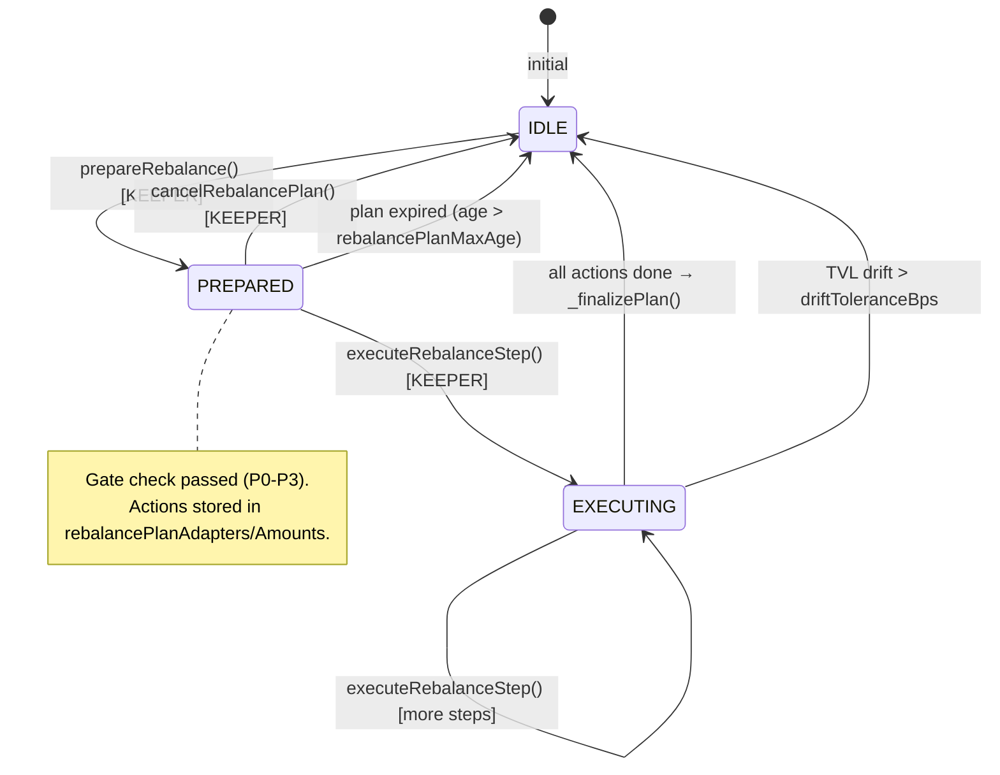

# USDC Lending Strategy — Overview

> **Status**: finalized | **Audit-scope**: multyr-strategies@b15aeb63
> **Last reviewed by code**: commit `b15aeb63` on branch `pierdev` (date: 2026-05-16)

---

## 1. Overview

The USDC Lending Strategy (`UsdcMultiLendingVault`) is a non-custodial, multi-adapter yield aggregator deployed on Arbitrum One. It receives USDC from a CoreAggregatorVault and autonomously distributes capital across up to seven lending protocols — Aave V3, Compound III (Comet), Dolomite, Euler V2, Fluid, Morpho Blue, and Venus — maximizing risk-adjusted yield through continuous scoring, exposure-capped allocation, and multi-step rebalancing. No funds are ever held by users directly; all investor-facing logic lives in the CoreVault layer above.

The strategy is designed exclusively for Arbitrum One native USDC (`0xaf88d065e77c8cC2239327C5EDb3A432268e5831`, enforced at construction in `src/strategies/usdc-lending/controller/UsdcLendingStrategy.sol:144`). It implements the `IStrategy` interface required by CoreAggregatorVault and exposes `deposit`, `withdraw`, `harvest`, and `totalAssets` as the Core-facing surface.

The contract is non-upgradeable (no proxy pattern). Administrative actions flow through an OpenZeppelin `AccessControl` role hierarchy (`DEFAULT_ADMIN_ROLE` held by Timelock, `KEEPER_ROLE` by `StrategyUpkeep`, `CORE_ROLE` by CoreVault and StrategyRouter). The deployer receives no role (`src/strategies/usdc-lending/controller/UsdcLendingStrategy.sol:148`).

---

## 2. Architecture

### 2.1 Contract stack

```
┌──────────────────────────────────────────────────────────────────┐
│                       CoreAggregatorVault                        │
│  deposit() / withdraw() / harvest() via CORE_ROLE                │
└──────────────────────────────┬───────────────────────────────────┘
                               │ CORE_ROLE calls
                               ▼
┌──────────────────────────────────────────────────────────────────┐
│              UsdcMultiLendingVault (main controller)             │
│  src/strategies/usdc-lending/controller/UsdcLendingStrategy.sol  │
│  • Adapter registry    • deposit/withdraw lifecycle              │
│  • Harvest             • Emergency recall                        │
│  • DegradedMode check  • fallback → 6-module routing            │
└──────┬───────────────────────────────────────────────┬───────────┘
       │ delegatecall (in vault storage context)        │
       ▼                                                ▼
┌─────────────────────┐                  ┌─────────────────────────┐
│  StrategyScoringMod │ ←delegatecall→   │  StrategyAllocCalcMod   │
│  (scoring, deploy   │                  │  (scoring pipeline:     │
│   idle, sync,       │                  │   compute/normalize/    │
│   degradedMode)     │                  │   targets/plan)         │
└─────────────────────┘                  └─────────────────────────┘
       │
       │ delegatecall
       ▼
┌─────────────────────┐  ┌─────────────────────┐  ┌───────────────┐
│  StrategyRebalance  │  │  StrategyRebalance  │  │ StrategyParams│
│  PlanModule         │  │  GateModule         │  │ Module        │
│  (plan lifecycle:   │  │  (P0-P3 gate check) │  │ (TVL poke,    │
│   prepare/execute/  │  │                     │  │  param setters│
│   cancel)           │  └─────────────────────┘  └───────────────┘
└─────────────────────┘
       │
       │ delegatecall
       ▼
┌─────────────────────┐  ┌─────────────────────┐
│  StrategyAdapterOps │  │  StrategySettings   │
│  Module             │  │  Module             │
│  (safe deposit,     │  │  (governance 45+    │
│   failure tracking) │  │   admin setters)    │
└─────────────────────┘  └─────────────────────┘
       │
       │ direct calls (not delegatecall)
       ▼
┌─────────────────────────────────────────────────────────────────┐
│              Adapter Layer (7 lending adapters)                  │
│  AaveV3USDCAdapter  CometUsdcMultiMarketAdapter                  │
│  DolomiteUsdcMultiMarketAdapter  EulerUsdcMultiMarketAdapter     │
│  FluidUsdcMultiMarketAdapter  MorphoUsdcMultiMarketAdapter       │
│  VenusUsdcMultiMarketAdapter                                     │
└─────────────────────────────────────────────────────────────────┘
       │
       ▼
Aave V3 / Compound III / Dolomite / Euler V2 / Fluid / Morpho / Venus
```

### 2.2 Module dispatch (fallback routing)

All functions not defined directly on `UsdcMultiLendingVault` are routed to delegatecall modules via the `fallback()` function (`src/strategies/usdc-lending/controller/UsdcLendingStrategy.sol:1022`). The dispatch chain is fixed and ordered:

```
fallback() → [scoringModule, rebalanceGateModule_addr, rebalancePlanModule_addr,
              adapterOpsModule, paramsModule, settingsModule_addr]
```

Each module is tried in order via `delegatecall`. The dispatcher distinguishes "selector not in this module" (empty returndata → continue) from "semantic revert" (non-empty returndata → propagate immediately). This pattern, implementing AUDIT-FINDING-9 fix, prevents silent error swallowing (`src/strategies/usdc-lending/controller/UsdcLendingStrategy.sol:1035-1038`).

### 2.3 Delegatecall storage discipline

All modules inherit `StrategyStorageLayout` (`src/strategies/usdc-lending/controller/StrategyStorageLayout.sol:91`) to guarantee bit-for-bit storage slot alignment. The heading comment enforces this is the "single source of truth" for storage layout (`src/strategies/usdc-lending/controller/StrategyStorageLayout.sol:7`). Any mismatch silently corrupts state in the delegatecall context.

The vault has no proxy pattern. `StrategyStorageLayout` extends `AccessControl + Pausable + ReentrancyGuard` and defines all storage fields, constants, custom errors, and shared events in one place. The `__gap[6]` reserve (`src/strategies/usdc-lending/controller/StrategyStorageLayout.sol:395`) preserves future storage slots within the layout.

---

## 3. Storage Layout

### 3.1 Constants (no storage slots)

All constants are defined in `StrategyStorageLayout` and do not occupy storage slots.

| Constant | Value | Line | Purpose |
|---|---|---|---|
| `PARAM_ROLE` | `keccak256("PARAM_ROLE")` | `src/strategies/usdc-lending/controller/StrategyStorageLayout.sol:96` | Governance parameter setters |
| `KEEPER_ROLE` | `keccak256("KEEPER_ROLE")` | `src/strategies/usdc-lending/controller/StrategyStorageLayout.sol:97` | Automation keeper (StrategyUpkeep) |
| `CORE_ROLE` | `keccak256("CORE_ROLE")` | `src/strategies/usdc-lending/controller/StrategyStorageLayout.sol:98` | CoreVault + StrategyRouter |
| `BOOTSTRAP_ROLE` | `keccak256("BOOTSTRAP_ROLE")` | `src/strategies/usdc-lending/controller/StrategyStorageLayout.sol:99` | One-shot StrategyBootstrapper |
| `MAX_ADAPTERS` | `10` | `src/strategies/usdc-lending/controller/StrategyStorageLayout.sol:114` | Hard cap on registered adapters |
| `MAX_EXTERNAL_TVL_JUMP_BPS` | `100000` (10x) | `src/strategies/usdc-lending/controller/StrategyStorageLayout.sol:117` | Capacity delta sanity limit |
| `DEFAULT_STABILITY_BPS` | `7000` | `src/strategies/usdc-lending/controller/StrategyStorageLayout.sol:120` | Stability fallback (no EMA) |
| `DEFAULT_RISK_BPS` | `7000` | `src/strategies/usdc-lending/controller/StrategyStorageLayout.sol:121` | Risk fallback (no score set) |
| `DEFAULT_LIQ_BPS` | `5000` | `src/strategies/usdc-lending/controller/StrategyStorageLayout.sol:122` | Liquidity fallback (50%) |
| `EXT_TVL_PANIC_DROP_BPS` | `3000` (30%) | `src/strategies/usdc-lending/controller/StrategyStorageLayout.sol:136` | DegradedMode trigger threshold |
| `EXT_TVL_PANIC_WINDOW_SEC` | `3600` (1h) | `src/strategies/usdc-lending/controller/StrategyStorageLayout.sol:137` | DegradedMode trigger window |

### 3.2 Immutables (no storage slots)

| Immutable | Type | Line | Purpose |
|---|---|---|---|
| `ASSET` | `IERC20Metadata` | `src/strategies/usdc-lending/controller/StrategyStorageLayout.sol:146` | Arbitrum native USDC |
| `core` | `address` | `src/strategies/usdc-lending/controller/StrategyStorageLayout.sol:147` | CoreAggregatorVault |
| `paramsModule` | `address` | `src/strategies/usdc-lending/controller/StrategyStorageLayout.sol:148` | StrategyParamsModule |
| `scoringModule` | `address` | `src/strategies/usdc-lending/controller/StrategyStorageLayout.sol:149` | StrategyScoringModule |
| `adapterOpsModule` | `address` | `src/strategies/usdc-lending/controller/StrategyStorageLayout.sol:150` | StrategyAdapterOpsModule |

### 3.3 Storage fields — Adapter Registry

| Field | Type | Line | Purpose |
|---|---|---|---|
| `adapters` | `address[]` | `src/strategies/usdc-lending/controller/StrategyStorageLayout.sol:154` | All registered adapter addresses |
| `isAdapter` | `mapping(address⇒bool)` | `src/strategies/usdc-lending/controller/StrategyStorageLayout.sol:155` | Membership guard |
| `enabled` | `mapping(address⇒bool)` | `src/strategies/usdc-lending/controller/StrategyStorageLayout.sol:156` | Active allocation eligibility |
| `flagged` | `mapping(address⇒bool)` | `src/strategies/usdc-lending/controller/StrategyStorageLayout.sol:157` | Admin hold (no new deposits) |
| `positionAssets` | `mapping(address⇒uint256)` | `src/strategies/usdc-lending/controller/StrategyStorageLayout.sol:158` | Bookkeeping NAV per adapter |
| `whitelistedAdapters` | `mapping(address⇒bool)` | `src/strategies/usdc-lending/controller/StrategyStorageLayout.sol:306` | Explicit security whitelist (Audit HIGH 2.3) |

### 3.4 Storage fields — Scoring Parameters

| Field | Type | Line | Purpose |
|---|---|---|---|
| `wAPY` | `uint16` | `src/strategies/usdc-lending/controller/StrategyStorageLayout.sol:171` | APY weight in scoring |
| `wLiq` | `uint16` | `src/strategies/usdc-lending/controller/StrategyStorageLayout.sol:172` | Liquidity weight |
| `wRisk` | `uint16` | `src/strategies/usdc-lending/controller/StrategyStorageLayout.sol:173` | Risk weight |
| `wStability` | `uint16` | `src/strategies/usdc-lending/controller/StrategyStorageLayout.sol:174` | Stability EMA weight |
| `wIncentive` | `uint16` | `src/strategies/usdc-lending/controller/StrategyStorageLayout.sol:175` | Incentive APY weight |
| `adapterMaxExposureBps` | `uint16` | `src/strategies/usdc-lending/controller/StrategyStorageLayout.sol:179` | Global governance ceiling on per-adapter cap |
| `maxRelativeExposureBps` | `uint16` | `src/strategies/usdc-lending/controller/StrategyStorageLayout.sol:239` | Max % of external market TVL allowed |
| `cachedExternalTVL` | `mapping(address⇒uint256)` | `src/strategies/usdc-lending/controller/StrategyStorageLayout.sol:240` | External market TVL per adapter (keeper-pushed) |
| `cachedLiquidityBps` | `mapping(address⇒uint16)` | `src/strategies/usdc-lending/controller/StrategyStorageLayout.sol:252` | Withdrawable ratio per adapter (keeper-pushed) |

### 3.5 Storage fields — DegradedMode

| Field | Type | Line | Purpose |
|---|---|---|---|
| `degradedModeActive` | `bool` | `src/strategies/usdc-lending/controller/StrategyStorageLayout.sol:186` | Defensive mode flag (packed with next 2) |
| `degradedModeEnteredAt` | `uint64` | `src/strategies/usdc-lending/controller/StrategyStorageLayout.sol:187` | Entry timestamp |
| `withdrawalLockSeconds` | `uint64` | `src/strategies/usdc-lending/controller/StrategyStorageLayout.sol:192` | Advisory lock; ×7 in degraded mode |

### 3.6 Storage fields — Multi-step Rebalance Plan

| Field | Type | Line | Purpose |
|---|---|---|---|
| `rebalancePlanPhase` | `uint8` | `src/strategies/usdc-lending/controller/StrategyStorageLayout.sol:257` | 0=none, 1=prepared, 2=executing |
| `rebalancePlanTs` | `uint64` | `src/strategies/usdc-lending/controller/StrategyStorageLayout.sol:258` | Plan creation timestamp |
| `rebalancePlanTotalActions` | `uint8` | `src/strategies/usdc-lending/controller/StrategyStorageLayout.sol:260` | Total withdrawal + deposit steps |
| `rebalancePlanAdapters` | `address[10]` | `src/strategies/usdc-lending/controller/StrategyStorageLayout.sol:265` | Ordered adapter list for plan |
| `rebalancePlanAmounts` | `uint256[10]` | `src/strategies/usdc-lending/controller/StrategyStorageLayout.sol:266` | Amount + direction (MSB=1 → deposit) |
| `rebalancePlanTvl` | `uint256` | `src/strategies/usdc-lending/controller/StrategyStorageLayout.sol:263` | TVL snapshot at prepare time |

---

## 4. NAV Computation

Total Assets (NAV) is computed by `totalAssets()` (`src/strategies/usdc-lending/controller/UsdcLendingStrategy.sol:860`):

```
NAV = USDC.balanceOf(vault)  +  Σ _safeTotalAssets(adapter_i)
```

`_safeTotalAssets` uses a low-level `staticcall` to `ILendingAdapter.totalAssets()` with a minimum 32-byte return data guard (`src/strategies/usdc-lending/controller/StrategyStorageLayout.sol:573`). On revert or malformed data, it falls back to the stored `positionAssets[adapter]` bookkeeping value. This prevents NAV from reverting due to a bricked adapter.

`withdrawableAssets()` (`src/strategies/usdc-lending/controller/UsdcLendingStrategy.sol:873`) follows the same pattern with `ILendingAdapter.withdrawableAssets()`, providing a conservative liquidity estimate to the Core queue settlement engine.

The internal `_tvl()` override (`src/strategies/usdc-lending/controller/UsdcLendingStrategy.sol:996`) uses `idleCash()` (= `USDC.balanceOf(address(this))`) plus `positionAssets[adapter_i]` for all adapters. This intentionally uses bookkeeping values (not live adapter reads) for gas efficiency in allocation hot paths.

### 4.1 Position sync

`_syncPositionAssets(bool force)` (`src/strategies/usdc-lending/controller/StrategyScoringModule.sol:600`) reconciles bookkeeping (`positionAssets`) against live adapter balances:

- `force=true`: always runs (used by `prepareRebalance`).
- `force=false`: respects `minSecondsBetweenSync` cooldown (used by `deployIdle`).
- Guards: skips adapter if it returns 0 on non-zero bookkeeping position (suspicious — emits `PositionSyncSkippedSuspicious`); skips if jump > 3× (manipulation guard).
- SSTOREs only when drift ≥ `dustTolerance` to minimize gas.

---

## 5. Scoring and Allocation Pipeline

### 5.1 Adapter scoring

```
Score_i = wAPY × APYnorm_i  +  wLiq × liq_i  +  wRisk × risk_i
        + wStability × stability_i  +  wIncentive × incentive_i
```

Each component is bounded [0, 10000]. The scoring pipeline runs in `StrategyAllocCalcModule` via delegatecall from `StrategyScoringModule`:

1. `_computeAdapterScores()` (`src/strategies/usdc-lending/controller/StrategyAllocCalcModule.sol:127`): reads live APY via `effectiveAPYBps()` (with fallback to `currentAPYBps()`), reads cached liquidity via `_cachedLiq()`, computes TVL confidence-modulated risk.
2. `_normalizeScores()` (`src/strategies/usdc-lending/controller/StrategyAllocCalcModule.sol:210`): normalizes scores to sum = 10000 (equal share fallback if all zero).
3. `_sortAdapterScores()` (`src/strategies/usdc-lending/controller/StrategyAllocCalcModule.sol:232`): insertion sort descending by score.
4. `_targetAllocations()` (`src/strategies/usdc-lending/controller/StrategyAllocCalcModule.sol:249`): applies absolute cap (`_effectiveAbsCapBps`) and relative cap (external TVL × `_effectiveRelativeCapBps`).

### 5.2 Four-layer cap engine (TIER_MODEL §4)

The per-adapter absolute cap is computed by `_effectiveAbsCapBps()` (`src/strategies/usdc-lending/controller/StrategyAllocCalcModule.sol:417`):

```
effectiveCap = STRUCTURAL_BASE × RISK_OVERLAY × FAILURE_OVERLAY × LIQUIDITY_OVERLAY
```

| Layer | Formula | Line | Notes |
|---|---|---|---|
| STRUCTURAL_BASE | `ceil(11000 / dMax)` clamp [2500, 10000] | `src/strategies/usdc-lending/controller/StrategyAllocCalcModule.sol:421` | T1 single-adapter → 100%; governance ceiling can tighten |
| RISK_OVERLAY | `max(0, 10000 - riskScoreBps/2)` | `src/strategies/usdc-lending/controller/StrategyAllocCalcModule.sol:437` | 50% max reduction; stale scores → no penalty |
| FAILURE_OVERLAY | `max(0, 10000 - failures × 1500)` | `src/strategies/usdc-lending/controller/StrategyAllocCalcModule.sol:450` | 15% per consecutive failure |
| LIQUIDITY_OVERLAY | tiered: ≥80%→100%, 50-79%→90%, 25-49%→75%, <25%→60% | `src/strategies/usdc-lending/controller/StrategyAllocCalcModule.sol:459` | Uses cached liquidity bps |

### 5.3 Tier model (TVL-based max adapters)

`_effectiveMaxAdapters()` (`src/strategies/usdc-lending/controller/StrategyAllocCalcModule.sol:405`) determines `dMax` used by the structural cap:

| Tier | TVL range | dMax |
|---|---|---|
| T1 | < $25K | 1 (100% single adapter) |
| T2 | $25K – $250K | 2 |
| T3 | $250K – $1M | 3 |
| T4 | $1M – $5M | 4 |
| T5 | ≥ $5M | 5 |

The static governance parameter `maxAdaptersPerAllocation` can only tighten (never loosen) the dynamic max (`src/strategies/usdc-lending/controller/StrategyAllocCalcModule.sol:414`).

### 5.4 TVL confidence bands

External market TVL is used to gate allocation eligibility. The confidence map in `_tvlConfidence()` (`src/strategies/usdc-lending/controller/StrategyStorageLayout.sol:602`):

| TVL (USDC) | Confidence | Constant |
|---|---|---|
| < 100K | ZERO (no allocation) | `src/strategies/usdc-lending/controller/StrategyStorageLayout.sol:127` |
| 100K – 500K | MICRO (3000 / 30%) | `src/strategies/usdc-lending/controller/StrategyStorageLayout.sol:128` |
| 500K – 2M | SMALL (5000 / 50%) | `src/strategies/usdc-lending/controller/StrategyStorageLayout.sol:129` |
| 2M – 10M | LOW (7000 / 70%) | `src/strategies/usdc-lending/controller/StrategyStorageLayout.sol:130` |
| 10M – 50M | MED (8500 / 85%) | `src/strategies/usdc-lending/controller/StrategyStorageLayout.sol:131` |
| 50M – 250M | HIGH (9500 / 95%) | `src/strategies/usdc-lending/controller/StrategyStorageLayout.sol:132` |
| ≥ 250M | VHIGH (10000 / 100%) | `src/strategies/usdc-lending/controller/StrategyStorageLayout.sol:133` |

Stale TVL cache (beyond `externalTVLStalenessSeconds`) downgrades to MICRO. Cache timestamp = 0 (never poked) → ZERO.

---

## 6. Rebalance Lifecycle



**Phase 0 (IDLE)**: `rebalancePlanPhase == 0` (`src/strategies/usdc-lending/controller/StrategyStorageLayout.sol:257`).

**Phase 1 (PREPARED)**: `prepareRebalance()` (`src/strategies/usdc-lending/controller/StrategyRebalancePlanModule.sol:88`):
1. Delegates sync + scoring to `StrategyScoringModule.computeInputsForPlan()`.
2. Gate check via `StrategyRebalanceGateModule.checkGate()` (P0 execution cost, P1 hysteresis, P2 coordination, P3 regime).
3. Builds ordered withdrawal + deposit action list (up to 10 actions, max `MAX_ADAPTERS`).
4. MSB encoding: `amount | (1 << 255)` = deposit; plain `amount` = withdrawal (`src/strategies/usdc-lending/controller/StrategyRebalancePlanModule.sol:225`).

**Phase 2 (EXECUTING)**: `executeRebalanceStep()` (`src/strategies/usdc-lending/controller/StrategyRebalancePlanModule.sol:100`) processes up to `maxRebalanceActionsPerTx` actions per call. Auto-finalizes when all actions complete.

**Finalization** (`src/strategies/usdc-lending/controller/StrategyRebalancePlanModule.sol:327`): updates `lastRebalanceTs`, resets backoff counter, auto-redeploys idle if > `2 × threshold`, emits `LendingPerformanceSnapshot` with 10-field monitoring data.

### 6.1 Plan invalidation

Silent invalidation (no `lastRebalanceTs` update, backoff counter incremented) occurs if:
- Plan age > `rebalancePlanMaxAge` (default 2h) (`src/strategies/usdc-lending/controller/StrategyRebalancePlanModule.sol:251`).
- TVL drift > `driftToleranceBps` AND > `rebalancePlanMinDrift` (default 5,000 USDC) (`src/strategies/usdc-lending/controller/StrategyRebalancePlanModule.sol:267`).

### 6.2 Backoff (P2.1)

Consecutive silent invalidations increment `rebalancePlanConsecutiveFailures`. If count > `rebalancePlanBackoffThreshold`, the effective cooldown is escalated: 1 above threshold → 2× cooldown, ≥2 above → 4× cooldown (`src/strategies/usdc-lending/controller/StrategyRebalancePlanModule.sol:133`).

---

## 7. DegradedMode

Three triggers activate DegradedMode (`_isDegradedMode()`, `src/strategies/usdc-lending/controller/StrategyScoringModule.sol:336`):

| Trigger | Condition | Code |
|---|---|---|
| MAJORITY_INELIGIBLE | Eligible adapters × 2 < enabled count | `src/strategies/usdc-lending/controller/StrategyScoringModule.sol:343` |
| FAILURE_VELOCITY | ≥2 adapter failures within last 1h | `src/strategies/usdc-lending/controller/StrategyScoringModule.sol:354` |
| EXT_TVL_PANIC | ≥30% drop in any adapter's external TVL within 1h snapshot window | `src/strategies/usdc-lending/controller/StrategyScoringModule.sol:358` |

When `degradedModeActive == true`:
- `deposit()` accepts funds but skips `deployIdleToAdapters` — capital stays idle (`src/strategies/usdc-lending/controller/UsdcLendingStrategy.sol:430`).
- `effectiveWithdrawalLockSeconds()` returns base × 7 as advisory signal to governance (`src/strategies/usdc-lending/controller/StrategyScoringModule.sol:388`).
- `harvest()` and `prepareRebalance()` revert via `DegradedViews` guard.

Cleared manually by governance via `clearDegradedMode()` (routed through StrategySettingsModule).

---

## 8. Public Interface Summary

| Function | Access | Module | Purpose |
|---|---|---|---|
| `deposit(uint256)` | CORE_ROLE | vault | Receive USDC from Core, deploy to adapters |
| `withdraw(uint256, address)` | CORE_ROLE | vault | Return USDC to Core (pro-rata realization) |
| `withdraw(uint256, address, bool)` | CORE_ROLE | vault | Strict-failure variant (`revertOnShortfall`) |
| `harvest()` | KEEPER_ROLE | vault | Harvest yield, auto-redeploy idle |
| `harvest(address)` | CORE_ROLE | vault | Harvest to Core (no redeploy) |
| `emergencyRecallAll()` | ADMIN or CORE | vault | Pull all positions from all adapters |
| `selectiveRecall(address[])` | ADMIN | vault | Pull positions from subset of adapters |
| `realizeLiquidity(uint256)` | KEEPER or CORE | vault | Pro-rata liquidity realization |
| `prepareRebalance()` | KEEPER_ROLE | plan module | Phase 1: score + gate + build plan |
| `executeRebalanceStep()` | KEEPER_ROLE | plan module | Phase 2: execute actions |
| `cancelRebalancePlan()` | KEEPER_ROLE | plan module | Cancel plan without backoff |
| `deployIdle()` | KEEPER_ROLE | scoring module | Deploy idle cash |
| `canRebalance()` | view | gate module | Off-chain rebalance signal |
| `totalAssets()` | view | vault | Vault NAV |
| `withdrawableAssets()` | view | vault | Conservative liquidity estimate |
| `positions()` | view | vault | Per-adapter bookkeeping positions |
| `addAdapter(address)` | ADMIN or BOOTSTRAP | vault | Register new lending adapter |
| `toggleAdapter(address, bool)` | ADMIN or BOOTSTRAP | vault | Enable/disable adapter |
| `pause()` / `unpause()` | ADMIN | vault | Circuit breaker |

---

## 9. Edge Cases

| Scenario | Behavior |
|---|---|
| Deposit when `degradedModeActive` | Capital accepted, stays idle; no `NoCashInvariant` revert (`src/strategies/usdc-lending/controller/UsdcLendingStrategy.sol:430`) |
| All adapters return CONFIDENCE_ZERO | `deployIdleToAdapters` returns immediately with empty allocation; idle exceeds threshold → `IdleCashRemaining` event |
| Adapter `totalAssets()` reverts | `_safeTotalAssets` falls back to `positionAssets` bookkeeping; no NAV disruption (`src/strategies/usdc-lending/controller/StrategyStorageLayout.sol:573`) |
| Withdraw shortfall (adapters can't deliver) | If `revertOnShortfall=true` → `InsufficientBalance`; if false → transfers whatever was realized (`src/strategies/usdc-lending/controller/UsdcLendingStrategy.sol:497`) |
| Rebalance plan TVL drift > tolerance | Silent invalidation; backoff counter incremented; emits `RebalancePlanInvalidatedDueToDrift` (`src/strategies/usdc-lending/controller/StrategyRebalancePlanModule.sol:271`) |
| `maxCapacity() == 0` on adapter | Adapter is treated as CLOSED (zero headroom); no new deposits (`src/strategies/usdc-lending/controller/StrategyAllocCalcModule.sol:354`) |
| T1 tier (TVL < $25K) | Single-adapter 100% concentration; global ceiling bypassed by design (`src/strategies/usdc-lending/controller/StrategyAllocCalcModule.sol:420`) |
| Bootstrap active | Looser idle cap (`maxIdleBootstrapBps`); adapter registration via BOOTSTRAP_ROLE one-shot (`src/strategies/usdc-lending/controller/UsdcLendingStrategy.sol:406`) |

---

## 11. Keeper Operations

The `LendingStrategyUpkeep` contract at
`src/strategies/usdc-lending/automation/LendingStrategyUpkeep.sol:198` integrates with
Chainlink Automation and executes the following OP codes:

| OP Code | Value | Constant | Action |
|---------|-------|----------|--------|
| `OP_HARVEST` | 1 | `src/strategies/usdc-lending/automation/LendingStrategyUpkeep.sol:113` | Trigger `harvest()` on strategy — collects reward tokens from all enabled adapters |
| `OP_REBALANCE` | 2 | `src/strategies/usdc-lending/automation/LendingStrategyUpkeep.sol:115` | Legacy: maps to `prepareRebalance()` for backward compat |
| `OP_POKE_APY` | 3 | `src/strategies/usdc-lending/automation/LendingStrategyUpkeep.sol:117` | Push fresh APY data: calls `pokeAPYSnapshots()` on Fluid-style adapters; pushes `setLiquidityRateRay()` to `AaveLiquidityRateProvider` |
| `OP_DEPLOY_IDLE` | 4 | `src/strategies/usdc-lending/automation/LendingStrategyUpkeep.sol:119` | Deploy idle USDC to adapters via `StrategyScoringModule.deployIdle()` |
| `OP_PREPARE_REBALANCE` | 5 | `src/strategies/usdc-lending/automation/LendingStrategyUpkeep.sol:121` | Phase 1 of 2-phase rebalance: compute plan via `StrategyRebalancePlanModule.prepareRebalance()` |
| `OP_EXECUTE_REBALANCE_STEP` | 6 | `src/strategies/usdc-lending/automation/LendingStrategyUpkeep.sol:123` | Phase 2: execute up to `maxRebalanceActionsPerTx` actions from the prepared plan |

Keeper also calls `pokeExternalTVL()` (`IStrategyPokeTVL`) during `OP_POKE_APY` at
`src/strategies/usdc-lending/automation/LendingStrategyUpkeep.sol:160` to refresh
`cachedExternalTVL[adapter]` values used by the TVL confidence scoring.

**LINK burn protection**: All keeper OP paths implement the no-progress guard pattern.
`OP_HARVEST` requires `canHarvest()` returning true before proceeding (see
`src/strategies/usdc-lending/controller/UsdcLendingStrategy.sol:911`). The `canSwap()`
M1 gate in `RewardSwapHelper` prevents wasting LINK on guaranteed-failure swaps.

---

## 12. Key Events Reference

Primary events emitted by `UsdcMultiLendingVault` and the module dispatch chain:

| Event | Location | Trigger |
|-------|----------|---------|
| `AdapterSkippedLowConfidence(adapter, tvl, confidence)` | `src/strategies/usdc-lending/controller/StrategyStorageLayout.sol:140` | TVL confidence < threshold during scoring |
| `AdapterSkippedOverCap(adapter, current, cap)` | `src/strategies/usdc-lending/controller/StrategyStorageLayout.sol:141` | Adapter already at cap — no new allocation |
| `AdapterUsingStaleExternalTVL(adapter, tvl, age)` | `src/strategies/usdc-lending/controller/StrategyStorageLayout.sol:142` | Cached external TVL older than `externalTVLStalenessSeconds` |
| `LendingPerformanceSnapshot(...)` | `src/strategies/usdc-lending/controller/StrategyRebalancePlanModule.sol:444` | Emitted after each `_finalizePlan()` — 10-field snapshot |
| `AdapterDepositFailed(adapter, amount, reason)` | `src/strategies/usdc-lending/controller/StrategyAdapterOpsModule.sol:48` | PUSH deposit reverted |
| `AdapterFundsStranded(adapter, amount)` | `src/strategies/usdc-lending/controller/StrategyAdapterOpsModule.sol:49` | PUSH deposit reverted after pre-transfer |

`LendingPerformanceSnapshot` at
`src/strategies/usdc-lending/controller/StrategyRebalancePlanModule.sol:444` encodes:
`totalAssets`, `idlePct`, `weightedAPY`, `concentration`, `adapterCount`, `planPhase`,
`gasUsed`, `backoffLevel`, `degradedMode`, `timestamp` — the primary telemetry event
for off-chain monitoring.

---

## 13. Deployment Parameters

The constructor accepts `StrategyInitParams` struct at
`src/strategies/usdc-lending/controller/UsdcLendingStrategy.sol:30`.
Constructor signature at
`src/strategies/usdc-lending/controller/UsdcLendingStrategy.sol:121`.
The deployer receives **no roles** (security note at L117):

| Parameter Group | Key Fields | Storage Variable |
|-----------------|-----------|-----------------|
| **Allocation** | `maxAdaptersPerAllocation`, `minAdaptersActive` | `src/strategies/usdc-lending/controller/StrategyStorageLayout.sol:164` |
| **Rebalance** | `rebalanceMinMoveBps`, `minSecondsBetweenRebalances`, `driftToleranceBps` | `src/strategies/usdc-lending/controller/StrategyStorageLayout.sol:167` |
| **Scoring weights** | `wAPY`, `wLiq`, `wRisk`, `wStability`, `wIncentive` (sum=10000) | `src/strategies/usdc-lending/controller/StrategyStorageLayout.sol:171` |
| **Exposure** | `adapterMaxExposureBps`, `newAdapterRampBps`, `maxRelativeExposureBps` | `src/strategies/usdc-lending/controller/StrategyStorageLayout.sol:179` |
| **Gate** | `gateHorizonDays`, `gateMinNetBenefitBps`, `slippageBpsEstimate` | `src/strategies/usdc-lending/controller/StrategyStorageLayout.sol:192` |
| **Harvest** | `harvestThresholdBps`, `minSecondsBetweenHarvests` | `src/strategies/usdc-lending/controller/StrategyStorageLayout.sol:198` |
| **Dust** | `dustTolerance` | `src/strategies/usdc-lending/controller/StrategyStorageLayout.sol:201` |
| **Bootstrap** | `bootstrapDuration`, `maxIdleBootstrapBps` | `src/strategies/usdc-lending/controller/StrategyStorageLayout.sol:227` |
| **TVL confidence** | `maxRelativeExposureBps`, `externalTVLStalenessSeconds` | `src/strategies/usdc-lending/controller/StrategyStorageLayout.sol:239` |

Constructor addresses: `_core` + `_router` receive `CORE_ROLE`; `_rootTimelock` receives
`DEFAULT_ADMIN_ROLE + PARAM_ROLE`; `_guardian` receives `KEEPER_ROLE`;
`_bootstrapper` receives `BOOTSTRAP_ROLE` (one-shot) at
`src/strategies/usdc-lending/controller/UsdcLendingStrategy.sol:121`.

---

## 14. Glossary

| Term | Definition | Code Reference |
|------|-----------|----------------|
| **Adapter** | External protocol integration contract implementing `ILendingAdapter` | `src/strategies/usdc-lending/interfaces/ILendingAdapter.sol:5` |
| **PULL mode** | Adapter calls `safeTransferFrom(strategy → adapter)` during deposit | `src/strategies/usdc-lending/interfaces/ILendingAdapter.sol:22` |
| **PUSH mode** | Strategy pre-transfers USDC to adapter via Permit2 before deposit | `src/strategies/usdc-lending/adapters/lending/EulerUsdcMultiMarket.sol:180` |
| **positionAssets** | Bookkeeping: internally-tracked USDC value per adapter | `src/strategies/usdc-lending/controller/StrategyStorageLayout.sol:158` |
| **idleCash** | USDC sitting in strategy vault, not deployed to any adapter | `src/strategies/usdc-lending/controller/UsdcLendingStrategy.sol:901` |
| **dustTolerance** | Max allowed idle USDC after operations (NoCashInvariant threshold) | `src/strategies/usdc-lending/controller/StrategyStorageLayout.sol:201` |
| **DegradedMode** | Defensive state: deposits idle, rebalances paused, lock multiplied 7× | `src/strategies/usdc-lending/controller/StrategyStorageLayout.sol:186` |
| **TVL confidence** | 7-band risk multiplier based on external protocol's USDC market depth | `src/strategies/usdc-lending/controller/StrategyStorageLayout.sol:127` |
| **AbsCapBps** | Absolute exposure cap per adapter (result of 4-layer multiplicative cap engine) | `src/strategies/usdc-lending/controller/StrategyAllocCalcModule.sol:417` |
| **RebalancePlan** | 3-phase state machine (IDLE → PREPARED → EXECUTING → IDLE) for capital moves | `src/strategies/usdc-lending/controller/StrategyStorageLayout.sol:257` |
| **MSB encoding** | Bit 255 of `rebalancePlanAmounts[i]`: 1=deposit, 0=withdraw | `src/strategies/usdc-lending/controller/StrategyRebalancePlanModule.sol:225` |
| **Quarantine** | Auto-isolation of an adapter with ≥ threshold consecutive failures | `src/strategies/usdc-lending/controller/StrategyStorageLayout.sol:216` |
| **wAPY/wLiq/wRisk/wStability/wIncentive** | Scoring weights (sum 10000); govern intra-strategy adapter ranking | `src/strategies/usdc-lending/controller/StrategyStorageLayout.sol:171` |
| **Bootstrap** | One-shot adapter registration phase; BOOTSTRAP_ROLE renounced after use | `src/strategies/usdc-lending/StrategyBootstrapper.sol:28` |

---

## 10. Cross-links

- Adapter specs: see [adapters.md](adapters.md)
- Formal invariants: see [invariants.md](invariants.md)
- Attack surface: see [threat-model.md](threat-model.md)
- Audit scope: see [audit-scope.md](audit-scope.md)
- Core-side interface: see `multyr-core/docs/modules.md` (ERC4626Module, QueueModule)

---

**Code reference**: commit `b15aeb63` on branch `pierdev` (date: 2026-05-16)
**Source .md inspired this doc** (DOCS-TRIAGE-01 consolidation_map):
- `docs/strategies/usdc-lending/STRATEGY_OVERVIEW.md` — used for: section headings, terminology
- `docs/TIER_MODEL.md` — used for: tier band values, overlay description

**Discrepancies found** (code vs old .md):
- [^1]: Old docs described a single-pass `rebalance()` function. Current architecture uses two-phase `prepareRebalance()` + `executeRebalanceStep()` extracted to `StrategyRebalancePlanModule` (EIP-170 refactor 2026-04-22, commit context in `StrategyRebalancePlanModule.sol:1-35`).
- [^2]: Old docs showed `StrategyScoringModule` handling all allocation logic. `StrategyAllocCalcModule` (REFACTOR-B, 2026-05-04) now handles the pure scoring/allocation pipeline; `StrategyScoringModule` delegates to it via delegatecall.
