# USDC Lending Strategy — Threat Model

**Version**: 1.0.0 — code-first, audit-grade citations
**Scope**: All attack surfaces for the USDC Lending Strategy (`src/strategies/usdc-lending/`)
**Commit**: b15aeb63

---

## Overview

This document catalogs identified attack surfaces, threat actors, and mitigations for
the USDC Lending Strategy. Threats are organized by attack class. Each entry includes:
- Attack vector description
- Affected component with code citation
- Existing mitigations with code citation
- Residual risk rating (LOW / MEDIUM / HIGH / CRITICAL)

---

## 1. Oracle Manipulation

### THREAT-ORACLE-01 — Stale APY oracle + reward swap

**Description**: If a Chainlink feed becomes stale (e.g., network downtime, price
deviation not triggered), `RewardSwapHelper.canSwap()` returns `false`. An attacker
cannot profit from a stale oracle because swaps are blocked. However, if the staleness
threshold is misconfigured (e.g., `maxFeedAgeSec` set too high), stale prices could
produce under-slippage-protected swaps.

**Affected component**:
`src/strategies/usdc-lending/swap/RewardSwapHelper.sol:95` (`RewardConfig.maxFeedAgeSec`)

**Mitigations**:
1. `canSwap()` pre-flight check by all adapters before calling `swapToUSDC()` (M1 gate)
2. `maxFeedAgeSec` minimum floor 3600s enforced in setter
3. Recommended heartbeat × 1.05 documented at
   `src/strategies/usdc-lending/swap/RewardSwapHelper.sol:57`
4. Sequencer uptime feed check at
   `src/strategies/usdc-lending/swap/RewardSwapHelper.sol:90` prevents swaps during
   Arbitrum sequencer downtime

**Residual risk**: LOW — staleness check is a pre-condition on all paths.

### THREAT-ORACLE-02 — Keeper-pushed APY cache manipulation

**Description**: `LendingStrategyUpkeep` holds `PARAM_ROLE` and can push arbitrary APY
values via `AaveLiquidityRateProvider.setLiquidityRateRay()` at
`src/strategies/usdc-lending/adapters/rates/AaveLiquidityRateProvider.sol:35`.
A compromised keeper could push a falsely high APY for one adapter, causing
over-allocation to that adapter on the next rebalance.

**Affected component**:
`src/strategies/usdc-lending/adapters/rates/AaveLiquidityRateProvider.sol:35`

**Mitigations**:
1. `staleness check` in `AaveV3USDCAdapter.currentAPYBps()` at
   `src/strategies/usdc-lending/adapters/lending/AaveV3USDCmarket.sol:271` — cache
   older than `maxRateStalenessSec (90_000s)` falls back to direct on-chain read
2. `StrategyRebalanceGateModule` P1 gate at
   `src/strategies/usdc-lending/controller/StrategyRebalanceGateModule.sol:87`
   checks BCR (benefit/cost ratio) and minimum net benefit before approving rebalance
3. Absolute cap `_effectiveAbsCapBps` at
   `src/strategies/usdc-lending/controller/StrategyAllocCalcModule.sol:417` limits
   any single adapter regardless of APY score
4. `maxRelativeExposureBps` at
   `src/strategies/usdc-lending/controller/StrategyStorageLayout.sol:239` caps
   relative exposure independent of APY

**Residual risk**: MEDIUM — a compromised keeper can bias allocation within cap bounds.
Mitigation: timelock on `PARAM_ROLE` grant; keeper key rotation procedure.

### THREAT-ORACLE-03 — External TVL manipulation (EXT_TVL_PANIC trigger)

**Description**: `cachedExternalTVL[adapter]` at
`src/strategies/usdc-lending/controller/StrategyStorageLayout.sol:240` is pushed by
the keeper via `LendingStrategyUpkeep.OP_POKE_APY`. A malicious keeper could push
a falsely low TVL to trigger `EXT_TVL_PANIC` DegradedMode, preventing new deposits
and locking users in advisory withdrawal lock.

**Affected component**:
`src/strategies/usdc-lending/controller/StrategyStorageLayout.sol:136` (EXT_TVL_PANIC_DROP_BPS)

**Mitigations**:
1. `MAX_EXTERNAL_TVL_JUMP_BPS = 100_000` (10× per poke) at
   `src/strategies/usdc-lending/controller/StrategyStorageLayout.sol:117` — limits
   single-poke TVL changes to 10× (both up and down)
2. DegradedMode only activates on ≥30% drop over 1h window — single stale push
   insufficient to trigger unless sustained
3. `checkDegradedMode()` at
   `src/strategies/usdc-lending/controller/StrategyScoringModule.sol:376` can clear
   degraded state — governance can intervene

**Residual risk**: MEDIUM — keeper compromise enables DegradedMode trigger.
Same mitigation as THREAT-ORACLE-02.

---

## 2. Donation and Inflation Attacks

### THREAT-DONATE-01 — Direct USDC donation to strategy

**Description**: An attacker donates USDC directly to `UsdcMultiLendingVault` address,
increasing `idleCash` without going through `deposit()`. This inflates `totalAssets()`
and could affect:
- NAV per share calculations (benefits existing depositors)
- NoCashInvariant triggers (idle cash exceeds `dustTolerance`)

**Affected component**:
`src/strategies/usdc-lending/controller/UsdcLendingStrategy.sol:901` (`idleCash`)

**Mitigations**:
1. `dustTolerance` at
   `src/strategies/usdc-lending/controller/StrategyStorageLayout.sol:201` — small
   donations below dust tolerance are absorbed silently
2. `deployIdle()` at
   `src/strategies/usdc-lending/controller/StrategyScoringModule.sol:131` — keeper
   deploys idle USDC into adapters on next poke, including donations
3. The strategy does not use ERC-4626 share math for vault deposits (CoreVault handles
   share/asset accounting at the vault layer) — share inflation attack vector is muted

**Residual risk**: LOW — donation increases NAV, benefiting existing depositors.

### THREAT-DONATE-02 — Donation to adapter (share inflation via ERC-4626)

**Description**: For ERC-4626-based adapters (Euler, Fluid, Morpho), donating underlying
assets directly to the adapter contract before first deposit could inflate the PPS and
cause share inflation (EIP-4626 first-depositor attack).

**Affected component**:
Euler: `src/strategies/usdc-lending/adapters/lending/EulerUsdcMultiMarket.sol:73`
Fluid: `src/strategies/usdc-lending/adapters/lending/FluidUsdcMultiMarket.sol:49`
Morpho: `src/strategies/usdc-lending/adapters/lending/MorphoUsdcMultiMarket.sol:58`

**Mitigations**:
1. Euler V2 (EVault) has native virtual offset protection — EIP-4626 inflation defense
   built into the vault implementation
2. Morpho curated vaults have their own share price protection
3. Fluid fToken uses Fluid's internal accounting
4. Strategy-level: `_syncPositionAssets` 3× jump guard at
   `src/strategies/usdc-lending/controller/StrategyScoringModule.sol:600` rejects
   sudden position value increases — inflated PPS would be treated as suspect

**Residual risk**: LOW — mitigated by both protocol-level and strategy-level guards.

---

## 3. Cross-Protocol Risk

### THREAT-XPROTOCOL-01 — Protocol exploit drains adapter

**Description**: If Aave V3, Compound III, Dolomite, Euler, Fluid, Morpho, or Venus
suffers an exploit (bad debt, oracle manipulation, governance attack), the adapter's
`totalAssets()` may drop to 0 while `positionAssets[adapter]` records a non-zero value.

**Affected component**: All adapters.
**Worst case**: Strategy `totalAssets()` becomes incorrect — `_tvl()` returns stale value.

**Mitigations**:
1. `_syncPositionAssets` 0-on-nonzero guard at
   `src/strategies/usdc-lending/controller/StrategyScoringModule.sol:600` — if
   adapter returns 0 while position book says non-zero, update is **skipped**.
   This prevents the strategy from incorrectly reporting lower NAV.
   NOTE: This means the strategy may temporarily overstate NAV if an adapter is drained.
   Governance must call `selectiveRecall()` or `emergencyRecallAll()`.
2. `emergencyRecallAll()` at
   `src/strategies/usdc-lending/controller/UsdcLendingStrategy.sol:669` — immediately
   pulls all capital from all adapters via `emergencyPullAllToVault()`
3. `selectiveRecall(adapter)` at
   `src/strategies/usdc-lending/controller/UsdcLendingStrategy.sol:700` — targeted
   recall from a single adapter
4. DegradedMode `FAILURE_VELOCITY` trigger (≥2 failures / 1h) at
   `src/strategies/usdc-lending/controller/StrategyScoringModule.sol:336` —
   rapid consecutive adapter failures trigger DegradedMode, freezing new deployment

**Residual risk**: HIGH — direct protocol risk. Capped by `adapterAbsCapOverrideBps` and
relative exposure cap. No amount of on-chain mitigation eliminates underlying protocol risk.

### THREAT-XPROTOCOL-02 — Adapter calls malicious contract

**Description**: If `pool.withdraw()`, `fToken.withdraw()`, or other external protocol
calls reenter into the strategy, an attacker could exploit reentrancy to modify state
(e.g., double-withdraw).

**Affected component**: All adapter external calls.

**Mitigations**:
1. `ReentrancyGuard` on all adapter contracts (OpenZeppelin)
2. `ReentrancyGuard` on `UsdcMultiLendingVault` (inherited via `StrategyStorageLayout` at
   `src/strategies/usdc-lending/controller/StrategyStorageLayout.sol:91`)
3. Checks-effects-interactions: position bookkeeping updated before/after external calls
4. `safeAdapterDeposit` wrapped in try/catch at
   `src/strategies/usdc-lending/controller/StrategyAdapterOpsModule.sol:43`

**Residual risk**: LOW — two layers of reentrancy protection.

---

## 4. Reward MEV

### THREAT-MEV-01 — Sandwich attack on reward swap

**Description**: An attacker front-runs `harvest()` by observing the pending reward
swap transaction, manipulating the pool price, and back-running after the swap.

**Affected component**:
`src/strategies/usdc-lending/swap/RewardSwapHelper.sol:71`

**Mitigations**:
1. Chainlink price anchor — `minAmountOut` computed from oracle price (not pool spot),
   requiring pool price to remain within `slippageBps` of the oracle price
2. `slippageBps` max 1000 (10%) per token — caps downside from price manipulation
3. Multi-DEX fallback: Uniswap V3 → Camelot V3 — deeper liquidity reduces manipulation
   impact
4. `canSwap()` check ensures oracle freshness before attempting swap — no swap on
   stale oracle

**Residual risk**: LOW — Chainlink anchor makes sandwich attacks cost-prohibitive.
Attacker would need to move the pool price beyond `slippageBps` against a Chainlink
floor.

### THREAT-MEV-02 — Keeper front-running on rebalance

**Description**: An attacker observing a pending `prepareRebalance()` transaction could
front-run to drain liquidity from the adapter that the rebalance is about to deposit into,
causing the rebalance to fail or deposit into an over-utilized market.

**Affected component**:
`src/strategies/usdc-lending/controller/StrategyRebalancePlanModule.sol:88`

**Mitigations**:
1. `StrategyRebalanceGateModule` P1 hysteresis at
   `src/strategies/usdc-lending/controller/StrategyRebalanceGateModule.sol:87` —
   minimum move BPS prevents micro-rebalances that are easy to front-run
2. `withdrawableAssets()` clamping in withdraw paths — adapters cap withdrawal to
   available liquidity, preventing overdraft
3. DegradedMode `MAJORITY_INELIGIBLE` trigger — if too many adapters become ineligible
   post front-run, rebalance stops
4. Plan TVL drift invalidation at
   `src/strategies/usdc-lending/controller/StrategyRebalancePlanModule.sol:265` —
   if TVL changes significantly between prepare and execute, plan is aborted

**Residual risk**: MEDIUM — MEV on Arbitrum is lower than Ethereum mainnet due to
sequencer centralization, but remains a theoretical concern.

---

## 5. Rebalance Griefing

### THREAT-GRIEF-01 — Gas exhaustion on large adapter set

**Description**: With `MAX_ADAPTERS = 10` at
`src/strategies/usdc-lending/controller/StrategyStorageLayout.sol:114`, iteration
over all adapters in scoring/rebalance loops consumes up to O(10) external calls per step.
A large number of failing adapters could cause `prepareRebalance()` to consume excessive gas.

**Mitigations**:
1. `MAX_ADAPTERS = 10` hard cap prevents unbounded iteration
2. `maxRebalanceActionsPerTx` at
   `src/strategies/usdc-lending/controller/StrategyStorageLayout.sol:261` limits
   actions per `executeRebalanceStep()` call (default 2)
3. `safeAdapterDeposit` try/catch at
   `src/strategies/usdc-lending/controller/StrategyAdapterOpsModule.sol:43` prevents
   one failing adapter from reverting the entire step
4. Gas EMA per adapter at
   `src/strategies/usdc-lending/controller/StrategyStorageLayout.sol:278` — execution
   cost gate in `StrategyRebalanceGateModule` P0 ensures gas cost is justified by yield benefit

**Residual risk**: LOW.

### THREAT-GRIEF-02 — DegradedMode activation via rapid adapter failures

**Description**: An attacker who controls an adapter could cause 2+ adapter failures
within 1 hour to trigger `FAILURE_VELOCITY` DegradedMode.

**Affected component**:
`src/strategies/usdc-lending/controller/StrategyScoringModule.sol:336` (trigger 2)

**Mitigations**:
1. Adapter whitelist at
   `src/strategies/usdc-lending/controller/UsdcLendingStrategy.sol:306` — only
   governance-approved adapters can be registered
2. Adapter failures are recorded via `safeAdapterDeposit`/`safeAdapterWithdraw`
   try/catch — adapters must actually fail their on-chain calls to record failures
3. `adapterQuarantineThreshold` auto-quarantine isolates repeatedly-failing adapters
   before they can accumulate failure counts
4. DegradedMode is reversible — `checkDegradedMode()` clears when triggers resolve

**Residual risk**: LOW — attacker must compromise a whitelisted adapter to trigger this.

---

## 6. Allocation Manipulation

### THREAT-ALLOC-01 — Scoring weight manipulation via keeper

**Description**: Scoring weights (`wAPY`, `wLiq`, `wRisk`, `wStability`, `wIncentive` at
`src/strategies/usdc-lending/controller/StrategyStorageLayout.sol:171-175`) can be
updated by `PARAM_ROLE`. A compromised keeper could bias allocation to a preferred adapter.

**Mitigations**:
1. `WeightsSumInvalid` guard at
   `src/strategies/usdc-lending/controller/StrategyStorageLayout.sol:76` — weights
   must sum to exactly 10000, preventing silent shifts
2. Absolute cap `_effectiveAbsCapBps` at
   `src/strategies/usdc-lending/controller/StrategyAllocCalcModule.sol:417` limits
   any single adapter regardless of score
3. `paramsFinalized` flag at
   `src/strategies/usdc-lending/controller/StrategyStorageLayout.sol:206` — once
   finalized via `StrategySettingsModule.finalizeParameters()` at
   `src/strategies/usdc-lending/controller/StrategySettingsModule.sol:49`, scoring
   parameters cannot be changed
4. Governance rebalance gate (`MAJORITY_INELIGIBLE`) provides backstop

**Residual risk**: MEDIUM before parameter finalization; LOW after.

### THREAT-ALLOC-02 — Bootstrapper front-running

**Description**: During deployment, `StrategyBootstrapper.bootstrap()` at
`src/strategies/usdc-lending/StrategyBootstrapper.sol:30` registers adapters.
An attacker who front-runs `bootstrap()` would need `BOOTSTRAP_ROLE`, which is only
held by the `StrategyBootstrapper` contract itself.

**Affected component**:
`src/strategies/usdc-lending/StrategyBootstrapper.sol:48` (`deployer` immutable)

**Mitigations**:
1. `onlyDeployer` check at `StrategyBootstrapper`: only the deployer (set in constructor)
   can call `bootstrap()` — reverts with `NotDeployer` at
   `src/strategies/usdc-lending/StrategyBootstrapper.sol:36`
2. `used` flag prevents reuse after bootstrap
3. `BOOTSTRAP_ROLE` renounced after `bootstrap()` — no replay possible

**Residual risk**: LOW.

---

## 7. Governance and Key Management

### THREAT-GOV-01 — Timelock bypass via compromised admin key

**Description**: `DEFAULT_ADMIN_ROLE` holder (Timelock) can grant/revoke all roles,
set caps, finalize parameters, freeze roles. Compromise of the Timelock key or
multisig allows full parameter manipulation.

**Mitigations**:
1. `rolesFrozen` at
   `src/strategies/usdc-lending/controller/StrategyStorageLayout.sol:205` — once
   frozen, role grants are permanently blocked
2. `paramsFinalized` at
   `src/strategies/usdc-lending/controller/StrategyStorageLayout.sol:206` — once
   finalized, scoring parameters cannot be changed
3. The above two flags are one-way (no unfreezing) — time-bounded governance attack
   window

**Residual risk**: HIGH — inherent to smart contract governance. Mitigated by operational
security (multisig, hardware wallets, Timelock delay).

### THREAT-GOV-02 — Paused state denial-of-service

**Description**: `StrategyStorageLayout` inherits OpenZeppelin `Pausable` at
`src/strategies/usdc-lending/controller/StrategyStorageLayout.sol:91`. A compromised
admin could pause all deposits/withdrawals indefinitely.

**Mitigations**:
1. Pause requires `DEFAULT_ADMIN_ROLE` (Timelock, not a single key)
2. CoreVault has independent emergency mechanisms
3. Same Timelock controls unpause — reversible

**Residual risk**: MEDIUM — governance-level risk.

---

## 8. Euler-Specific Risks (PUSH Mode)

### THREAT-EULER-01 — Permit2 unlimited approval exposure

**Description**: `EulerUsdcMultiMarketAdapter` grants Permit2 an unlimited USDC
allowance in the constructor at
`src/strategies/usdc-lending/adapters/lending/EulerUsdcMultiMarket.sol:180`.
If Permit2 (`0x000000000022D473030F116dDEE9F6B43aC78BA3`) is compromised, the
adapter's USDC balance could be drained.

**Mitigations**:
1. Permit2 is the canonical audited Uniswap contract — widely deployed, battle-tested
2. Unlimited approval only to Permit2 (not the EVault directly) — EVault access
   requires a separate Permit2 internal allowance set per-market in `initializeMarkets()`
3. `idleAssetBalance()` at
   `src/strategies/usdc-lending/adapters/lending/EulerUsdcMultiMarket.sol:73` exposed
   — idle USDC in the adapter is the only exposure surface

**Residual risk**: LOW — Permit2 is a well-audited canonical contract.

### THREAT-EULER-02 — Missing initializeMarkets() call

**Description**: If `initializeMarkets()` at
`src/strategies/usdc-lending/adapters/lending/EulerUsdcMultiMarket.sol:200` is not
called before admin role transfer, all Euler deposits silently fail (Permit2 internal
allowances not set). USDC would accumulate idle in the strategy, violating NoCashInvariant.

**Mitigations**:
1. Deploy checklist includes `initializeMarkets()` as a mandatory step
2. Deployment script `DeployUsdcLendingStrategy.s.sol` Phase 1.7 calls this explicitly
3. Fork test `LendingStrategyForkHardening.t.sol` verifies Euler deposit/withdraw

**Residual risk**: OPERATIONAL — code is correct; deployment sequence must be followed.

---

## 9. Internal Findings Reference (Resolved)

The following findings were discovered during internal review and resolved before
external audit. They are documented here as audit trail context.

| ID | Severity | Description | Resolution |
|----|----------|-------------|-----------|
| AUDIT-FINDING-9 | HIGH | Fallback dispatcher swallowed semantic reverts (empty vs non-empty returndata confusion) | Fixed: empty returndata = selector not found; non-empty = semantic result. `src/strategies/usdc-lending/controller/UsdcLendingStrategy.sol:1022` |
| AUDIT-FINDING-13 | HIGH | Observability gap: `StrategyScoringModule.effectiveAbsCapBps()` returned STRUCTURAL_BASE only while `StrategyAllocCalcModule._effectiveAbsCapBps()` applied full 4-layer cap | Fixed: mirror overlays copied to `StrategyScoringModule` at `src/strategies/usdc-lending/controller/StrategyScoringModule.sol:279` |
| AUDIT-FINDING-3 | HIGH | Whitelist bypass: `addAdapter()` checked only `underlying() == USDC`, allowing any USDC-denominated contract | Fixed: explicit `whitelistedAdapters[adapter]` check at `src/strategies/usdc-lending/controller/UsdcLendingStrategy.sol:306` |
| FINDING-OOS-02 | HIGH (OOS) | `FeeCollector AUTO_HARVEST broken` (Core-side, not strategy-side) | Fixed in `runbook-fix-feecollector-autoharvest-01` |
| FINDING-OOS-03 | HIGH | EIP-7201 SLOT placeholders uncorrected in 3 src contracts | Fixed in `runbook-fix-eip7201-slots-01` |

---

## 10. LINK Burn Protection Policy

All keeper operations (harvest, rebalance, deploy-idle, poke-APY) must implement
the following no-progress guard pattern to prevent wasting Chainlink Automation LINK
on guaranteed-failure transactions:

1. **checkUpkeep must predict performUpkeep success**: If `checkUpkeep` returns
   `performNeeded = true`, the corresponding `performUpkeep` must succeed. No
   fire-and-hope patterns.

2. **Stale oracle skip**: `RewardSwapHelper.canSwap(rewardToken)` at
   `src/strategies/usdc-lending/swap/RewardSwapHelper.sol:71` returns `false`
   when the Chainlink feed is stale. All harvest paths call `canSwap()` before
   attempting swap (M1 gate).

3. **Sequencer uptime check**: `sequencerUptimeFeed` at
   `src/strategies/usdc-lending/swap/RewardSwapHelper.sol:90` blocks swaps during
   Arbitrum sequencer downtime and during the `SEQUENCER_GRACE_PERIOD_SEC` restart window.

4. **`canHarvest()` pre-flight**: Strategy exposes `canHarvest()` at
   `src/strategies/usdc-lending/controller/UsdcLendingStrategy.sol:911` for
   `checkUpkeep` to call — returns `(ok, sumHarvestable, sinceLastHarvest)`.

5. **M2 graceful claim/swap**: All claim/swap operations are wrapped in try/catch.
   Failures defer rather than revert (emit `SwapDeferred` events for monitoring).

---

## Summary

```mermaid
graph TB
    A[Attacker] --> B{Attack Class}
    B --> C[Oracle Manipulation]
    B --> D[Donation / Inflation]
    B --> E[Cross-Protocol Exploit]
    B --> F[Reward MEV]
    B --> G[Rebalance Griefing]
    B --> H[Allocation Manipulation]
    B --> I[Governance Compromise]
    B --> J[Euler PUSH-mode]

    C --> C1[Stale APY → canSwap block / LOW]
    C --> C2[Keeper APY bias → cap limits / MED]
    C --> C3[TVL panic → DegradedMode trigger / MED]
    D --> D1[Direct donation → deployIdle absorbs / LOW]
    D --> D2[ERC-4626 inflation → protocol+jump guard / LOW]
    E --> E1[Protocol drain → recall + DegradedMode / HIGH*]
    F --> F1[Swap sandwich → Chainlink anchor / LOW]
    F --> F2[Rebalance front-run → drift invalidation / MED]
    G --> G1[Gas exhaust → MAX_ADAPTERS bound / LOW]
    G --> G2[Failure velocity → whitelist gate / LOW]
    H --> H1[Weight bias → cap + finalize lock / MED→LOW]
    H --> H2[Bootstrap front-run → onlyDeployer / LOW]
    I --> I1[Admin key → rolesFrozen / HIGH*]
    J --> J1[Permit2 approval → canonical contract / LOW]
    J --> J2[Missing initMarkets → deploy checklist / OPS]

    style E1 fill:#ff9999
    style I1 fill:#ff9999
```

*HIGH* = inherent risk; no smart-contract-only mitigation. Requires operational security.

---

## Code Reference Index

| Artifact | Reference |
|----------|-----------|
| `RewardSwapHelper.canSwap()` area | `src/strategies/usdc-lending/swap/RewardSwapHelper.sol:71` |
| `RewardSwapHelper.sequencerUptimeFeed` | `src/strategies/usdc-lending/swap/RewardSwapHelper.sol:90` |
| `RewardSwapHelper.RewardConfig.maxFeedAgeSec` | `src/strategies/usdc-lending/swap/RewardSwapHelper.sol:99` |
| `RewardSwapHelper` heartbeat table | `src/strategies/usdc-lending/swap/RewardSwapHelper.sol:57` |
| `AaveLiquidityRateProvider.setLiquidityRateRay()` | `src/strategies/usdc-lending/adapters/rates/AaveLiquidityRateProvider.sol:35` |
| `AaveV3USDCAdapter.currentAPYBps()` | `src/strategies/usdc-lending/adapters/lending/AaveV3USDCmarket.sol:271` |
| `MAX_EXTERNAL_TVL_JUMP_BPS` | `src/strategies/usdc-lending/controller/StrategyStorageLayout.sol:117` |
| `cachedExternalTVL` mapping | `src/strategies/usdc-lending/controller/StrategyStorageLayout.sol:240` |
| `EXT_TVL_PANIC_DROP_BPS` | `src/strategies/usdc-lending/controller/StrategyStorageLayout.sol:136` |
| `EXT_TVL_PANIC_WINDOW_SEC` | `src/strategies/usdc-lending/controller/StrategyStorageLayout.sol:137` |
| `dustTolerance` storage | `src/strategies/usdc-lending/controller/StrategyStorageLayout.sol:201` |
| `UsdcMultiLendingVault.deposit() degraded skip` | `src/strategies/usdc-lending/controller/UsdcLendingStrategy.sol:430` |
| `UsdcMultiLendingVault.emergencyRecallAll()` | `src/strategies/usdc-lending/controller/UsdcLendingStrategy.sol:669` |
| `UsdcMultiLendingVault.selectiveRecall()` | `src/strategies/usdc-lending/controller/UsdcLendingStrategy.sol:700` |
| `UsdcMultiLendingVault.addAdapter() whitelist` | `src/strategies/usdc-lending/controller/UsdcLendingStrategy.sol:306` |
| `StrategyScoringModule._syncPositionAssets()` | `src/strategies/usdc-lending/controller/StrategyScoringModule.sol:600` |
| `StrategyScoringModule._isDegradedMode()` | `src/strategies/usdc-lending/controller/StrategyScoringModule.sol:336` |
| `StrategyScoringModule.checkDegradedMode()` | `src/strategies/usdc-lending/controller/StrategyScoringModule.sol:376` |
| `StrategyAllocCalcModule._effectiveAbsCapBps()` | `src/strategies/usdc-lending/controller/StrategyAllocCalcModule.sol:417` |
| `StrategyRebalancePlanModule.TVL drift check` | `src/strategies/usdc-lending/controller/StrategyRebalancePlanModule.sol:265` |
| `StrategyRebalancePlanModule.prepareRebalance()` | `src/strategies/usdc-lending/controller/StrategyRebalancePlanModule.sol:88` |
| `StrategyRebalanceGateModule.checkGate()` | `src/strategies/usdc-lending/controller/StrategyRebalanceGateModule.sol:87` |
| `StrategyAdapterOpsModule.safeAdapterDeposit()` | `src/strategies/usdc-lending/controller/StrategyAdapterOpsModule.sol:43` |
| `MAX_ADAPTERS` constant | `src/strategies/usdc-lending/controller/StrategyStorageLayout.sol:114` |
| `maxRebalanceActionsPerTx` storage | `src/strategies/usdc-lending/controller/StrategyStorageLayout.sol:261` |
| `rolesFrozen` storage | `src/strategies/usdc-lending/controller/StrategyStorageLayout.sol:205` |
| `paramsFinalized` storage | `src/strategies/usdc-lending/controller/StrategyStorageLayout.sol:206` |
| `StrategySettingsModule.freezeRoles()` | `src/strategies/usdc-lending/controller/StrategySettingsModule.sol:44` |
| `StrategySettingsModule.finalizeParameters()` | `src/strategies/usdc-lending/controller/StrategySettingsModule.sol:49` |
| `EulerUsdcMultiMarketAdapter` PERMIT2 | `src/strategies/usdc-lending/adapters/lending/EulerUsdcMultiMarket.sol:89` |
| `EulerUsdcMultiMarketAdapter` Permit2 approve | `src/strategies/usdc-lending/adapters/lending/EulerUsdcMultiMarket.sol:180` |
| `EulerUsdcMultiMarketAdapter.initializeMarkets()` | `src/strategies/usdc-lending/adapters/lending/EulerUsdcMultiMarket.sol:200` |
| `StrategyBootstrapper` deployer guard | `src/strategies/usdc-lending/StrategyBootstrapper.sol:48` |
| `StrategyBootstrapper` NotDeployer error | `src/strategies/usdc-lending/StrategyBootstrapper.sol:36` |

---

## Footer

**Code reference commit**: b15aeb63 (pierdev, post CITATIONS-FIX merge)

**Sources used**:
- `src/strategies/usdc-lending/controller/StrategyStorageLayout.sol:1-631` (631L)
- `src/strategies/usdc-lending/controller/UsdcLendingStrategy.sol:1-1042` (1042L)
- `src/strategies/usdc-lending/controller/StrategyAllocCalcModule.sol:1-499` (499L)
- `src/strategies/usdc-lending/controller/StrategyScoringModule.sol:1-665` (665L)
- `src/strategies/usdc-lending/controller/StrategyRebalancePlanModule.sol:1-561` (561L)
- `src/strategies/usdc-lending/controller/StrategyRebalanceGateModule.sol:1-417` (417L)
- `src/strategies/usdc-lending/controller/StrategyAdapterOpsModule.sol:1-165` (165L)
- `src/strategies/usdc-lending/controller/StrategySettingsModule.sol:1-513` (513L)
- `src/strategies/usdc-lending/adapters/lending/EulerUsdcMultiMarket.sol:1-1039` (1039L)
- `src/strategies/usdc-lending/adapters/lending/AaveV3USDCmarket.sol:1-543` (543L)
- `src/strategies/usdc-lending/adapters/rates/AaveLiquidityRateProvider.sol:1-54` (54L)
- `src/strategies/usdc-lending/swap/RewardSwapHelper.sol:1-411` (411L)
- `src/strategies/usdc-lending/StrategyBootstrapper.sol:1-142` (142L)

**Discrepancies found during code-first read**:
1. `_syncPositionAssets` 0-on-nonzero guard creates a temporary NAV overstatement scenario
   when a protocol is drained. This is a known trade-off: preventing false NAV drops
   is prioritized over immediate write-down. The operational response is `selectiveRecall()`
   or `emergencyRecallAll()`.
2. `Pausable` inheritance is present in `StrategyStorageLayout` but no `whenNotPaused`
   modifier usage was observed in key deposit/withdraw paths during code review. Verify
   that `Pausable` is wired to the correct functions.
