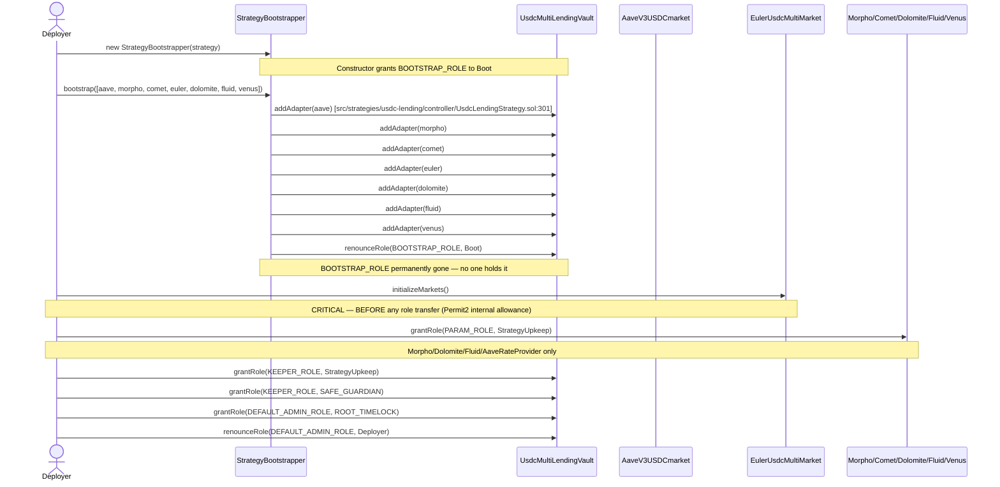

# Wiring — multyr-strategies

Covers the full wiring lifecycle for `UsdcMultiLendingVault` (V9.1): strategy registration in
CoreVault's router, one-shot bootstrap, PARAM_ROLE grants, upkeep wiring, post-deploy verification,
and unwiring. Companion to `multyr-core/docs/wiring.md` (core-side ownership) and
`multyr-strategies/docs/deployment.md` (deploy phases).

---

## 1. Strategy ←→ Vault Wiring (Phase 5.5)

After the strategy is deployed, three calls wire it into the Core ecosystem. These happen in
`multyr-strategies/script/DeployUsdcLendingStrategy.s.sol` Phase 2 (lines 490-530).

### 1.1 Register in StrategyRouter

`src/core/modules/StrategyRouter.sol:196`:

```solidity
router.register(
    address(strategy),
    priority,           // lower = higher priority; default 100
    maxBps              // max weight in allocation pool (e.g., 10000 = 100%)
);
```

Verify: `router.isStrategyEnabled(address(strategy))` returns `true`
(`src/core/modules/StrategyRouter.sol:267`).

### 1.2 HealthRegistry Authorization

`src/core/modules/StrategyHealthRegistry.sol:163`:

```solidity
healthRegistry.setAuthorizedCaller(address(strategy), true);
```

This allows the strategy to call `healthRegistry.reportHealth(...)` during rebalance.

### 1.3 CORE_ROLE Verification

`UsdcLendingStrategy` constructor (`src/strategies/usdc-lending/controller/UsdcLendingStrategy.sol:150-151`)
grants CORE_ROLE to both `_core` (CoreVault) and `_router` (StrategyRouter) automatically.
Verify at `multyr-strategies/script/DeployUsdcLendingStrategy.s.sol:514-522`:

```solidity
bytes32 CORE_ROLE = keccak256("CORE_ROLE");
require(strategy.hasRole(CORE_ROLE, address(vault)), "CoreVault missing CORE_ROLE");
require(strategy.hasRole(CORE_ROLE, address(router)), "StrategyRouter missing CORE_ROLE");
```

---

## 2. Adapter Bootstrap (Phase 5.5b — One-Shot)

The V9.1 bootstrap pattern uses `StrategyBootstrapper` for a single atomic registration pass.
Once executed, `BOOTSTRAP_ROLE` is permanently renounced.



### Bootstrap source references

- `src/strategies/usdc-lending/StrategyBootstrapper.sol:87` — `bootstrap(adapters[])` function
- `src/strategies/usdc-lending/StrategyBootstrapper.sol:116-117` — BOOTSTRAP_ROLE renounce
- `docs/09-audit/deployment-map-appendix.md:356-368` — V9.1 bootstrap critical timing notes

**Idempotency**: `bootstrap()` is **NOT idempotent**. After first call, BOOTSTRAP_ROLE is permanently
renounced. A second call reverts with `AccessControl: account is missing role`.

---

## 3. PARAM_ROLE Grants (Phase 3.4 — Critical)

`PARAM_ROLE` must be granted to `StrategyUpkeep` on adapters that support poke-based rate updates.
Missing PARAM_ROLE causes silent failures — `poke()` calls revert internally, upkeep loop silently
skips the operation, TVL confidence degrades.

Source: `multyr-strategies/script/DeployUsdcLendingStrategy.s.sol:599-608`.

### Per-Adapter PARAM_ROLE Table

| Adapter | Contract | Role constant defined at | PARAM_ROLE granted to | Phase |
|---|---|---|---|---|
| Aave V3 | `AaveV3USDCmarket` | no PARAM_ROLE (VAULT_ROLE only — `src/strategies/usdc-lending/adapters/lending/AaveV3USDCmarket.sol:89`) | n/a | n/a |
| Morpho | `MorphoUsdcMultiMarket` | `src/strategies/usdc-lending/adapters/lending/MorphoUsdcMultiMarket.sol:62` | StrategyUpkeep + timelock | 3.4 |
| Comet | `CometUsdcMultiMarket` | `src/strategies/usdc-lending/adapters/lending/CometUsdcMultiMarket.sol:82` | (verify in DeployUsdcLendingStrategy) | 3.4 |
| Euler | `EulerUsdcMultiMarket` | `src/strategies/usdc-lending/adapters/lending/EulerUsdcMultiMarket.sol:86` | timelock only (Phase 3.5 special) | 3.5 |
| Dolomite | `DolomiteUsdcMultiMarket` | `src/strategies/usdc-lending/adapters/lending/DolomiteUsdcMultiMarket.sol:111` | StrategyUpkeep + timelock | 3.4 |
| Fluid | `FluidUsdcMultiMarket` | `src/strategies/usdc-lending/adapters/lending/FluidUsdcMultiMarket.sol:53` | StrategyUpkeep + timelock | 3.4 |
| Venus | `VenusUsdcMultiMarket` | `src/strategies/usdc-lending/adapters/lending/VenusUsdcMultiMarket.sol:66` | (verify in DeployUsdcLendingStrategy) | 3.4 |
| AaveRateProvider | `AaveLiquidityRateProvider` | `src/strategies/usdc-lending/adapters/rates/AaveLiquidityRateProvider.sol:15` | StrategyUpkeep + timelock | 3.4 |

**Euler special case** (`multyr-strategies/script/DeployUsdcLendingStrategy.s.sol:628-630`):
Euler adapter's `initializeMarkets()` must be called BEFORE PARAM_ROLE is granted to timelock.
The Euler adapter receives PARAM_ROLE only from timelock (not upkeep), because upkeep poke
pattern differs for Euler v2.

### Grant sequence

```solidity
// Phase 3.4: grant to StrategyUpkeep first (multyr-strategies/script/DeployUsdcLendingStrategy.s.sol:599-608)
IAccessControl(morphoAdapter).grantRole(PARAM_ROLE, address(upkeep));
IAccessControl(dolomiteAdapter).grantRole(PARAM_ROLE, address(upkeep));
IAccessControl(fluidAdapter).grantRole(PARAM_ROLE, address(upkeep));
IAccessControl(aaveRateProvider).grantRole(PARAM_ROLE, address(upkeep));

// Phase 3.5: transfer DEFAULT_ADMIN on each adapter to timelock, then grant PARAM_ROLE to timelock
// (multyr-strategies/script/DeployUsdcLendingStrategy.s.sol:628-636)
IAccessControl(eulerAdapter).grantRole(eulerAdapter.PARAM_ROLE(), cfg.timelock);

// Strategy-level PARAM_ROLE (multyr-strategies/script/DeployUsdcLendingStrategy.s.sol:681)
strategy.grantRole(PARAM_ROLE, cfg.timelock);
```

---

## 4. Strategy Upkeeper Wiring (Phase 3.1-3.3)

`LendingStrategyUpkeep` (`src/strategies/usdc-lending/automation/LendingStrategyUpkeep.sol:193`)
coordinates HARVEST and REBALANCE actions across multiple strategy vaults.

### Deploy + Grant KEEPER_ROLE

`multyr-strategies/script/DeployUsdcLendingStrategy.s.sol:575-586`:

```solidity
address[] memory strategies = new address[](1);
strategies[0] = address(strategy);
StrategyUpkeep upkeep = new StrategyUpkeep(strategies);  // src/strategies/usdc-lending/automation/LendingStrategyUpkeep.sol:229

strategy.grantRole(KEEPER_ROLE, address(upkeep));         // src/strategies/usdc-lending/controller/StrategyStorageLayout.sol:97
strategy.grantRole(KEEPER_ROLE, SAFE_GUARDIAN);           // backup keeper
```

### Chainlink Automation Registration

Register `upkeep` on Chainlink Automation Network (Arbitrum):
- **Gas limit**: 5,000,000 (covers worst-case 7-adapter rebalance)
- **Funding**: min 5 LINK at registration
- **Check frequency**: Chainlink default (~1 block)

Post-register: verify `upkeep.checkUpkeep("")` returns `(false, "")` on a fresh deployment
(no pending harvest/rebalance before first deposit).

---

## 5. Strategy Role Matrix

| Role | Constant | Source | Granted to | Grant phase | Can revoke |
|---|---|---|---|---|---|
| `DEFAULT_ADMIN_ROLE` | OZ built-in | `src/strategies/usdc-lending/controller/UsdcLendingStrategy.sol:148` | ROOT_TIMELOCK (from deployer) | Phase 3.5 renounce | ROOT_TIMELOCK via `revokeRole` |
| `PARAM_ROLE` | `src/strategies/usdc-lending/controller/StrategyStorageLayout.sol:96` | ROOT_TIMELOCK | Phase 3.5 constructor | ROOT_TIMELOCK |
| `KEEPER_ROLE` | `src/strategies/usdc-lending/controller/StrategyStorageLayout.sol:97` | StrategyUpkeep + SAFE_GUARDIAN | Phase 3.2-3.3 | DEFAULT_ADMIN_ROLE |
| `CORE_ROLE` | `src/strategies/usdc-lending/controller/StrategyStorageLayout.sol:98` | CoreVault + StrategyRouter | Phase constructor | DEFAULT_ADMIN_ROLE |
| `BOOTSTRAP_ROLE` | `src/strategies/usdc-lending/controller/StrategyStorageLayout.sol:99` | StrategyBootstrapper | Phase constructor (self) | renounced permanently post-bootstrap |
| `VAULT_ROLE` (adapters) | `src/strategies/usdc-lending/adapters/lending/AaveV3USDCmarket.sol:89` | UsdcMultiLendingVault | Adapter constructor | Adapter DEFAULT_ADMIN |
| `PARAM_ROLE` (adapters) | per-adapter (see §3 table) | StrategyUpkeep + timelock | Phase 3.4 | Adapter DEFAULT_ADMIN |

**Deployer role post-wiring**: deployer must hold NO roles after Phase 3.5 completes.
Verify: `strategy.hasRole(DEFAULT_ADMIN_ROLE, deployer) == false`
(`src/strategies/usdc-lending/controller/UsdcLendingStrategy.sol:205`).

---

## 6. Post-Deploy Verification

Run these checks after `multyr-strategies/script/DeployUsdcLendingStrategy.s.sol` completes
all 5 phases.

```bash
# Role verification
cast call $STRATEGY "hasRole(bytes32,address)(bool)" $(cast keccak "CORE_ROLE") $VAULT
cast call $STRATEGY "hasRole(bytes32,address)(bool)" $(cast keccak "CORE_ROLE") $ROUTER
cast call $STRATEGY "hasRole(bytes32,address)(bool)" $(cast keccak "KEEPER_ROLE") $UPKEEP
cast call $STRATEGY "hasRole(bytes32,address)(bool)" $(cast keccak "DEFAULT_ADMIN_ROLE") $ROOT_TIMELOCK
cast call $STRATEGY "hasRole(bytes32,address)(bool)" $(cast keccak "DEFAULT_ADMIN_ROLE") $DEPLOYER
# ^ must return false

# Bootstrap complete
cast call $STRATEGY "getRoleMemberCount(bytes32)(uint256)" $(cast keccak "BOOTSTRAP_ROLE")
# ^ must return 0

# Adapter count and TVL
cast call $STRATEGY "adapterCount()(uint256)"
# ^ must return 7 (src/strategies/usdc-lending/controller/UsdcLendingStrategy.sol:988)
cast call $STRATEGY "totalAssets()(uint256)"
# ^ initial: 0 if no deposits yet (src/strategies/usdc-lending/controller/UsdcLendingStrategy.sol:860)

# Router registration
cast call $ROUTER "isStrategyEnabled(address)(bool)" $STRATEGY

# Adapter PARAM_ROLE grants (Morpho as example)
cast call $MORPHO_ADAPTER "hasRole(bytes32,address)(bool)" $(cast keccak "PARAM_ROLE") $UPKEEP
cast call $EULER_ADAPTER "hasRole(bytes32,address)(bool)" $(cast keccak "PARAM_ROLE") $ROOT_TIMELOCK

# Euler initializeMarkets done (via AToken balance sanity check)
cast call $EULER_ADAPTER "totalAssets()(uint256)"
# ^ must return 0 (not revert) if initializeMarkets succeeded
```

---

## 7. Adapter Constructor Role Pattern

Every lending adapter follows the same OZ AccessControl constructor pattern. Example from
`src/strategies/usdc-lending/adapters/lending/AaveV3USDCmarket.sol:147-168`:

```solidity
constructor(
    address asset_,
    address pool_,
    address aToken_,
    address admin_,    // deployer initially; transferred to timelock in Phase 3.5
    address vault_,    // UsdcMultiLendingVault — granted VAULT_ROLE
    uint256 maxCap_
) {
    _grantRole(DEFAULT_ADMIN_ROLE, admin_);   // deployer temp
    _grantRole(VAULT_ROLE, vault_);           // strategy controller
    // AaveV3 has no PARAM_ROLE — rate is fed externally via AaveLiquidityRateProvider
}
```

The `VAULT_ROLE` (`src/strategies/usdc-lending/adapters/lending/AaveV3USDCmarket.sol:89`)
authorizes `UsdcMultiLendingVault` to call `push()`, `pull()`, `harvest()` on the adapter.
It is set at construction time and is never transferred.

Adapters with PARAM_ROLE (Morpho, Comet, Dolomite, Euler, Fluid, Venus) additionally grant
it to the deployer in the constructor (via DEFAULT_ADMIN), then it is handed off to
StrategyUpkeep in Phase 3.4. Poke calls from upkeep use PARAM_ROLE gating.

### Adapter DEFAULT_ADMIN Transfer (Phase 3.5)

After all PARAM_ROLE grants, deployer transfers DEFAULT_ADMIN on each adapter to timelock:

```solidity
// Source: multyr-strategies/script/DeployUsdcLendingStrategy.s.sol (Phase 3.5 ~line 611-680)
IAccessControl(aaveAdapter).grantRole(DEFAULT_ADMIN_ROLE, cfg.timelock);
IAccessControl(aaveAdapter).renounceRole(DEFAULT_ADMIN_ROLE, deployer);
// Repeat for morpho, comet, euler, dolomite, fluid, venus, aaveRateProvider
```

Post-transfer: no adapter can be modified without a timelock proposal. This is the final
step before deployer renounces DEFAULT_ADMIN_ROLE on the strategy itself.

---

## 8. Strategy Unwiring (Operational Recovery)

### Pause Adapter (Non-Breaking)

Disable a single adapter without full emergency. Requires DEFAULT_ADMIN_ROLE (timelock):

```solidity
// Disable allocation to adapter (src/strategies/usdc-lending/controller/UsdcLendingStrategy.sol:338)
strategy.toggleAdapter(address(adapter), false);
```

This stops new allocation but does not withdraw existing funds from the adapter.

### Emergency Recall

For immediate full withdrawal from all adapters (KEEPER_ROLE or CORE_ROLE):

```solidity
// src/strategies/usdc-lending/controller/UsdcLendingStrategy.sol:669
strategy.emergencyRecallAll();
```

All adapter funds are pulled back to vault idle balance. Adapters remain registered but will
receive 0 allocation until toggled back on.

### PARAM_ROLE Revocation

If upkeep address changes (e.g., new CLA forwarder), revoke old and grant new:

```solidity
strategy.revokeRole(KEEPER_ROLE, oldUpkeep);
// Per-adapter:
IAccessControl(morphoAdapter).revokeRole(PARAM_ROLE, oldUpkeep);
IAccessControl(dolomiteAdapter).revokeRole(PARAM_ROLE, oldUpkeep);
IAccessControl(fluidAdapter).revokeRole(PARAM_ROLE, oldUpkeep);
IAccessControl(aaveRateProvider).revokeRole(PARAM_ROLE, oldUpkeep);
// Then grant to newUpkeep (same phase pattern as §3)
```

Roles not frozen until explicit `rolesNotFrozen` modifier is lifted (does not happen post-V9.1 — roles remain mutable via timelock).

---

## 9. Warm Adapter Interaction (Strategy ←→ BufferManager)

`UsdcMultiLendingVault` does NOT directly use `BufferManager` warm adapters — those are
CoreVault's idle-management layer. The strategy receives USDC from CoreVault via `CORE_ROLE`-gated
`push()` calls, allocates to adapters, and returns liquidity on demand via `pull()`.

The wiring points between strategy and core are:

| Connection | Source | Purpose |
|---|---|---|
| `strategy.hasRole(CORE_ROLE, vault)` | `src/strategies/usdc-lending/controller/UsdcLendingStrategy.sol:150` | Vault can push/pull to strategy |
| `strategy.hasRole(CORE_ROLE, router)` | `src/strategies/usdc-lending/controller/UsdcLendingStrategy.sol:151` | Router can call deposit/withdraw on strategy |
| `router.register(strategy, prio, bps)` | `src/core/modules/StrategyRouter.sol:196` | Vault knows strategy exists and how to allocate |
| `healthRegistry.setAuthorizedCaller(strategy, true)` | `src/core/modules/StrategyHealthRegistry.sol:163` | Strategy can report health scores |

The strategy's `totalAssets()` (`src/strategies/usdc-lending/controller/UsdcLendingStrategy.sol:860`)
is called by CoreVault during NAV calculation. This is a view-only path — no role required.

---

## 10. SimpleProtocolRegistry Wiring

`UsdcMultiLendingVault` uses `SimpleProtocolRegistry` to track which external market vaults
are approved for each protocol. This is wired in Phase 1.5 of the deploy script
(`multyr-strategies/script/DeployUsdcLendingStrategy.s.sol:325-358`).

The registry has a default `owner` (deployer) and does not use OZ AccessControl.
Post-deploy, ownership should be transferred to ROOT_TIMELOCK:

```solidity
// After Phase 1.5 vault registrations (Morpho/Euler/Dolomite entries)
protocolRegistry.transferOwnership(ROOT_TIMELOCK);
```

Verify: adapters call `registry.isApproved(protocol, market)` internally. If the registry
is stale or ownership transferred prematurely, new markets cannot be added without timelock
proposal.

---

## 11. Critical Timing Invariants

The following ordering constraints are HARD requirements. Violating any causes either silent
failures or irreversible misconfigurations:

| # | Invariant | Source | Severity if violated |
|---|---|---|---|
| T1 | Euler `initializeMarkets()` BEFORE any role transfer | `multyr-strategies/script/DeployUsdcLendingStrategy.s.sol:399` | HIGH — Euler deposits revert (Permit2 allowance missing) |
| T2 | PARAM_ROLE grants BEFORE adapter admin transfer to timelock | `multyr-strategies/script/DeployUsdcLendingStrategy.s.sol:599` | HIGH — poke fails silently; TVL confidence degrades immediately |
| T3 | `bootstrap()` BEFORE DEFAULT_ADMIN_ROLE renounce | `src/strategies/usdc-lending/StrategyBootstrapper.sol:87` | CRITICAL — cannot register adapters after renounce |
| T4 | `bootstrap()` is one-shot — never call twice | `src/strategies/usdc-lending/StrategyBootstrapper.sol:116-117` | CRITICAL — second call reverts, BOOTSTRAP_ROLE already renounced |
| T5 | CORE_ROLE auto-granted at construction — do not re-grant | `src/strategies/usdc-lending/controller/UsdcLendingStrategy.sol:150-151` | LOW — duplicate grant is harmless but confusing |
| T6 | FeeCollectorUpkeep `addToken(vault)` before timelock transfer | `src/periphery/automation/FeeCollectorUpkeep.sol:1` | HIGH — fees accumulate, checkUpkeep returns false forever (v9 mainnet incident) |
| T7 | Deployer must renounce DEFAULT_ADMIN_ROLE last | `multyr-strategies/script/DeployUsdcLendingStrategy.s.sol:681` | CRITICAL — premature renounce blocks remaining role grants |

### Complete Wiring Smoke Test (post Phase 3.5)

Run from Arbitrum fork or live network:

```bash
# T1: Euler initialized — totalAssets should not revert
cast call $EULER_ADAPTER "totalAssets()(uint256)"

# T2: PARAM_ROLE on upkeep (Morpho example)
cast call $MORPHO_ADAPTER "hasRole(bytes32,address)(bool)" \
    $(cast keccak "PARAM_ROLE") $STRATEGY_UPKEEP
# ^ must return true

# T3+T4: BOOTSTRAP_ROLE fully renounced
cast call $STRATEGY "getRoleMemberCount(bytes32)(uint256)" \
    $(cast keccak "BOOTSTRAP_ROLE")
# ^ must return 0

# T5: CORE_ROLE present on both callers
cast call $STRATEGY "hasRole(bytes32,address)(bool)" $(cast keccak "CORE_ROLE") $VAULT
cast call $STRATEGY "hasRole(bytes32,address)(bool)" $(cast keccak "CORE_ROLE") $ROUTER

# T7: deployer has no admin roles
cast call $STRATEGY "hasRole(bytes32,address)(bool)" \
    $(cast keccak "DEFAULT_ADMIN_ROLE") $DEPLOYER
# ^ must return false
```
